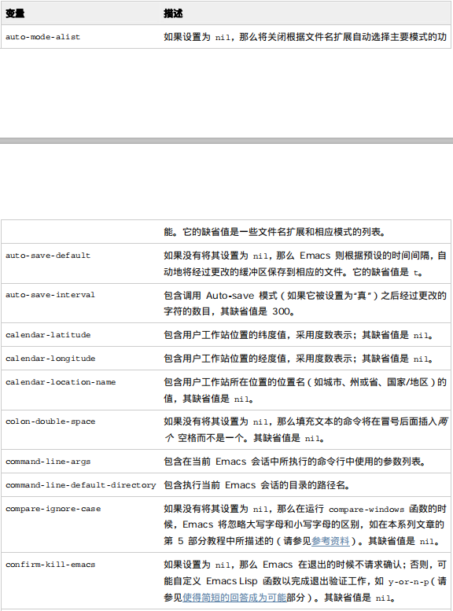
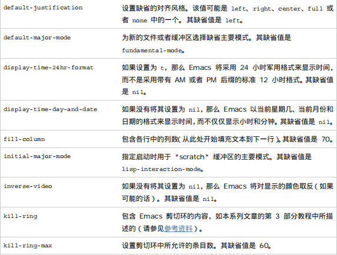
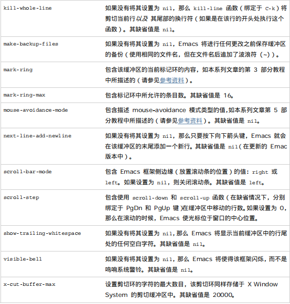
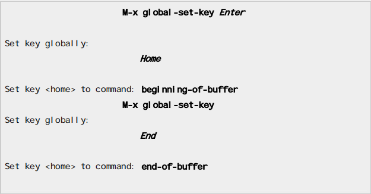
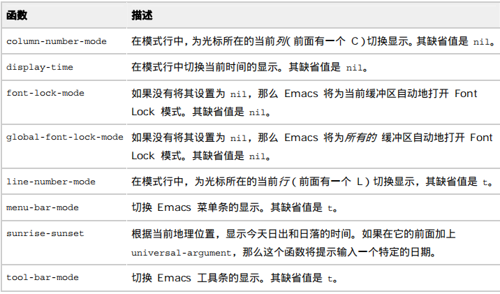
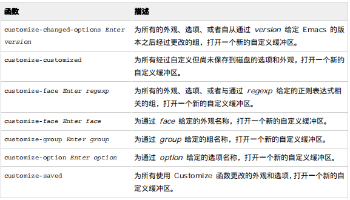

## 一、设置emacs变量

* 对emacs环境的某些方面进行自定义，最快捷的方式就是设置emacs变量。
* 变量是emacs lisp<em>符号</em>，通过名称对其引用，且通常具有缺省值，有些变量可以包含数值或者字符串值，而其他变量则是“真”（t）或“假”（nil）

| 快捷键       | 功能               | 函数              | 注释 |
| ------------ | ------------------ | ----------------- | ---- |
| C-h v 变量名 | 查看变量的值和描述 | describe-variable |      |

| 变量        | 功能                               | 说明                                     |
| ----------- | ---------------------------------- | ---------------------------------------- |
| fiil-column | 控制fill-paragrahp的宽度，默认为70 | 局部变量，每个缓冲区都有一个自己的该变量 |

其他常见的变量<a name="table">表格</a>

## 二、自定义Emacs键绑定

* global-set-key函数将给定的函数绑定与给定的键，并是它在所有的模式和缓冲区中都有效。

以修改Home键和End键为例，原本我的Home键是回到光标所在行开头，End是到光标所在行结尾，但是经过如下修改，可将它们分别改为回到缓冲区开头和缓冲区结尾。

其他所有的键绑定方式（修改或者新建）与之类似。(这种方法对一个框架下的所有缓冲区和窗口都有用，但是退出后不会保存修改的键绑定)

## 三、一些自定义功能

| 函数          | 功能                   | 注释                                                         |
| ------------- | ---------------------- | ------------------------------------------------------------ |
| menu-bar-mode | 关闭/开启菜单栏        | 退出不保存                                                   |
| display-time  | 在模式行中放置一个时钟 | 同上。通过设置相应的变量可以进一步自定义，具体变量参<a href="#table">图表</a> |

其他常用功能:

## 四、使用Emacs启动文件

* Emacs的启动文件即.emac.d文件夹
* 可在.emac.d文件夹下的init.el文件中设置变量和函数：

> 设置变量的格式为(setq 变量名 值),注意<strong>lisp的语法是每一句都用括号括起来，注释符为分号，习惯用两个分号和一个空格之后再开始注释;真值为t，假为nil。
>
> 设置函数或模式(函数名或模式名 t)真值表示自动启动。

* 在.emac.d文件夹下的init.el文件中设置键绑定：

> 例如：
>
> ;; Make Del delete the character at point. 
> (global-set-key [delete] 'delete-char)
>
> <strong>注意：只有一个单引号，不成对</strong>

* 重定义函数

> 例子：
>
> ;; eliminate long "yes" or "no" prompts 
> (fset 'yes-or-no-p 'y-or-n-p)
>
> 这个例子是当Emacs询问你是否执行操作时，把要输入的yes/no改为输入y/n

## 五、使用Emacs的Customize函数

* Customize函数是一个特殊的Emacs函数，该函数使得Emacs的自定义变的简单，变为可与用户进行交互。<strong>特别对于显示各种字体、外观和颜色，Customize可以实时显示</strong>。
* 在Emacs中输入customize函数之后会产生一个新的缓冲区*Customize Group:Emacs*，缓冲区中有很多组，进入某个组进行个性化选择。

有关的选项和按钮;

* state:描述该选项的当前状态
* revert：撤销所有设置
* apply：应用到当前框架
* apply and save：应用并且保存配置

直接进入某个自定义组的函数：

