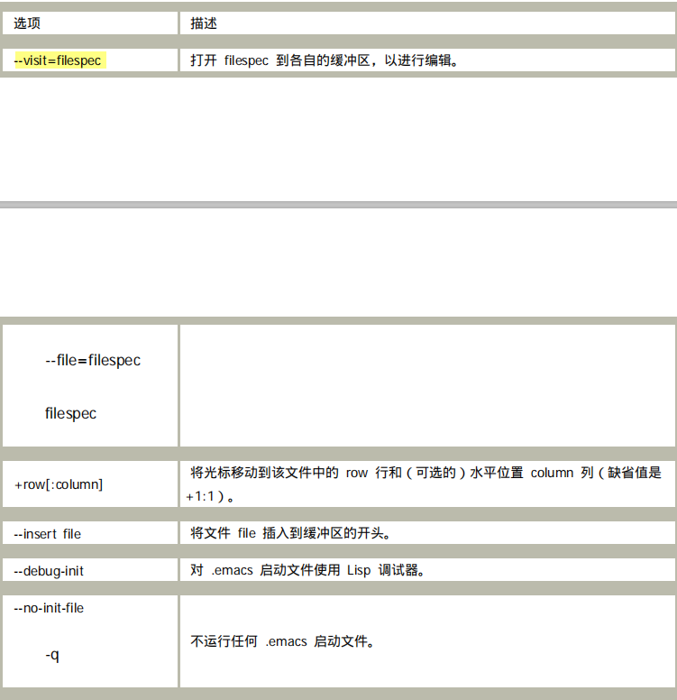
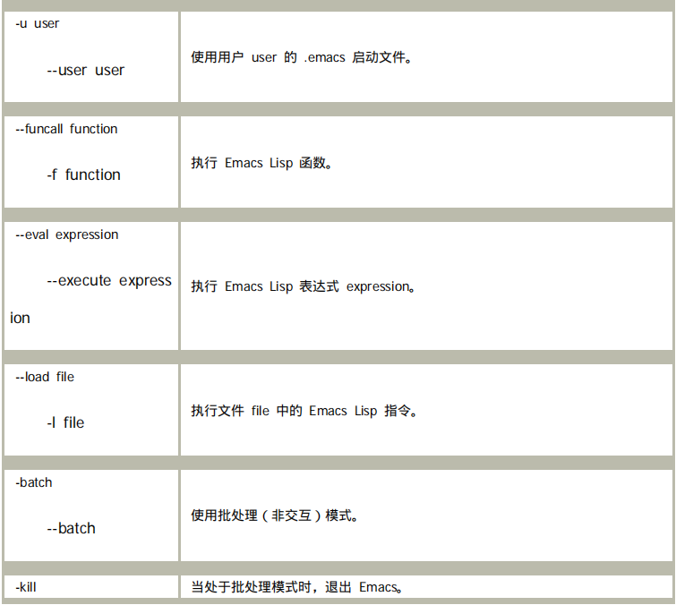
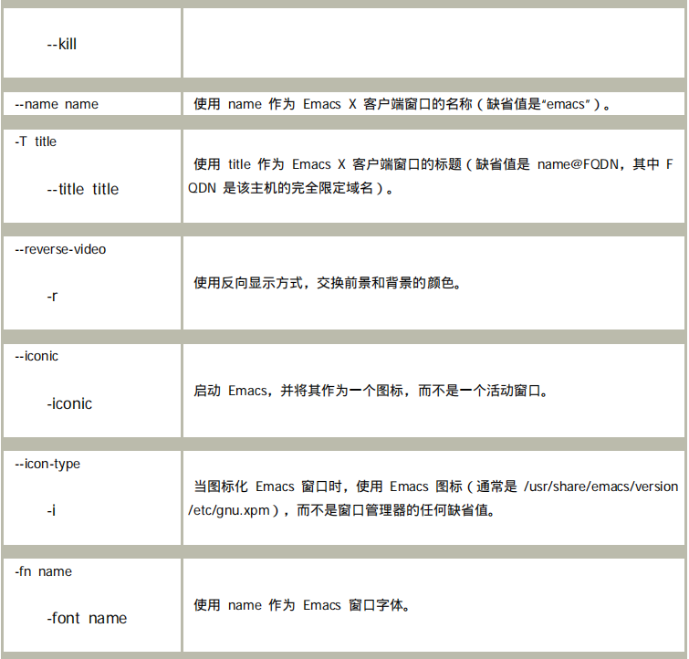
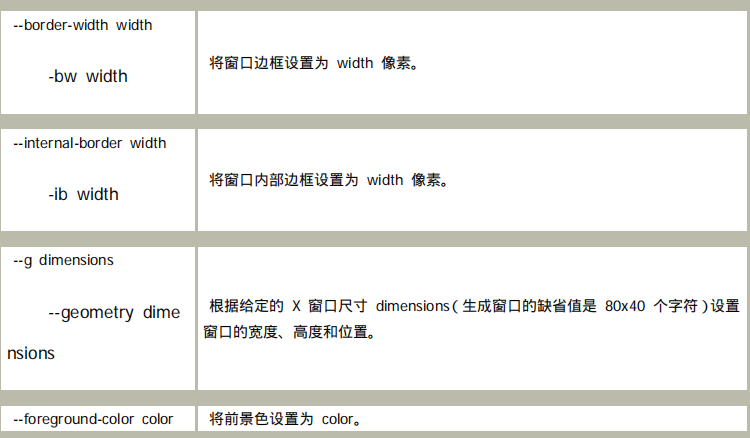
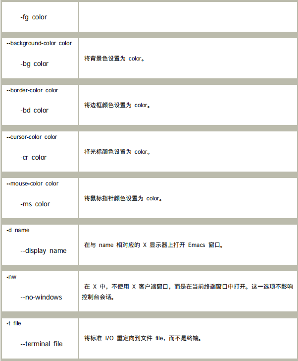

## 一、选项

emacs在shell中输入时，向其他命令一样有着参数，运行emacs时，带上不同的参数可以控制emacs的各种行为。

* 打开文件和修改显示属性：

<pre><ol>
    <li>打开文件时转到制定行列：
    	例子：emacs +100：100 file
    	例子：emacs +999 file	说明：加上一个很大的参数，可以到达文件底部。</li>
    <li>在临时缓冲区中插入某个文件：
    	例子：emacs （缺省）--insert file	说明：打开后是scratch缓冲区，但是插入了file的内容。
    	例子：emacs +10:5 practice.b --insert myfile anotherfile	说明：这个操作将启动 Emacs，同时使 practice.b 的内容处于一个新的缓冲区中，在第十行
的第五列插入 myfile，然后在一个新的缓冲区中打开名为 anotherfile 的新文件，并将其作
为当前缓冲区。</li>
	<li>在终端中打开emacs：
		例子：emacs -nw</li>
	<li>打开文件时改动字体、背景：<a href="#graph">表格</a></li>
</ol></pre>

* 控制启动文件：

Emacs的配置大体上由两个文件决定，.emacs（在家目录中，我的是.emacs.d）和site-start.el(通常在/etc/emacs中)

<pre>
	<ol>
		<li>不运行任何启动文件：
		例子：emacs -q</li>
		<li>运行该系统下其他用户的配置文件：
		例子：emacs -u 用户名</li>
		<li>打开emacs时启动Lisp调试器检查启动文件：
		例子：emacs --debug-init</li>
		<li>命令行运行emacs lisp函数：
		例子：emacs -f 函数名	说明：结果将会在缓冲区中打开。</li>
		<li>运行一个lisp表达式：
		例子：emacs --eval 表达式</li>
		<li>批处理操作：使用--batch选项，emacs --batch
		例子：emacs --batch +35 practice.b -f kill-line -f save-buffer --kill	说明：emacs将会依次运行emacs命令后的函数和选项，直到晕倒--kill才停止</li>
		
总结表格：

## 二、<a name="jicunqi">寄存器</a>

* Emacs寄存器是一种通用的存储机制，它可以存储很多内容中的一项，包括文本、矩形区域、缓冲区中的位置，或者其他值或设置。每个寄存器都有一个标签，只能保存一个内容，重复保存将会覆盖，每次退出emacs，寄存器将会被清空。所有寄存器命令都是以C-x r开头。

<pre>
<ol>
    <li>保存一个寄存器：
    <ol>
    	<li>存储当前光标位置：point-to-register，C-x r space，同时给出寄存器名称，可以是任意数字字母字符，区分大小写。</li>
    	<li>复制一个区域到寄存器：copy-to-register,C-x s.</li>
    	<li>复制一个矩形区域到寄存器：copy-rectangle-to-register,C-x r r</li>
    </ol>
    </li>
    <li>查看一个寄存器：view-register
    </li>
    <li>跳转到一个寄存器：jump-to-register，C-x r j，跳转到保存的某个光标位置。</li>
    <li>恢复一个寄存器：insert-register，C-x r i
    </li>
</ol>
</pre>

## 三、书签

Emacs 提供了保存缓冲区中位置的另一种工具。这些 Emacs 书签 的工作方式与寄
存器相同，但是它们的标签可以超过一个字符长，而且它们比寄存器更为持久：如果保存了
书签，那么您可以在两个不同的会话之间使用它们。它们将一直保留下来，直到您删除它们。
正如它们的名称所表示的，对于保存您在缓冲区中的位置，以便您稍后可以返回到该位置（通
常是在以后的 Emacs 会话期间），使用书签是非常方便的。

<strong>书签标存在家目录下的.emac.bmk中</strong>

<ol>
    <li>设置一个标签：bookmark-set，C-x r m，在输入书签的名称，缺省情况下为缓冲区名称。</li>
    <li>列出书签：bookmarks-bmenu-list，C-x r l，在列表中使用enter选择书签</li>
    <li>直接跳转到书签：bookmark-jump:C-x r b</li>
    <li>删除一个书签：bookmark-delete</li>
</ol>

