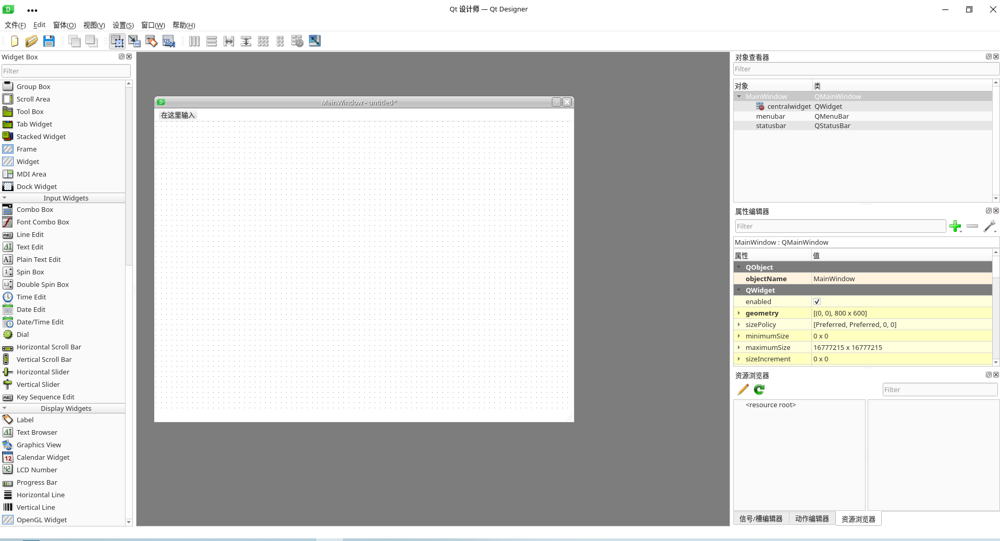

# Qt Designer快速入门

* Qt Designer是一个程序，是一个可视化的GUI设计工具
* Qt Designer可以生成一个.ui文件（实际上是XML文件，使用文本编辑器打开即可看到），更改其后缀为.py后（pyuic5 -o *.py *.ui），其可以被Python脚本引用
* 它在下载的PyQt5的依赖包中

## 1.新建主窗口

* Main Window即主窗口
* Widget Box是控件窗口，其中的空间可以直接拖放到主窗口中，Ctrl+R查看效果
* 对象查看器中包括的是窗体对象的各个组件
* 属性编辑器则是提供了对窗口、控件、布局的属性编辑功能
* * objectName，空间对象名称
  * geometry，相对坐标系
  * sizePolicy，控件大小策略
  * minimumSize，最小宽度、高度
  * maximumSize，最大宽度、高度
  * font，字体
  * cursor，光标
  * windowTitle，窗口标题
  * windowsIcon/icon，窗口图标/空间图标
  * iconSize，图标大小
  * toolTip，提示信息
  * statusTip，任务栏提示信息
  * text，控件文本
  * shortcut，快捷键
* 信号/槽编辑器，为控件添加自定义函数和槽函数
* 资源浏览器可以为控件添加背景图片等



## 2.界面与逻辑分离

* 界面文件是被调用的资源
* 资源的使用逻辑需要新建py文件

``````python
import sys
from PyQt5.QtWidgets import QApplication, QMainWindow
from ui.first import *


class MyMainWindow(QMainWindow, Ui_MainWindow):
    def __init__(self, parent=None):
        super(MyMainWindow, self).__init__(parent)
        self.setupUi(self)


if __name__ == "__main__":
    app = QApplication(sys.argv)
    myWin = MyMainWindow()
    myWin.show()
    sys.exit(app.exec_())
``````

