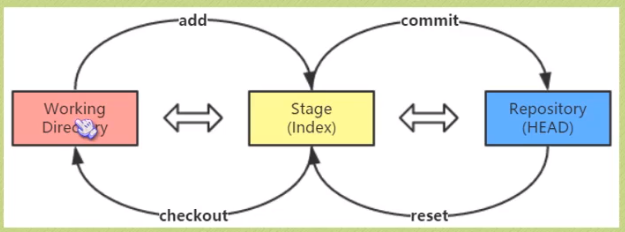

# github及git使用指南

## 一、六个概念

概念：

> repository:
>
> > 仓库，一个仓库即一个项目，仓库是集中存放和管理你的代码的位置。
>
> star：
>
> > 收藏，就是它通常的含义，收藏一个项目，方便下次查看
>
> fork：
>
> > 克隆，将别人的仓库fork一份到自己的仓库集下，便于自己操作

> pull request:
>
> > 在将别人的仓库fork之后，我们有自己的想法，对别人的文件进行了修改，但我们不满足于仅仅自己使用修改或添加的内容，希望将这些修改也实现到我们fork的最初的仓库中，此时我们可以进行pull request，向原仓库的拥有者提交我们的修改，让其审核是否可以将修改实现到原仓库里。
>
> watch：
>
> > 即关注，关注某个项目后，与之相关的消息我们就都可以收到
>
> issue：
>
> > 我们在使用某个仓库的时候，发现了一个问题，我们就可以新建一个issue，就相当与开启了一个与仓库拥有者的短暂聊天，在我们解决了这个问题之后，可以关闭这个issue。

## 二、Github主页

Github的主页很简洁明了，只有以下三个：

> repository主页
>
> 个人主页
>
> github主页

## 三、git的使用

<u><em>前提</em>:我们可以通过github网站来管理我们的仓库，但是打开网页有时有点繁琐，我们可以通过git在本地使用命令行对仓库进行管理。</u>

### 使用git管理仓库的步骤(省略了登录和验证等过程)：

#### 1.对于已有的仓库：

* git clone 仓库地址：将远程仓库克隆到本地

* 增、删除、改：

  增：git add “文件名”（将文件添加到暂存区）

   删：先删除本地文件，在使用git rm “文件名”删除暂存区中文件

  改：本地修改文件后，和增操作相同，添加到暂存区（git rm 旧文件名 新文件名   可以重命名暂存区文件）

* 通过命令git commit（-m "同步描述"）,将本地仓库的变化同步到仓库

* 通过命令git push将本地仓库同步到远端

#### 2.git本地新建仓库

#### 3.git本地删除仓库

#### 5.关于版本变化的命令

* git reset HEAD    取消最近一次对仓库的改动，将仓库的内容回到暂存区[^1]
* git checkout   -- 文件名    使用暂存区域的文件将工作区的同名文件覆盖[^1]
* git log    查看历史提交
* git resert HEAD~   回到上一个版本的快照，～后加上数字表示回到前n个版本（仓库与暂存区都会回到上一个版本）
* git reset --soft HEAD～（只有仓库会更改）
* git reset --hard HEAD～（仓库、暂存区、工作区（工作区会被更改后的暂存区覆盖）都会更改，暂存区和仓库都有不同版本的记录，但是工作区自己如果没有备份，修改后难以找回，所以此命令有风险）
* git reset ID号   回滚（往前进）到指定版本;git reset ID号 具体文件      将某个文件回滚（往前进)，但仓库总体内容不回滚

#### 6.对比不同版本

方法1：新建一个文件夹，将某个版本的仓库克隆到该文件夹，使用diff命令把该文件夹与需要对比的文件夹进行对比

方法2：git diff 快照ID1 快照ID2;  git diff 快照ID   将某个快照的内容与当前目录的内容对比

对比暂存区域和仓库快照：git diff --cached ID

[^1]:

## 四、git分支

创建分支：git  branch 分支名称

 切换分支：git checkout 分支ID   

将某个分支合并到当前分支：git merge 分支名（两个分支中同名文件不同时会产生冲突，冲突会标记在同名文件中，此时要将两个分支中的同名文件内容统一后再合并）

删除分支：git branch -d 分支名

## 五、github pages搭建网站

github pages搭建网站：

创建个人站点-》新建仓库（仓库名称必须是用户名.github.io-》在该仓库下新建index.html即可

* 仅支持静态网页
* 仓库里只能是html文件

可以为每个仓库搭建一个站点：

项目主页：settings-》launch automatic page generator-》新建站点基础信息设置-》选择主题-》生成网页

生成站点后的网页文件全部在自动生成的另一个分支里。