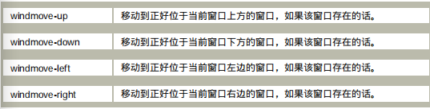

## 一、控制emacs的窗口

| 快捷键    | 函数                             | 功能                                                         | 注释                                                         |
| --------- | -------------------------------- | ------------------------------------------------------------ | ------------------------------------------------------------ |
| C-x 2     | split-window-vertically          | 将当前窗口划分为上下两个                                     | 前面可以加数字参数，正数表示上方窗口的高度，负数表示下方窗口的高度 |
| C-x 4 f/r | find-file-read-only-other-window | 在新的窗口打开文件                                           | f打开的文件可读可写，r打开的只可读                           |
| C-x 4 b   | switch-to-buffer-other-window    | 若只有一个窗口，打开新的窗口切换缓冲区并将其设为活跃。若有两个及以上窗口，在另外的非活跃窗口切换缓冲区，且该窗口变为活跃 |                                                              |
| C-x 4 C-o | display-buffer                   | 同上，只是活跃窗口始终尾当前窗口                             |                                                              |
| C-M-v     | scroll-other-window              | 要滚动另一个 窗口，而不是光标所在的窗口                      |                                                              |
|           | scroll-all                       | 同时滚动所有的打开了相同缓冲区的窗口                         |                                                              |
| C-x o     | other-window                     | 在不同窗口间切换                                             | 其他切换窗口的函数[^1]                                       |
| C-x 0     | delete-window                    | 删除当前窗口                                                 |                                                              |
| C-x 1     |                                  | 删除除当前窗口外的所有窗口                                   |                                                              |
| C-x 4 0   |                                  | 删除窗口的同时删除缓冲区                                     |                                                              |
| C-x 3     |                                  | 将当前窗口划分为左右两个                                     | 前面可以加数字参数，正数表示左方窗口的宽度，负数表示右方窗口的宽度 |
|           | follow-mode                      | 当使用多个窗口显示一个缓冲区时，多个窗口的内容为该缓冲区全部内容的各个部分 |                                                              |
| C-x  ^    |                                  | 调整窗口的高度                                               | 前面不加数字参数时默认增加一行，加整数增加n行，负数减少n行   |
| C-x {     |                                  | 将窗口变窄                                                   |                                                              |
| C-x }     |                                  | 将窗口变宽                                                   |                                                              |
| C-x -     |                                  | 将当前窗口变为最小                                           |                                                              |
| C-x +     |                                  | 平衡所有窗口，使他们大小相当                                 |                                                              |
|           | compare-windows                  | 将当前窗口的内容与下一个长口的内容进行比较，从光标处到缓冲区结束 |                                                              |
| C-x 5 2   | make-frame-command               | 可以生成一个新的框架，并使其处于活动状态                     | 将以C-x 4为前缀的命令换为C-x 5为前缀，则仍具有相同的功能只不过对象换为了新的框架而不是新的窗口 |

[^1]: 