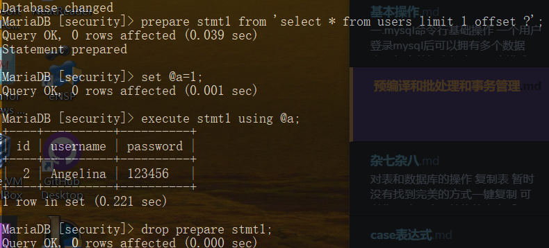

## 预编译

### 一.SQL语句的执行处理

#### 1.即时SQL

一条 SQL 在 DB 接收到最终执行完毕返回，大致的过程如下：
　　1. 词法和语义解析；
　　2. 优化 SQL 语句，制定执行计划；
　　3. 执行并返回结果；
　　如上，一条 SQL 直接是走流程处理，一次编译，单次运行，此类普通语句被称作 Immediate Statements （即时 SQL）。

#### 2.预处理SQL

但是，绝大多数情况下，某需求某一条 SQL 语句可能会被反复调用执行，或者每次执行的时候只有个别的值不同（比如 select 的 where 子句值不同，update 的 set 子句值不同，insert 的 values 值不同）。如果每次都需要经过上面的词法语义解析、语句优化、制定执行计划等，则效率就明显不行了。
　　所谓预编译语句就是将此类 SQL 语句中的值用占位符替代，可以视为将 SQL 语句模板化或者说参数化，一般称这类语句叫Prepared Statements。
　　预编译语句的优势在于归纳为：一次编译、多次运行，省去了解析优化等过程；此外预编译语句能防止 SQL 注入。

### 二.PREPARE STATEMENT

​	MySQL 官方将 prepare、execute、deallocate 统称为 PREPARE STATEMENT。

````mysql
# 定义预处理语句
PREPARE stmt_name FROM preparable_stmt;
# 执行预处理语句
EXECUTE stmt_name [USING @var_name [, @var_name] ...];
# 删除(释放)定义
{DEALLOCATE | DROP} PREPARE stmt_name;
````



## 事务管理

### 一.什么是事务管理

- 可以把一系列要执行的操作称为事务，而事务管理就是管理这些操作要么完全执行，要么完全不执行（很经典的一个例子是：A要给B转钱，首先A的钱减少了，但是突然的数据库断电了，导致无法给B加钱，然后由于丢失数据，B不承认收到A的钱；在这里事务就是确保加钱和减钱两个都完全执行或完全不执行，如果加钱失败，那么不会发生减钱）。
- 事务管理的意义：保证数据操作的完整性。
- mysql中并不是所有的数据引擎都支持事务管理的，只有innodb支持事务管理。

### 二.事务管理的特性

- 原子性：事务的整个操作是一个整体，不可以分割，要么全部成功，要么全部失败。
- 一致性：事务操作的前后，数据表中的数据没有变化。
- 隔离性：事务操作是相互隔离不受影响的。
- 持久性：数据一旦提交，不可改变，永久的改变数据表数据。

### 三.事务管理操作

* 开启事务管理：start transaction	开启事务管理后，再执行sql语句并不会将结果写入表中，而是写入到事务日志中
* 回退操作: rollback    回退操作会清理掉开始事务管理后写入到事务日志中的内容，即回复到开启事务管理之前
* 事务提交：commit   将sql语句的结果写到数据表中

<u>当commit或者rollback后，事务会自动关闭</u>

<u>锁机制：在事务操作一个表时，如果使用索引来取值，那么会锁定到对应行；如果没有使用索引来取值，那么会锁定整个表。锁定之后其他连接无法操作指定行或表。</u>

### 四.回滚点

在rollback的时候，不止可以回到start transaction的位置，还可以回到我们设置的回滚点。

* 设置回滚点: savepoint name;  退出事务后设置的回滚点消失
* 回滚:rollback to name;  不会退出事务

### 五.默认的事务管理

- 默认情况下，mysql的事务管理是关闭（自动事务）的，语句的结果会马上写到数据表中。

- - 可以通过show variable like 'autocommit';来查看是否开启自动事务，值为1为自动事务已开启，为0则为关闭。

- 关闭自动事务：set autocommit =0;【关闭后需要commit来执行每一条语句，相当于开始了事务管理】

- - 不过注意的是set autocommit针对的是会话变量，所以这个设置只在此次会话连接中生效。