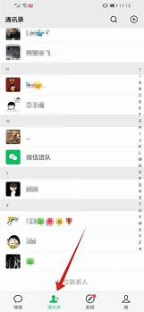
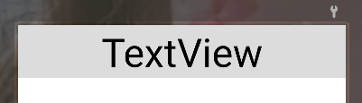
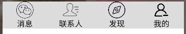
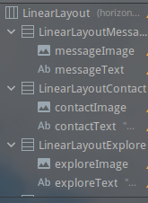
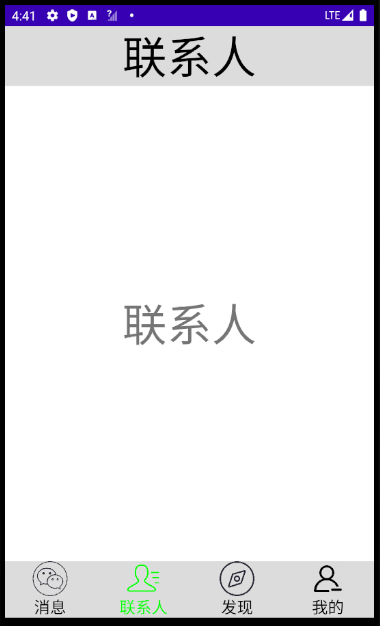

# 使用fragment开发类微信界面

## 一.作业要求

​	实现APP门户框架设计，至少包含四个tab页，能实现top页之间的点击切换。

## 二.分析与实现

### 1.分析

​	我们需要设计一个类微信的界面，关键还是在于UI设计。微信界面的组成大致可以分为三部分：



* 顶栏
* 中间显示内容的页面
* 底栏

​	顶栏和底栏内容相对固定，比较好解决，但是中间显示内容的部分在切换不同页面时变化很大，甚至布局都改变了，所以切换页面的效果肯定不能是通过修改中间部分的控件达成的，而是要将每个页面独立开来，这可以使用fragment实现。

### 2.具体实现

#### a.XML文件部分

​	fragment达成的功能无法直接通过XML文件实现，需要java和xml的结合，先按下不表。我们先说说比较好搞的顶栏和底栏。


<u>顶栏</u>：



​	顶栏可说的内容不多，直接在一个LinearLayout中增加一个TextView，然后调整字体大小、背景颜色即可。

XML代码需要注意的地方：

* 我们要做到顶栏的宽度和手机界面匹配，需要设置LinearLayout和TextView android:layout_width="match_parent"

---------------------

​	

<u>底栏</u>：

​		

​	底栏可以看出是一个纵向+横向的组合，每个纵向组合是一个LinearLayout内纵向放置一个ImageView+一个TextView组成，四个这样的纵向组合放入一个横向的LinearLayout达成我们想要的效果。



------------------------------


​	顶栏和底栏都可以各用一个XML文件编写，最后再在activity_main.xml中通过include引用。

``````xml
<?xml version="1.0" encoding="utf-8"?>
<LinearLayout xmlns:android="http://schemas.android.com/apk/res/android"
    xmlns:app="http://schemas.android.com/apk/res-auto"
    xmlns:tools="http://schemas.android.com/tools"
    android:layout_width="match_parent"
    android:layout_height="match_parent"
    android:orientation="vertical"
    tools:context=".MainActivity">
	
    <!-- 引用顶栏的XML文件 -->
    <include layout="@layout/top" />

    <FrameLayout
        android:id="@+id/id_content"
        android:layout_width="match_parent"
        android:layout_height="match_parent"
        android:layout_weight="1"/>
	
    <!-- 引用底栏XML文件 -->
    <include layout="@layout/botton" />
</LinearLayout>
``````

#### b.fragment

​	先谈谈这次作业中用到的Fragment的一些概念：

* Fragment是Android3.0开始新增的概念，意为碎片。Fragment是依赖于Activity的，不能独立存在的
  * 解读：Fragment不能仅用XML文件实现，必须用到java文件
*  Fragment是一种可以嵌入在Activity当中的UI片段
  * 解读：可以达到我们前文所说的局部切换页面的效果
* 本质上会产生一个FrameLayout,它加载的布局为其子布局
  * 解读：我们需要在activity_main.xml文件中设置一个FrameLayout来“承接”Fragment加载的布局

--------------------

构建Fragment的详细过程：

​	首先在MainActivity.java文件所在的目录下生成一个java类文件，文件中是Fragment的子类（操作：new->Fragment->Fragment(Blank)），同时layout文件夹下将会生成一个相应的xml文件。xml文件中是fragment的UI表现形式，我们要通过与之相应的Fragment子类文件和MainActivity文件将其加载到activity_main.xml的界面中。

​	fragment的xml文件这一次作业暂时不用管太多，里面设置一个TextView控件即可。我们主要来看看fragment相应的的类和Java文件中有关fragment的部分。


fragment类：

`````java
package com.example.mywork1_lda;

import android.os.Bundle;
import android.app.Fragment;
import android.view.LayoutInflater;
import android.view.View;
import android.view.ViewGroup;


public class FragmentMessage extends Fragment {


    public FragmentMessage() {
        // Required empty public constructor
    }


    @Override
    public View onCreateView(LayoutInflater inflater, ViewGroup container,
                             Bundle savedInstanceState) {
        // Inflate the layout for this fragment
        return inflater.inflate(R.layout.fragment_message, container, false);
    }
}
`````

​	引用包部分没什么好说的，缺什么包引用什么即可。原本自动生成的java原本有很多的内容，但是我们这次的作业只用到了onCreateView和必须的构造器函数，onCreateView是创建Fragment时所必需调用的，构造器函数不用多说。onCreateView的inflater参数是一个压缩器，inflater.inflate(R.layout.fragment_message, container, false)表示将R.layout.fragment_message"压入"容器container，R.layout.fragment_message就是之前产生fragment类时生成的XML文件,false表示该过程失败时不做任何处理。


``````java
// ............    
// ............    
// ............    
private Fragment messageFragment = new FragmentMessage();
private Fragment contactFragment = new FragmentContact();
private Fragment exploreFragment = new FragmentExplore();
private Fragment meFragment = new FragmentMe();
private FragmentManager fragmentManager;
// ............
// ............    
// ............    
public void initFragmentManager(){
        // android而不是androidx
        fragmentManager = getFragmentManager();
        // transaction是事务管理方式
        FragmentTransaction transaction = fragmentManager.beginTransaction();
        transaction.add(R.id.id_content, messageFragment);
        transaction.add(R.id.id_content, contactFragment);
        transaction.add(R.id.id_content, exploreFragment);
        transaction.add(R.id.id_content, meFragment);
        transaction.commit();  // 添加要先提交
        hideFragmentAll(transaction);
        // 加载四个fragment之后默认显示第一个界面
        showFragmentOne(messageFragment);
        topText.setText(R.string.message);
        messageText.setTextColor(Color.GREEN);
        messageImage.setColorFilter(Color.GREEN);

}
public void hideFragmentAll(FragmentTransaction transaction){
        transaction.hide(messageFragment);
        transaction.hide(contactFragment);
        transaction.hide(exploreFragment);
        transaction.hide(meFragment);
}

public void showFragmentOne(Fragment oneFragment){
        FragmentTransaction transaction = fragmentManager.beginTransaction();
        hideFragmentAll(transaction);
        transaction.show(oneFragment);
        transaction.commit();
}
// ............
// ............    
// ............    
``````

​	前面定义变量的部分不用多说，后面三个函数的功能分别是初始化fragment、隐藏fragment、显示fragment的作用。fragment是通过FragmentManager进行管理的，所以在initFragmentManager中，我们初始化了private FragmentManager fragmentManager，而FragmentTransaction则是一种事务管理方式，我们通过其实施具体的事务管理;transaction.add(R.id.id_content, messageFragment)则是将我们的fragment子类添加到activity_main.xml的FrameLayout中区，R.id.id_content就是通过id引用这个FrameLayout;transaction.show和transaction.hide的含义就很明显了，一个是展示某个Fragment，一个是隐藏某个Fragment;除这些之外，transaction.commit()也不可缺少，这是在transaction的一些操作结束后需要有的提交。

#### c.Java实现其他控制功能

​	本次作业仅仅把Fragment”压缩“到FrameLayout上是不够的，我们还需要通过Java实现一定的控制功能，例如在点击底栏的消息、联系人等不同区域时要实现中间内容界面也就是fragment的切换和底部的颜色变化效果。要达到这样的效果，大致有两个部分，监听点击，监听到点击后进行相应的操作。

`````java
public class MainActivity extends AppCompatActivity implements View.OnClickListener {
// ................
// ................
// ................
@Override
    public void onClick(View view) {
    switch (view.getId()){
        case R.id.LinearLayoutMessage:
            showFragmentOne(messageFragment);
            topText.setText(R.string.message);
            setColorDefault();
            messageText.setTextColor(Color.GREEN);
            messageImage.setColorFilter(Color.GREEN);
            break;
        case R.id.LinearLayoutContact:
            showFragmentOne(contactFragment);
            topText.setText(R.string.contact);
            setColorDefault();
            contactText.setTextColor(Color.GREEN);
            contactImage.setColorFilter(Color.GREEN);
            break;
        case R.id.LinearLayoutExplore:
            showFragmentOne(exploreFragment);
            topText.setText(R.string.explore);
            setColorDefault();
            exploreText.setTextColor(Color.GREEN);
            exploreImage.setColorFilter(Color.GREEN);
            break;
        case R.id.LinearLayoutMe:
            showFragmentOne(meFragment);
            topText.setText(R.string.me);
            setColorDefault();
            meText.setTextColor(Color.GREEN);
            meImage.setColorFilter(Color.GREEN);
            break;
        default:
            break;
    }
    }
    public void setColorDefault(){
        messageImage.setColorFilter(0);
        messageText.setTextColor(Color.BLACK);
        contactImage.setColorFilter(0);
        contactText.setTextColor(Color.BLACK);
        exploreImage.setColorFilter(0);
        exploreText.setTextColor(Color.BLACK);
        meImage.setColorFilter(0);
        meText.setTextColor(Color.BLACK);
    }

}
`````

​	这一次设置监听方式和以往不太一样，之前我们设置监听的方式都是针对单独的一个空间，例如：

`````java
button.setOnClickListener(new View.OnClickListener() {
            @Override
            public void onClick(View view) {
                textView.setText(editText.getText());
                // imageView.setImageDrawable(getDrawable(R.drawable.p1));
                imageView.setImageResource(R.drawable.p1);
            }
        });
`````

这里的button就是一个控件，我们对其设置了一个监听点击的函数，而这一次采用的则是另一种监听全局的方式，我们监听全局的点击，对于每次传入的点击进行检测，根据其ID确定是哪一个控件，然后进行相应的操作，需要注意的是这种方式需要继承接口View.OnClickListener。

​	至于实现点击切换的效果，则是比较简单的，对于fragment部分，先隐藏所有fragment，再显示点击的那一个即可。更改底栏控件的颜色也是与之类似，先将底栏所有控件的颜色设置为默认颜色，在将点击的那个控件设置为自己需要的颜色即可。


最终效果：

