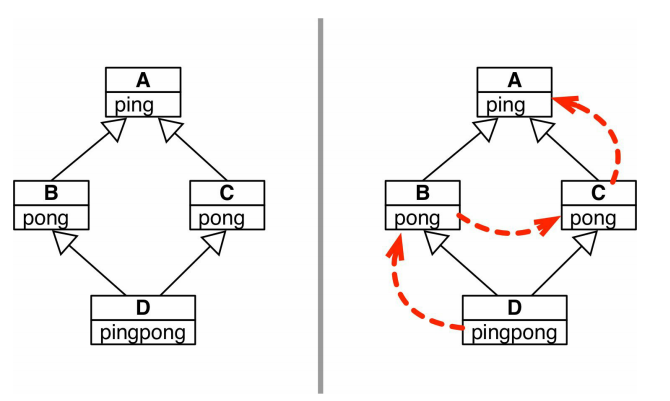

# 第十二章 继承的优缺点

## 1.子类化内置类型

​	内置类型如list、dict、str等是用C语言编写的，效率比较高，在自定义类继承内置类型时，内置类型的方法不会调用子类覆盖的方法。

```python
class DoppelDict(dict):
    def __setitem__(self, key, value):
        super().__setitem__(key, [value] * 2)
        

dd = DoppelDict(one = 1)  # 理论上来讲，__init__函数将会调用DoppelDict的__setitem__方法来初始化实例，但是实际上，__init__忽略了子类覆盖的方法，仍然调用的是dict的__setitem__方法，这是内置类型特有的现象
```

 	**但是，Python为我们提供了解决这个问题的方法**，即继承collections模块中用纯Python实现的UserDict、UserList、UserString等类

## 2.多重继承和方法解析顺序



`````python
class A:
    def ping(self):
        print('ping:', self)
        

class B(A):
    def pong(self):
        print('pong:', self)
        
 
class C(A):
    def pong(self):
        print('PONG:', self)
        
        
        
class D(B, C):
    def ping(self):
        super().ping()
        print('post-ping:', self)
        
    def pingpong(self):
        self.ping()  
        super().ping()
        self.pong()
        super().pong()
        C.pong(self)
`````

​	查看D的属性\_\_mro\_\_，可以发现为(<class 'diamond.D'>, <class 'diamond.B'>, <class 'diamond.C'>,

<class 'diamond.A'>, <class 'object'>)，当D的方法调用某一个方法时，它会按这个元组的顺序寻找

，如果调用的是super()的某一个方法，就是排除掉第一个即自身后向后寻找。如果不相按顺序搜寻，则按照C.pong(self)的方式调用，而且目前据我所知，在类外也没有通过D的实例直接调用C的pong方法的途径，也只能使用C.pong(D的实例) 。

## 3.继承时应注意的规则

### a.搞清继承是为了接口还是为了实现

​	当自定义类继承某个类时，通常有两个目的：一个是为了继承超类的接口，这中继承情况下，一般需要自己重写父类的接口方法，所以一般使用抽象基类作为超类;二是为了实现继承，即减少代码重复。

### b.混入类

​	一个类的作用是为了给一些不相关的子类提供方法实现，以实现代码重用，其本身并不像在描述一个对象，那么这个类被称为混入类，其不用于实例化。

​	**混入类的命名需要以Mixin**为后缀。

### c.具体类

​	具体类是可以用于实例化的类，它已经在描述一个对象。具体类可以没有或者至多有一个具体类作为超类。

### d.聚合类

​	当需要组合多个抽象基类和混合类时，可以提供一个类，将它们全部继承，但是这个类不要新增任何属性和方法。这样的类称为聚合类。