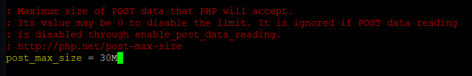
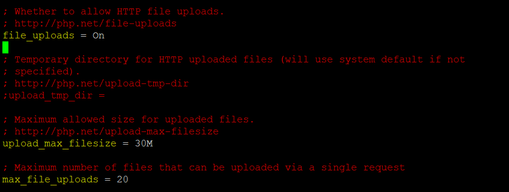

# 上传文件

## php.ini中关于文件上传的设置





## 文件上传的html表单

``````html
<!DOCTYPE html>
<html>
<head>
   <title>Upload a File</title>
</head>
<body>
  <h1>Upload a File</h1>
  <form action="upload.php" method="post" enctype="multipart/form-data">
  <input type="hidden" name="MAX_FILE_SIZE" value="1000000" />
  <label for="the_file">Upload a file:</label>
  <!-- name是前端传递到后端的参数名 -->
  <!-- <input type="file" name="the_files[]" id="the_file"/>
类似于这样可以用一个参数名上传多个文件，后端相当于接收到了一个数组，可以通过$_FILE['the_files']['name'][0]等形式处理-->
  <input type="file" name="the_file" id="the_file"/>
  <input type="submit" value="Upload File"/>
  </form>
</body>
</html>
``````

注意form只能使用post上传文件,还有enctype的属性值,此外还要注意input中的type='file'

## 处理上传文件的脚本

``````php
<!DOCTYPE html>
<html>
<head>
  <title>Uploading...</title>
</head>
<body>
   <h1>Uploading File...</h1>

<?php
  // $_FILE文件专用穿全局变量
  // $_FILE[文件名]['tmp_name']是文件临时保存目录
  // $_FILE[文件名]['name']是文件上传时的初始名
  // $_FILE[文件名]['size']是文件大小，以字节为单位
  // $_FILE[文件名]['type']是文件MIME类型
  // $_FILE[文件名]['error']是文件上传出现的错误，错误码有九种
  // 0表示没有错误，8表示PHP扩展停止文件上传
  if ($_FILES['the_file']['error'] > 0)
  {
    echo 'Problem: ';
    switch ($_FILES['the_file']['error'])
    {
      case 1:  
         echo 'File exceeded upload_max_filesize.';
         break;
      case 2:  
         echo 'File exceeded max_file_size.';
         break;
      case 3:  
         echo 'File only partially uploaded.';
         break;
      case 4:  
         echo 'No file uploaded.';
         break;
      case 6:  
         echo 'Cannot upload file: No temp directory specified.';
         break;
      case 7:  
         echo 'Upload failed: Cannot write to disk.';
         break;
    }
    exit;
  }

  // Does the file have the right MIME type?
  if ($_FILES['the_file']['type'] != 'image/png')
  {
    echo 'Problem: file is not a PNG image.';
    exit;
  }

  // put the file where we'd like it
  $uploaded_file = '/filesystem/path/to/uploads/'.$_FILES['the_file']['name'];
  // is_uuploaded_file验证目标是否通过POST上传；这个函数存在缓存，需要 clearstatcache() 清除缓存
  if (is_uploaded_file($_FILES['the_file']['tmp_name']))
  {
     // 只偶有目标文件是通过POST上传的，该函数才会移动文件
     if (!move_uploaded_file($_FILES['the_file']['tmp_name'], $uploaded_file))
     {
        echo 'Problem: Could not move file to destination directory.';
        exit;
     }
  }
  else
  {
    echo 'Problem: Possible file upload attack. Filename: ';
    echo $_FILES['the_file']['name'];
    exit;
  }

  echo 'File uploaded successfully.';

  // show what was uploaded
  echo '<p>You uploaded the following image:<br/>';
  echo '';
?>
</body>
</html>
``````

## 会话上传进度

可以在前端使用AJAX技术结合后端使用$_SESSION超全局变量，显示文件上传进度，特别注意，使用$\_SESSION变量也需要在php.ini中进行设置，此处不再多说。

## 避免常见上传问题

* 一般不允许未验证用户上传文件
* 要对上传的文件进行类型检查
* 文件无法上传时检查php.ini是都否进行相应的设置

# 目录函数

## 面向过程脚本示例

``````php+HTML
<!DOCTYPE html>
<html>
<head>
   <title>Browse Directories</title>
</head>
<body>
   <h1>Browsing</h1>

<?php
  $current_dir = '/path/to/uploads/';
  // 类似读取一个文件之前，要先打开该目录
  $dir = opendir($current_dir);

  echo '<p>Upload directory is '.$current_dir.'</p>';
  echo '<p>Directory Listing:</p><ul>';
  // readdir每次读取一个目录下的文件名
  while(false !== ($file = readdir($dir)))
  {
    //strip out the two entries of . and ..
    if($file != "." && $file != "..")
       {
         echo '<li>'.$file.'</li>';
       }
  }
  echo '</ul>';
  // 关闭读取目录
  closedir($dir);
?>

</body>
</html>
``````

## 面向对象的脚本示例

```````php+HTML
<!DOCTYPE html>
<html>
<head>
   <title>Browse Directories</title>
</head>
<body>
   <h1>Browsing</h1>

<?php
  //dir 函数创建了一个dir对象
  $dir = dir("/path/to/uploads/");
  // handle属性是处理的该目录的程序ID
  echo '<p>Handle is '.$dir->handle.'</p>';
  // path属性好理解
  echo '<p>Upload directory is '.$dir->path.'</p>';
  echo '<p>Directory Listing:</p><ul>';
  // read()方法则是和readdir相似
  while(false !== ($file = $dir->read()))
    //strip out the two entries of . and ..
    if($file != "." && $file != "..")
       {
         echo '<li>'.$file.'</li>';
       }
       
  echo '</ul>';
  // close和closedir相似
  $dir->close();
?>

</body>
</html>
```````

* 函数scandir(dir,[升序或者降序])可以将一个目录下的文件名以数组形式有序返回，第二个参数是排序类型
* 函数dirname(path)返回文件的目录部分
* 函数basename(path)返回文件的名称部分

## 创建和删除目录

* mkdir(path,0777)和umask(022)，创建目录的权限取决于这两个函数权限值的差。此外对于umask()函数，不传入参数将会使其返回当前umask权限，传入参数将会更改其权限并返回上一次的umask权限。
* rmdir(path)删除一个目录，要求目录为空

# 与文件系统的交互

## 脚本示例

``````php+HTML
<!DOCTYPE html>
<html>
<head>
  <title>File Details</title>
</head>
<body>
<?php
  
  if (!isset($_GET['file'])) 
  {
     echo "You have not specified a file name.";
  } 
  else {
     $uploads_dir = '/path/to/uploads/';
     $the_file = basename($_GET['file']);  // strip off directory information for security

     $safe_file = $uploads_dir.$the_file;

     echo '<h1>Details of File: '.$the_file.'</h1>';

     echo '<h2>File Data</h2>';
     echo 'File Last Accessed: '.date('j F Y H:i', fileatime($safe_file)).'<br/>';
     echo 'File Last Modified: '.date('j F Y H:i', filemtime($safe_file)).'<br/>';

     $user = posix_getpwuid(fileowner($safe_file));
     echo 'File Owner: '.$user['name'].'<br/>';
  
     $group = posix_getgrgid(filegroup($safe_file));
     echo 'File Group: '.$group['name'].'<br/>';

     echo 'File Permissions: '.decoct(fileperms($safe_file)).'<br/>';
     echo 'File Type: '.filetype($safe_file).'<br/>';
     echo 'File Size: '.filesize($safe_file).' bytes<br>';

     echo '<h2>File Tests</h2>';
     echo 'is_dir: '.(is_dir($safe_file)? 'true' : 'false').'<br/>';
     echo 'is_executable: '.(is_executable($safe_file)? 'true' : 'false').'<br/>';
     echo 'is_file: '.(is_file($safe_file)? 'true' : 'false').'<br/>';
     echo 'is_link: '.(is_link($safe_file)? 'true' : 'false').'<br/>';
     echo 'is_readable: '.(is_readable($safe_file)? 'true' : 'false').'<br/>';
     echo 'is_writable: '.(is_writable($safe_file)? 'true' : 'false').'<br/>';
  }
?>
</body>
</html>
``````

## 与UNIX中命令等价的文件修改函数

* chgrp(file,group)
* chmod(file,permissions)
* chown(file,user)

所有权限参数都是0开头

## 创建、删除和移动文件

* bool  touch(file,[int time[,]int atime])
* unlink(path)删除文件
* copy(源文件，目标文件)
* rename(源，目的)和mv命令一样既可以重命名又可以移动

## 程序执行函数

* string exec(string cmd[,array result[,int return_value]])该函数没有输出，默认返回命令执行结果最后一行，如果传入result则命令执行的每一行结果都会传入该参数,命令执行的返回代码将会传入return_value
* void passthru(string cmd[,int return_value])直接输出命令结果
* string system(string cmd[,int return_value])与passthru相似，唯一不同是还会额外返回命令执行是成功或是失败
* 反双引号

如果需要执行的命令要借助用户传入的参数，建议先使用escapeshellcmd(cmd)对字符串进行转义，转义一些shell命令的元字符。

## 与环境交互

getenv()函数和putenv()函数可以获取php环境变量，phpinfo()则可以查看环境变量