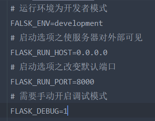

# 第一章 初识Flask

## 一.开始Flask前的准备

### 1.虚拟环境

先解决虚拟环境不在pycharm终端中生效的问题，在pycharm中使用一个虚拟环境创建项目之后，应该会有一个脚本自动运行将终端中的python设置为虚拟环境中的python（作用仅限当前的终端窗口），这在linux中很明显，但是windows中却常常不生效，这是因为windows中有一个脚本执行策略，默认禁止所有脚本的运行。我们以管理员身份进入PowerShell，执行get-executionpolicy可以看到默认策略是Restricted，这是禁止所有脚本运行，然后输入 Set-ExecutionPolicy RemoteSigned即可更改策略。更改策略后进入项目的Script目录，执行activate脚本即可切换。

但是虚拟环境切换成功后，cmd中的f虚拟环境仍然不能用，人麻了，但是powershell还可以用。

### 2.pipenv

pipenv的使用：

pipenv shell 虚拟环境shell

pipenv install 在当前目录下创建一个虚拟环境，使用pycharm可以忽略

pipenv run python py文件	在没有激活虚拟环境的情况下使用虚拟环境中的解释器运行文件

pipenv insatll watchdog --dev 将watchdog声明为开发者依赖


这为我们解决虚拟环境的问题提供了另一种解决方案。

### 3.Flask命令

#### a.常用

flask --help查看所有命令

以上命令等同于 python -m flask --he

#### b.自定义

````python
# 使用装饰器将函数注册为自定义命令
# 装饰器中可以传入一个字符串作为命令名称，不传入则默认为函数名
@app.cli.command()
def hello():
    click.echo('hello, Human!')
# flask hello
````

## 二.配置Flask

### 1.启动选项

启动选项举例：

服务器对外部可见	flask run --host=0.0.0.0

改变默认端口	flask run --port=8000

所有启动选项都可以通过设置环境变量完成，这些环境变量在项目下文件.flaskenv中



尤其注意其中的运行环境，有开发者模式和生产模式两种。

pycharm中的调试模式无法通过flask开启，必须修改pycharm的配置

配置文件除了.flaskenv以外，还有.env（在项目下）和.gitignore（在venv下），.env保存一些不能泄露的配置选项，例如一些账号密码之类的，而.flaskenv则是存放和flask相关的可公开变量。.gitignore则可以指定在上传git时，哪些文件被忽略。

### 2.运行环境

上面已经解释

### 3.内置配置

设置内置变量：

app.config['ADMIN_NAME']='Peter'

或者同时设置多个

app.config.update{

​		TESTING=True,

​		SECRET_KEY='123456'

}

读取：

value=app.config['ADMIN_NAME']

## 三.Flask的一些内容和部件

### 1.注册路由

将url规则与函数处理它的函数连接起来

多个url规则可以连接一个函数

url规则不仅仅可以是一个具体的url，也可以是动态的

url规则是相对路径，/为根目录

### 2.调试器

### 3.重载器

重载器可以使Flask对文件的修改实时做出反应，而无需重启Flask

这里下载更优秀的watchdog

### 4.URL与端点

端点即是URL对应的视图函数

前面说过了一个URL规则与一个视图函数相联系，如果我们在其他地方引用与某个函数联系的URl规则，如果直接引用这个URL规则，如果原来的URL修改了，这意味着每一处引用的URL都需要修改，这很麻烦。通常对于这样的问题，我们是定义一个变量，但是当URl规则过多时，每一个规则都定义一个变量也不方便，Flask中给我们提供了一个解决方法：

url_for('index':'视图函数名，以获取相应URL',name='lda':'动态URL规则中的变化部分',_external=False:'获取完整URL，默认不开启')->'返回URL规则'

### 5.flask shell

flask shell命令将会进入一个包含flask环境和app实例的控制台

### 6.模板和静态文件

static文件夹下存放静态资源

templates文件夹下存放模板文件

### 7.MVC架构

Flask不是严格地MVC架构，而Django是的
