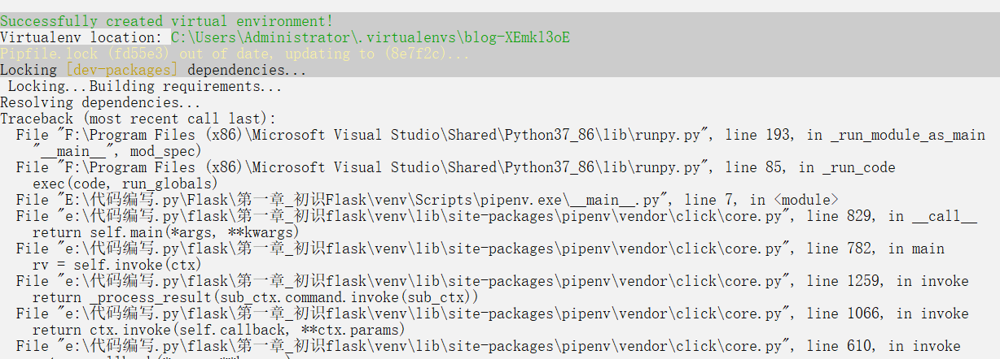
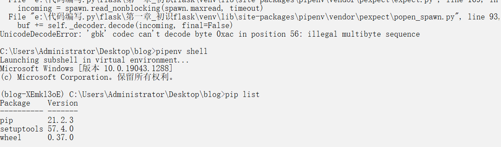

# 问题描述

​	在开发flask项目时，我clone了别人的源代码，准备在clone的项目下使用pipenv创立虚拟环境。但是在解决一些基本的问题后（例如pipenv需要添加环境变量才能使用），我遇到了两个比较棘手的问题：

1. pipenv创建虚拟环境的同时无法安装依赖包

创建虚拟环境成功



安装依赖包失败


2. 创建的虚拟环境不在当前目录下

# 问题的解决

1. 可以从异常提示信息看到，这是编码导致的问题，从网上查询到的解决办法是：

   在Python解释器目录的Lib下建立一个sitecustomize.py 文件，如果是python2，写入：

   `````python
   import sys
   sys.setdefaultencoding('gb2312') # 或者是utf-8
   # 我也不确定，因为我使用的时python3，网上查到的是第一种写法，但是根据报错信息我倾向于第二种
   `````

   如果是python3

   `````python
   import imp
   import sys
   imp.reload(sys)
   `````

2. 在windows下使用pipenv shell时，虚拟环境文件夹会在C：\Users\Administrator\.virtualenvs\目录下默认创建，为了方便管理，将这个虚环境的文件的位置更改一下。

   新建一个名为“ WORKON_HOME ”的环境变量（如果已存在就忽略此步骤），然后将环境变量的值设置为“ PIPENV_VENV_IN_PROJECT ” （其他名字也行？还试过）

   我觉得重点是在 WORKON_HOME 这个变量名。


