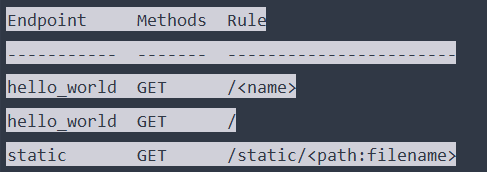

# 第二章 Flask与HTTP

## 一.Flask中的Request对象

flask中的request对象封装了请求对象从客户端发来的请求报文。

`````python
from flask import Flask, request

app = Flask(__name__)

@app.route('/hello')
def hello():
    name=request.args.get('name', 'Flask')
    return '<h1>Hello, %s!</h1>' % name
`````


### 1.request对象获取URL

假设URL是http://baidu..com/index?name=flask

| 属性      | 值                                  |
| --------- | ----------------------------------- |
| path      | 'index'                             |
| full_path | 'index?name=flask'                  |
| host      | ‘baidu.com’                         |
| host_url  | 'http://baidu.com/'                 |
| base_url  | 'http://baiducom/index'             |
| url       | 'http://baidu.com/index?name=flask' |
| url_root  | 'http://baidu.com/'                 |

### 2.request对象获取报文中的其他部分

| 属性或者方法 | 说明                                                         |
| ------------ | ------------------------------------------------------------ |
| args         | 存储解析后的查询字符串，可以通过键值对的方式访问，要获取未解析的原生查询字符串可以通过query_string访问 |
| blueprint    | 当前蓝本的名称                                               |
| cookies      | 包含所有cookies的字典                                        |
| endpoint     | 与当前请求匹配的端点值                                       |
| files        | 包含所有上传文件，可以用键值对的方式获取，键是上传文件的input标签的name值 |
| form         | 与files类似                                                  |
| values       | 结合了args和form                                             |
| get_data     |                                                              |
| get_json     |                                                              |
| headers      |                                                              |
| is_json      |                                                              |
| json         |                                                              |
| method       |                                                              |
| referer      |                                                              |
| scheme       |                                                              |
| user_agent   |                                                              |

files、form、args等是Werkzeug中的MuliDict或者ImmutableMultiDict类，这两个类是Dict的子类，他们可以通过键值对访问数据，如果没有对应的键不会报错而会返回HTTP 400错误，但是可以通过使用get方法来避免。

## 二.在Flask中处理请求

### 1.路由匹配

flask routes命令得到：



从左到右：端点	方法	路由

### 2.设置监听路由的HTTP方法

这里说的HTTP方法即是GET、POST等方法，一般只会在程序中设置GET、HEAD、OPITION等方法。DELETE、PUT等方法在构建Web API时才会使用。


设置方法：@app.route(路由,methods=['GET','POST'])

### 3.URL处理

这部分内容主要是转换器。

举个例子：

```````python
@app.route('/goback/<int:year>')
def go_back(year):
    return "welcome to %d" % (year)
```````

\<int:year\>就是转换器，这表示path的最后不分期待的是一个整形数，并将查询字符串中的字符串数转为int，强转出错则404，如果没有这个转换器，需要自己手动在视图函数中强转，一旦传入的字符串不是数字，则会报错，处理起来比较麻烦。

| 转换器 | 说明                       |      |
| ------ | -------------------------- | ---- |
| string | 不包含斜线的字符串（默认） |      |
| int    |                            |      |
| float  |                            |      |
| path   |                            |      |
| any    | 枚举型                     |      |
| uuid   | UUID字符串                 |      |

再举一个枚举型的🌰：

``````python
@app.route(''/colors/<any(blue,white,red):color')
def func(color):
           pass
``````


### 4.请求钩子

钩子是修饰器，可以将某个函数注册为钩子，这些钩子函数的功能就是在每次处理请求前或者处理请求后进行一些处理和操作。

| 钩子                 | 说明                                                     |
| -------------------- | -------------------------------------------------------- |
| before_first_request | 第一个请求前                                             |
| before_request       | 每一个请求前                                             |
| after_request        | 没有异常抛出时，在每个请求之后                           |
| teardown_request     | 在每个请求后抛出，如果存在异常，会将异常对象传入注册函数 |
| after_this_request   | 在视图函数内注册一个函数，会在这个请求结束后运行         |


常用场景：

* before_first_request:对程序的初始化，比如创建数据库、添加管理员用户。
* ：比如要记录网站中每个用户的上线时间，就可以在这里面完成
* 数据库的更新插入等操作

`````python
@app.route('/')
def index():
    @after_this_request
    def add_header(response):
        response.headers['X-Foo'] = 'Parachute'
        return response
    return 'Hello World!'
`````


## 三.HTTP响应

Flask中的响应对象使用Response表示，不过生成Response的方法有好几种。

### 1.返回Response

#### a.直接使用视图函数的return返回具体内容

`````python
@app.route('/hello')
def hello():
    '''省略'''
    return '', 302, {'Location':'http://www.example.com'}
`````

​	return返回的三个内容依次是报文主体、状态代码、报头，这三个部分最终会生成一个Response对象并且返回。

#### 4.先生成Response后再返回

`````python
@app.route（'/'）
def foo():
    response = make_response('Hello World!')
    response.mimetype = 'text/plain'
    return response
`````

make_response(‘报文主体’)，生成了一个Response对象。response.mimetype = 'text/plain'则是为返回的主体设置了类型（不用设置字符集），很显然这也可以通过return完成或者直接设置response.headers['Content-Type']='text/plain;charset=utf-8'.

这里简要介绍一下集中MIME类型：

* text/plain 纯文本
* text/html html
* application/xml xml
* application/json json

### 2.使用Flask中的API操作Response

* 重定向 return redirect(url_for(视图函数),code=302)
* 返回异常状态码   abort(异常代码) 这将直接返回异常界面
* 设置mine类型 response.mimetype='类型'
* 设置首部 response.headers['首部']=‘值’
* jsonify函数 jsonify是flask中对json函数封装的一个函数，我们仅需传入数据或者参数，他会对我们传入的参数进行序列化，并且设置正确地mime类型，return jsonify(字典或者键值对参数)

### 3.cookie

先介绍Response的常用属性和方法：

| 属性/方法    | 说明             |
| ------------ | ---------------- |
| headers      | 首部             |
| status       | 状态码的文本描述 |
| status_code  | 状态码，整形     |
| mimetype     | MIME类型         |
| set_cookie() | 设置cookie       |

#### a.传统cookie的设置

response.set_cookie('name','lda)

#### b.更安全的cookie设置session

* session会对数据进行签名加密：

三种秘钥设置方式：

* * 程序内设置：app.secret_key='secret string'或者SECRET_KEY='sercret string'
  * 配置文件中设置：在配置文件中加入SECRET_KEY=secret string
  * 设置系统环境变量

后两种方式获取时需要使用os.getenv('SECRET_KEY', 'secret string')


session和php中的session使用完全相同，可以向操作字典一样操作session：

sessionp['log_in']=True

session.pop('log_in')

session.get('log_in','guest')

<u>Flask中的session和php中的session一样也可以设置过期时间，具体方法不在此处记录。</u>

## 四.Flask上下文

### 1.上下文全局变量

举例说明：

在Flask中，我们引入了request，在每次请求发生时我们并没有实例化这个类，但是我们引用request时他确实被实例化，这是因为每一次请求发生时request的作为一个上下文变量被激活了，而且这个变量是全局的，我们无需传入视图函数就可以直接在其中使用它。


四个上下文变量：

| 变量名      | 上下文类别 | 说明                       |
| ----------- | ---------- | -------------------------- |
| current_app | 程序上下文 | 指向处理当前请求的程序实例 |
| g           | 程序上下文 | 代替Python全局变量的用法   |
| request     | 请求上下文 |                            |
| session     | 请求上下文 |                            |

对于g的说明：

``````python
from flask import g

# g一般都是在请求前设置
@app.before_request
def get_name():
    # 设置g.name之后，它就相当于一个全局变量了，可以直接在所有视图函数内使用
    g.name = request.args.get('name')
``````

g也支持类似于字典的操作，get、pop、setdefault等


所有上下文变量都是代理对象，他们只是指向真实的对象，一般情况下使用代理即可，不过他们都有_get_current_object方法可以获取被代理的真实对象

### 2.激活上下文

大多数情况下都是自动激活，也可以手动激活，这里不再多说。

### 3.上下文钩子

teardown_appcontext注册的钩子函数将会在程序上下文和请求上下文被销毁时调用，可以以用来断开数据库连接或者关闭文件等。

## 五.HTTP进阶实践

### 1.重定向回上一个界面

​	我们在实践中常遇到这样的例子，我们浏览一个网站的网页时，它需要我们登录，我们进入登录页面并登录之后，一般都是自动跳转回原页面。

#### a.通过http首部中的referer

``````python
@app.route('/bar')
def bar():  # put application's code here
    return f'<p>Hello bar!This is <a href="{url_for("do_something")}">do_something</a></p>'


@app.route('/foo')
def foo():
    return f'<p>Hello foo!This is <a href="{url_for("do_something")}">do_something</a></p>'


@app.route('/do_something')
def do_something():
    return redirect(request.referrer or url_for('foo'))
``````

​	这个方法有时候并不是很可靠，因为referer常常因为各种原因而为空。

#### b.查询参数

````python
@app.route('/bar')
def bar():  # put application's code here
    return f'<p>Hello bar!This is <a href="{url_for("do_something", next=request.full_path)}">do_something</a></p>'


@app.route('/foo')
def foo():
    return f'<p>Hello foo!This is <a href="{url_for("do_something", next=request.full_path)}">do_something</a></p>'


@app.route('/do_something')
def do_something():
    return redirect(request.args.get('next', url_for('foo')))
````


​	在跳转到do_somgthing时加上一个参数，do_something根据参数重定向；不过为了防止用户端修改这个参数为空，还要设置一个默认页面为。

#### c.综合以上两种方法

这是我写的一个return 返回

`````python
return redirect(request.args.get('next') or request.referrer or url_for('hello'))
`````

书上的例子：

`````python
def redirect_back(default='hello', **kwargs):
    for target in request.args.get('next'), request.referrer:
        if target:
            return redirect(target)
    return redirect(url_for(default, **kwargs))

@app.route('do_something_and_redirect')
def do_something():
    return redirect_back()
`````

### 2.对URL进行安全验证

​	如果一个网站内允许重定向到其它网站，这是危险的，会形成开放重定向漏洞。如果你是一个银行的用户已，攻击者构建了一个和这个银行的网站外观完全相同的网站，然后给你发一封邮件，邮件的网站确实是银行的网站，但是next函数则是指向攻击者伪造的网站，而且银行的网站允许重定向到其它网站，会造成你进入了攻击者的网站还不自知。所以验证URL的安全性很重要。

​	验证URl的关键在于验证URL是否属于程序内部，这是用到了urlparse库

`````python
from flask import Flask, redirect, url_for, request
from urllib.parse import urlparse, urljoin


# 接收目标url为目标
@app.route()
def is_safe_url(traget):
    # request.host_url获取程序内的主机URL
    ref_url = urlparse(request.host_url)
    # urljoin中第二个参数如果有残缺，用第一个参数中的补齐然后返回
    test_url = urlparse(urljoin(request.host_url, traget))
    return test_url.scheme in ('http', 'https') and ref_url.netloc == test_url.netloc

def redirect_back(default='hello', **kwargs):
    for target in request.args.get('next'), request.referrer:
        if not target:
            continue
        if is_safe_url(target):
            return redirect(target)
    return redirect(url_for(default, **kwargs))
`````


### 3.ajax

### 4.HTTP服务器推送

​	最常见的使用场景是一个公共聊天室，当一个用户发言之后，服务器要将这个用户的发言推送给所有用户。

常用推送技术：

| 名称               | 说明                                                         |
| ------------------ | ------------------------------------------------------------ |
| 传统轮询           | 在特定时间间隔内，客户端使用ajax技术像服务器端发起请求       |
| 长轮询             | 和上面类似                                                   |
| Server-Sent Events | 客户端通过HTML5的EventSource API实现，客户端监听，服务器端可以任意时刻发送请求 |

此外，HTML5的API中还包含一个WebSocket协议，这是一个基于TCP/IP的双全工协议

## 六.Web安全防范

​	我之前对各类的安全问题已经有过一些了解，所以这里只写一下在Flask中怎么针对各类安全问题进行防范。

### 1.SQL注入

* 使用ORM
* 验证输入类型，如果对传入参数的使用是int型，就使用转换器将其转为int
* 参数化查询，SQL查询时避免字符串拼接，使用format等方法构建，将数据和控制结构分开
* 使用各类库的API接口对数据库进行操作
* 转义特殊字符

### 2.XSS

### 3.CSRF

