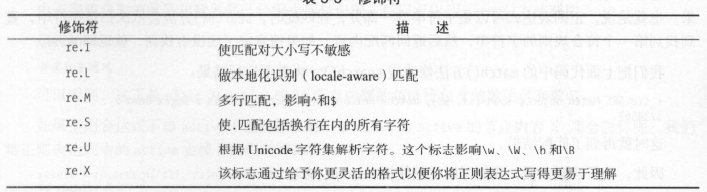

# re库

## 主要函数

### re.search()

`````python
re.search(pattern,string,flags = 0)
`````

返回第一个匹配的match对象

从任意位置开始匹配

flags:多个修饰符使用 | 连接

re.L:忽略大小写

re.M：^符号从每行开始匹配

re.S：.匹配除换行符外所有字符

### re.match

````python
re.match(pattern,string,flags=0)
````

返回match对象

从第一个字符串处开始匹配

### re.findall

``````python
re.findall(pattern,string,flags=0)
``````

搜索字符串，以列表返回全部匹配的字符串

### re.split

``````python
re.split(pattern,string,maxsplit=0,flags=0)
``````

将一个字符串以正则表达式匹配结果进行切割，返回列表类型

### re.finditer

`````python
re.finditer(pattern,string,flags=0)
`````

搜索字符串，返回一个匹配结果的迭代类型，每个迭代元素是match对象

### re.sup

`````python
re.sup(pattern,repl,string,count=0,flags=0)
`````

在一个字符串中替换所有匹配正则表达式，返回替换后的字符串，count为最大替换次数

## 注意事项

### 修饰符



### 字符串

传入函数的字符串是 r''形式，表示字符串内的\不为转义字符

### 预编译

正则表达式有两种使用方法：

* 一次使用：re.search(正则表达式,字符串)
* 一次编译，多次使用：re.compile(正则表达式)，返回正则表达式编译对象

`````python
pat = re.compile(正则表达式)
rst= pat.search(字符串)
`````

### Match对象

| 属性    | 说明                       |
| ------- | -------------------------- |
| .string | 待匹配的文本               |
| .re     | 匹配时使用的pattern对象    |
| .pos    | 从字符串的哪个位置开始匹配 |
| .endpos | 从字符串的哪个位置结束匹配 |


| 方法      | 说明                               |
| --------- | ---------------------------------- |
| .group(0) | 返回匹配后的字符串                 |
| .start()  | 匹配字符串在原始字符串中的开始位置 |
| .end()    | 匹配字符串在原始字符串中的结束位置 |
| .span()   | 返回(.start(),.end())              |


`````````python
import re
a = "123abc456"
print re.search("([0-9]*)([a-z]*)([0-9]*)",a).group(0)   #123abc456,返回整体
print re.search("([0-9]*)([a-z]*)([0-9]*)",a).group(1)   #123
print re.search("([0-9]*)([a-z]*)([0-9]*)",a).group(2)   #abc
print re.search("([0-9]*)([a-z]*)([0-9]*)",a).group(3)   #456
`````````

group(0)表示匹配的完整字符串，而1/2/3等表示匹配的第1/2/3个()内的内容

### 贪婪匹配

在使用职匹配一次的函数时，会存在一个贪婪匹配问题，python默认是贪婪匹配，要使用非贪婪匹配需要使用一些特殊的元字符，这些元字符貌似正则表达式原本并没有。

| 操作符 | 说明                                  |
| ------ | ------------------------------------- |
| *?     | 前一个字符0次或无限次扩展，最小匹配   |
| +?     | 前一个字符1次或无限次扩展，最小匹配   |
| ??     | 前一个字符0次或1次扩展，最小匹配      |
| {m,n}? | 扩展前一个字符m至n次（含n），最小匹配 |


`````python
import re
match = re.search(r'PY.*N','PYANBNCNDN')
match.group(0)
'PYANBNCNDN'
`````


`````python
import re
match = re.search(r'PY.*?N','PYANBNCNDN') #最小匹配
match.group(0)
'PYAN'
`````


