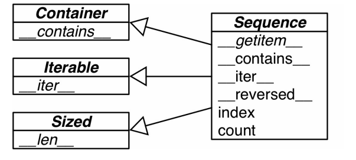
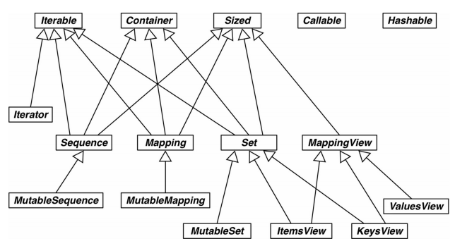
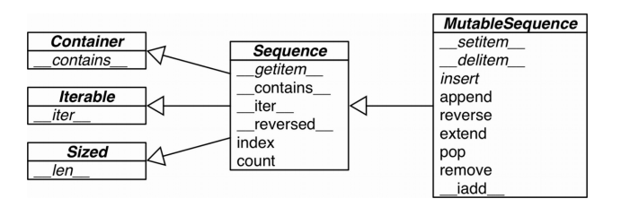
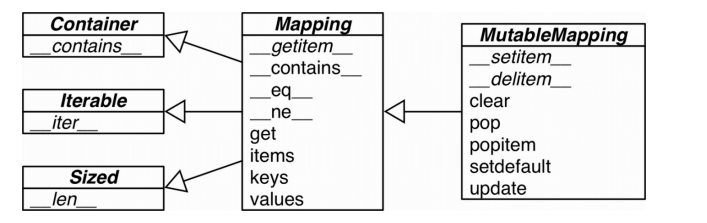

# 第十一章 接口：从协议到抽象基类

## 1. Python文化中的接口和协议

* 抽象基类很少使用，而且对于大多数程序员来说，不要试着去定义一个抽象基类
* 协议是非正式的接口，是让Python实现多态的方式
* 接口：对象公开方法的子集，让对象在系统中扮演特定的角色，例如我们常说的“可迭代对象”和“文件类对象”就是这个意思。接口是实现特定角色的方法集合，并不是某个特定的类。协议和继承没有关系，一个类肯能会实现多个协议，从而让实例扮演多个角色。


## 2. Python喜欢序列

​	Python数据模型的设计哲学是尽量支持基本协议，序列就是经常用到的基础协议。


抽象基类Sequence的三个接口：




​	但是正如我们在上一节说的那样，协议和继承没有关系，一个类型是否有某个接口不依赖于它的超类和是否继承于某个抽象基类。例如：

````python
class Foo:
    def __getitem__(self, pos):
        return range(0, 30, 10)[pos]  
````

​	这个类不是Sequence的子类，但是由于它实现了\_\_getitem\_\_()方法，它还是实现了序列协议，所以协议/接口的是否实现是依赖于类有没有实现某些特定方法。

​	此外要说明的是，Foo没有实现\_\_iter\_\_()方法和\_\_contains\_\_()方法，但是它仍然可以：i for i in Foo()和20 in Foo()    。即Foo仍是一种可迭代对象，因为存在一种后备机制，当Foo没有实现\_\_iter\_\_()时，Foo可以利用\_\_getitem\_\_()来尝试获取这个序列的所有值，完成迭代。


## 3.使用猴子补丁在运行时实现协议

​	第一章的FrenchDeck类中，我们没有实现洗牌的功能，要实现这个功能，我们一般会再定义一个方法去实现这个功能，但是我们了解了协议之后，可以不用去编写新的方法，转而更有效地利用一些内置的函数和方法。比如random.shuffle()，这个函数的功能是就地打乱序列，我们就可以使用这个函数来对FrenchDeck进行洗牌，但是我们在FrenchDeck中仅仅实现了\_\_getitem\_\_()，这只能让FrenchDeck满足不可变序列的接口，我们还需要定义\_\_setitem\_\_()来将FrenchDeck变为可变序列。

​	我们没有必要去重写FrenchDeck方法，基于动态语言的特性，我们可以在程序运行时完善我们自定义的类，其实就如同类的属性可以在定义类之后再添加一样，方法也可以。

`````python
def set_card(deck, position, card):
    deck._cards[position] = card
    
FrenchDeck.__setitem__ = set_card
`````


​	我们在新增方法的时候，方法的第一个参数不是self，但是我们要明确的是，方法本质上就是普通函数，在方法中把第一个参数命名为self只是一种约定，它的作用等同于C++中的this指针。

​	我们没有修改FrenchDeck类的源码，而是在随后运行的过程中给它增加了一些新的方法使得它具有某些协议和功能，我们把这种技术叫做**猴子补丁**。

## 4.定义抽象基类的子类

​	继承抽象基类时，必须要实现它所有的抽像方法，例如：

`````python
import collections

class FrenchDeck2(collections.MutableSequence):
    ranks = [str(n) for n in range(2, 11)] + list('JQKA')
    suits = 'spades diamonds clubs hearts'.split()
    
    def __init__(self):
        self._card = [Card(rank, suit) for suit in self.suits
                      for rank in self.ranks]  # Card对象为元素的列表

    def __len__(self):
        return len(self._card)

    def __getitem__(self, position):
        return self._card[position]
    
    # 下面三个抽象方法是必须要实现的
    def __setitem__(self, position, value):
        self._cards[position] = value
        
    def __delitem__(self, position):
        del self._card[positions]
        
    def insert(self, position, value):
        self._cards.insert(position, value)
`````

## 5.标准库中的抽象基类

### 1. collections.abc 模块中的抽象基类



#### Iterable Container Sized

​	各个集合应该继承这三个抽象基类，或者至少实现兼容的协议。Iterable通过\_\_iter\_\_实现可迭代，\_\_Container\_\_通过\_\_contains\_\_支持in运算符，Sized通过\_\_len\_\_方法支持len()函数。

#### Sequence Mapping Set

​	主要是不可变集合类型，都各自有可变类型子类。






#### MappingView

​	Python3中映射方法.items()、.keys()、.values()、返回的对象分别是ItemView、KeyView、ValuesView的实例，前两个类还从Set继承了丰富的接口，可以实现Set的几乎全部运算符（& | - ^)

#### Callable和Hashable

目前所知，这两个抽象基类仅用于isinstance判断对象是否可以调用或者是否散列。

### 2.抽象基类的数字塔

Number-->Complex-->Real-->Rational-->Integral

有一些类型不是继承于某些抽象基类，也没有实现相应的协议，但是它可以通过抽象基类注册的方式来让Python视它们为某些抽象基类的子类。

## 6.定义并使用一个抽象基类

​	因为自定义的抽象基类并不被提倡，所以我们先不讨论它的应用场景，仅仅讨论抽象基类和抽象方法的定义方法。

``````python
import

class Tombola(abc.ABC):
    """抽象基类必须继承abc.ABC"""
    
    @abc.abstractmethod
    def load(self, iterable):
        """从可迭代对象中添加元素"""
        
    @abc.abstractmethod
    def pick(self):
        """随机删除元素，然后将其返回"""
        """如果实例为空，这个方法应该抛出LookupError"""
        
    def loaded(self):
        """如果至少有一个元素，返回True，否则返回False"""
        return bool(self.inspect())
    
    def inspect(self):
        """返回一个有序元组，由当前元素组成"""
        items = []
        while True:
            try:
                items.append(self.pick())
            except LookupError:
                break
        self.load(items)
        return tuple(sorted(items))
``````

#### 抽象基类句法详解

* 定义虚拟方法时，可以叠加多个装饰器，且@abc.abstractmethod

	* 继承抽象基类的类必须实现抽象基类中没有实现的具体方法，否则定义该类时将会出错
	* 通过抽象基类注册的方式成为某些抽象基类的子类时，在定义该类时不会检查它是否实现了抽象方法
	* 注册的虚拟子类可以被isinstance和issubclass所识别

#### Tombola子类的测试方法

用到了两个方法：

> * \_\_subclasses\_\_(),这个方法直接返回类的直接子类列表，不包含虚拟子类(可以检测到程序自定义继承的类)
>
> * _abc_registry,只有抽象基类具有这个数据属性，其值是一个WeakSet对象，即抽象类注册的虚拟子类的弱引用。
> * 抽象基类.register(注册类)，来注册虚拟子类

## 7.鹅的行为有可能像鸭子

`````python
from collections import abc

class Struggle:
    def __len__(self): return 23
    
isinstance(Struggle(), abc.Sized)  # isinstance()第一个参数是实例
issubclass(Struggle, abc.Sized)  # issubclass()第一个参数是类型
`````

​	Struggle没有继承Sized，也没有注册为Sized的虚拟子类，但是也被判断为SIzed的虚拟子类。这是因为abc.Sized实现了一个特殊的类方法，名为\_\_subclasshook\_\_。

`````python
class Sized(metaclass=ABCMeta):
    
    __slots__ = ()
    
    @abstractmethod
    def __len__(self):
        return 0
    
    @classmethod
    def __subclasshook__(cls, C):
        if cls is Sized:
            if any("__len__" in B.__dict__ for B in C.__mro__):
                return True
        return NotImplemented
            
`````

