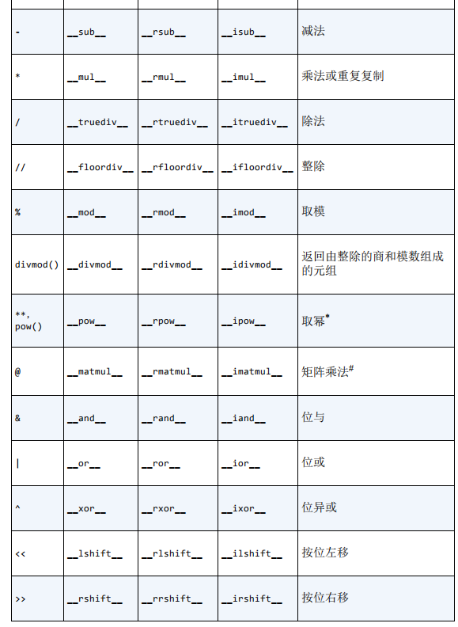
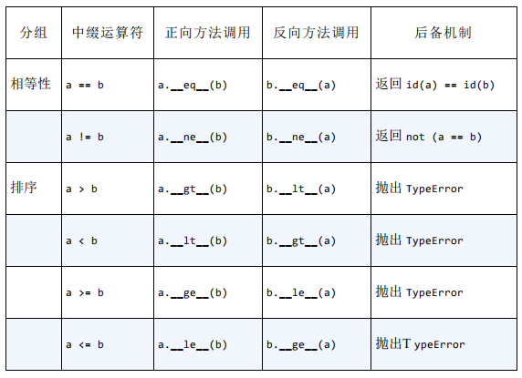

# 第十三章 运算符重载

## 1.运算符重载基础

* 不能重载内置类型的运算符
* 不能新建运算符，只能重载现有
* is、and、not、or不能重载

## 2.一元运算符

* -（\_\_neg__），取负
* +（\_\_pos__），x == +x 不一定成立
* ~（\_\_invert__），对整数按位取反：~x = -(x+1)
* abs(\_\_abs__)，取绝对值

注意：以上运算符只有一个参数self，而且始终会返回一个新对象而不修改原有对象。这也就解释了为什么x = +x不一定为真，因为+x实际上以老对象为参数返回了一个新对象，如果老对象在被创建之后有过改变，那么x = +x不成立就不奇怪了。

我们以第十章的<a href="./第十章 序列的修改、散列和切片.md#vector">Vector</a>类为基础，再重载一些运算符。

`````python
def __abs__(self):  # 在此处是取向量的长度
	return math.sqrt(x * x for x in self)
def __neg__(self):
    return Vector(-x for x in self)
def __pos__(self):
    return Vector(self)  # 创建新对象返回
`````

## 3.二元运算符加和乘

* +（\_\_add__和\_\_radd\_\_），对于任意的a + b，它的调用是这样一个过程：

> 1.a如果有\_\_add\_\_方法，且返回的不是NotImplemental，调用a.\_\_add\_\_(b)，返回结果
>
> 2.a没有\_\_add\_\_，或者返回NotImplemental，则查看b是否有\_\_radd\__，如果有就掉用b.\_\_radd__(a),返回结果
>
> 3.如果b没有\_\_radd__或者返回NotImplemental，则**抛出TypeError，并在错误消息中指明操作类型不明确**

首先明确Vector类的+操作要做到什么样，在这里我们希望它可以和所有序列相加。

`````python
def __add__(self，other):
	pairs = itertools.zip_longest(self, other, fillvalue=0)  # zip_longest是zip的加强版，可以设置一个补全参数
    return Vector(a + b for a, b in pairs)
def __radd__(self):
    return self + other  # 直接调用__add__
`````

​	显而易见，当other提供的是可迭代对象时，\_\_add__才能正确操作，否则将会抛出异常，且提供的异常信息也不是很有用，因为它没有遵循上面所说的过程。只有调用了radd之后还返回NotImplemental，才会返回一个标准的错误消息。

​	应该改为：

`````python
def __add__(self, other):
    try:
        pairs = itertools.zip_longest(self, other, fillvalue=0.0)
        return Vector(a + b for a, b in pairs)
    except:  # 此处用捕获异常而不是用isinstance判断，这是因为此处需要设置成所有序列类型都可用（遵循鸭子类型精神）
        return NotImplemented
def __radd__(self, other):
    return self + other  # 顺序不能反
`````

* \* （\_\_mul\_\_和\_\_rmul__），它们和+的调用是一个相似的过程。

明确我们的需求，当vector * x ,x是一个数字时，是计算标量积，x乘上vector的各个分量;当x同为一个向量时，是求点积（矩阵乘法），流行的做法并不是用\_\_mul__实现，nunpy中用的运算符是@,python3.5之后@作为求点积的运算符。

`````python
def __mul__(self, scalar):
    if isinstance(scalar, numbers.Real):  # 此处需要和Vector相乘的是数，故使用isinstance判断
        return Vector(n * scalar for n in self)
    else:
        return NotImplemented
    
def __rmul__(self, other):
    return self + scalar
`````

*******

其他一些：




​	pow(a,b,c)表示a ** b % c

## 3.比较运算符



比较运算符与上面的+和*机制差不多，但是有两点不同：

> 1.正向方法和反向方法调用的方法相同，只不过参数不同
>
> 2.==和!=存在与众不同的后备机制。

实现eq

`````python
def __eq__(self, other
    if isinstance(other, Vector):  # 保证other必须为Vector或其子类才能相等
        return (len(self) == len(other) and
                all(a == a for a, b in zip(self, ohter))	
        else:
                return NotImplemented
`````

ne不需要实现，它是借助eq实现的，而且所有类都可以从object继承它，它的运作方式类似如下代码：

```python
def __ne__(self, other):
    eq_result =  self == other  # 为NotImplemented说明==无法处理
    if eq_result is NotImplemented:  
        return NotImplemented
    else:
        return not eq_result
```

## 4.增量赋值运算符

+=、*=等运算符只有在类型是可变类型才有其独有的意义，特别注意的是，我们要模仿内置类型的实现方法，例如list：

````python
a = [1, 2]
b = (3, 4)
a += b  # 不报错和.extend()一样可以接受一个序列
a + b  # 会报错，+对另一个操作数的要求更严
````

