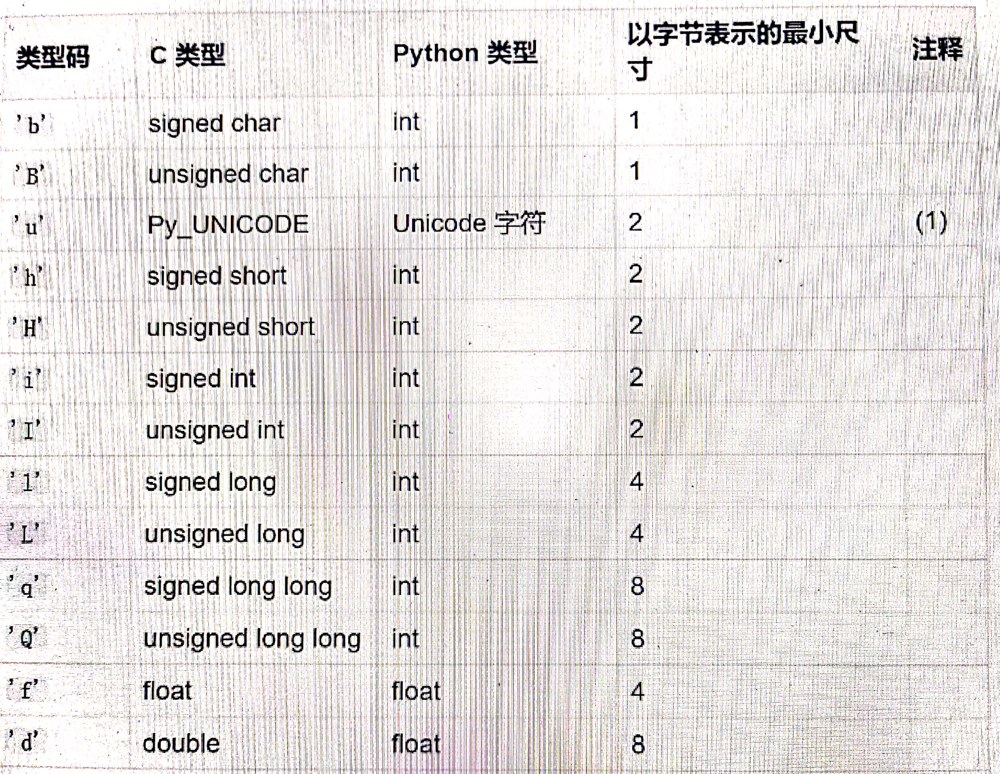
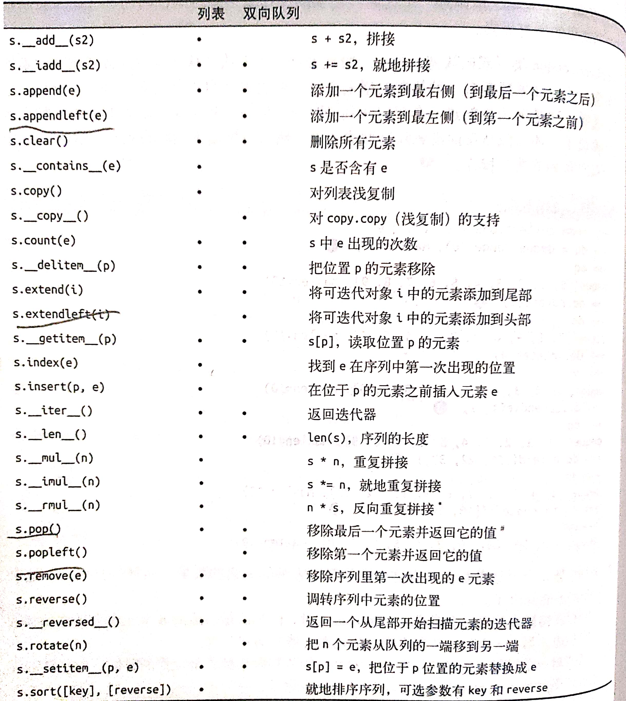

# 有些情况下，列表不应该成为我们的首选
## 1.存放大量浮点数或整形数时
* 事实上Python中的int类型和float类型是对象而不同于C/C++，sys.getsizeof(1)得到的结果并不是4而是28,
这是因为python中的int并不是一个简单的整型，而是一个结构体组成的整型对象，所以存放大量浮点型或者int类型数据时，使用列表将会有很大开销。

这个时候，我们使用数组（array）来代替列表，数组中的元素大小就和c/c++中相同了：
```python
from array import array
from random import random
floats = array('d', (random() for i in range(10 ** 7)))
"""
floats是一个有1000万个浮点数的数组，array中1第一个参数'd'是类型码，指定这个数组可存放的数据类型，
'd'为double
"""
```
列表与数组对比：

| 属性和方法 | 列表 | 数组 | 描述 |
|:----------:|:-------:|:-----:|:-----:|
|s.\_\_add__(b)|*|*|s+b|
|s.\_\_iadd__(b)|*|*|s+=b|
|s.\_\_contains__(b)|*|*|s是否包含b|
|s.\_\_delitem__(b)|*|*|del s[b]|
|s.\_\_getitem__(b)|*|*|s[b]|
|s.\_\_iter__()|*|*|获取s的迭代器|
|s.\_\_len__()|*|*|len(S)|
|s.\_\_mul__(b)|*|*|s*b|
|s.\_\_imul__(b)|*| |s*=b|
|s.\_\_rmul__(b)|*|*|b*s,反向拼接|
|s.\_\_reversed__()|*| |返回一个从s尾部开始的迭代器|
|s.\_\_setitem__(b,c)|*| |s[b]=c|
|s.append(b)|*|*|尾部添加新元素|
|s.clear()|*| |清空列表|
|s.copy()|*| |浅复制|
|s.count(b)|*|*|b在s中出现的次数|
|s.extend(b)|*|*|把可迭代对象b追加给s|
|s.index(b)|*|*|在s中找到b第一次出现的位置|
|s.insert(b,c)|*|*|在b位置前插入c，c的位置成为b|
|s.pop([b])|*|*|弹出最后一个元素或者b处的元素|
|s.remove(b)|*|*|删除第一次出现的b|
|s.reverse()|*|*|将列表倒序排列|
|s.sort([key],[reverse])|*| |就地对s中的元素进行排序，key和reverse为可选参数|


|以下是array的特有||
|:---:|:---:|
|s.\_\_copy__()|对copy.copy的支持|
|s.\_\_deepcopy__()|对copy.deepcopy的支持|
|s.frombytes(b)|将压缩成机器值的季节序列读出来添加到尾部|
|s.fromfile(b，n)|将二进制文件b中含有的机器值读出来添加到尾部，最多添加n项|
|s.fromlist(b)|将列表b中的元素添加到尾部，但要求列表中的所有元素都符合数组的要求，否则所有添加都会取消|
|s.itemsize|数组中每个元素的字节长度|
|s.tobytes()|把所有元素的机器值用bytes对象的形式返回|
|s.tofile(b)|把所有元素以机器值的形式写入一个文件|
|s.tolist()|把数组转换成列表，列表中的元素类型是数字对象|
|s.typecode|返回只有一个字符的字符串，代比啊数组元素砸在C语言中的类型|
<strong>需要注意的是，要给数组排序，需要使用sorted函数新建一个数组,例如：a = array.array(a.typecode, sorted(a))</strong>
<br>

<br>
### 关于内存视图
memoryview是一个内置类，它能直接操作一个数组的某些或某个内存单元。
举一个栗子：


```python
import array
numbers = array.array('h', [i for i in range(-2, 3)])
memv = memoryview(numbers)
len(memv)  # 结果为5
memv[0]  # 结果为-2
memv_oct = memv.cast('B')
memv_oct.tolist()  #结果为[254, 255, 255, 255, 0, 0, 1, 0, 2, 0]对应内存中从低到高
memv_oct[5] = 4
numbers  # 结果为array('h', [-2, -1, 1024, 1, 2])
```
## 2.双向队列
* 当需要一个元素可以频繁实现先进先出的序列时，可以使用双向队列
* collections.deque类是一个可以快速从亮度啊添加或者删除元素的数据类型
```python
from collections import deque
dp = deque(range(10), maxlen=10)  # 双向队列一经定义，其队列的长度将不可改变
dp.rotate(3)  # 将队列元素循环又移3位
dp.rotate(-3)  # 循环左移三位
dp.appendleft(-1)  # -1从队列左端进入，右端将会出一个元素
dp.append(-1) 
dp.extendleft([ i for i in range(3)])  # 将迭代器中的元素逐个添加到左边，右边相应数量的元素被挤出
dp.extend([i for i in range(3)])
```


