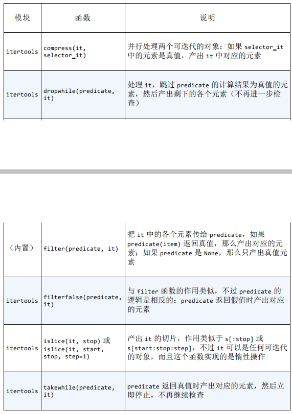
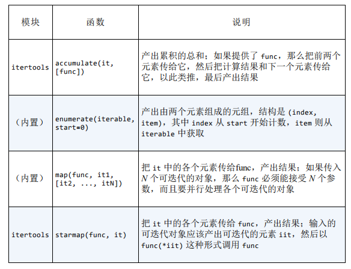
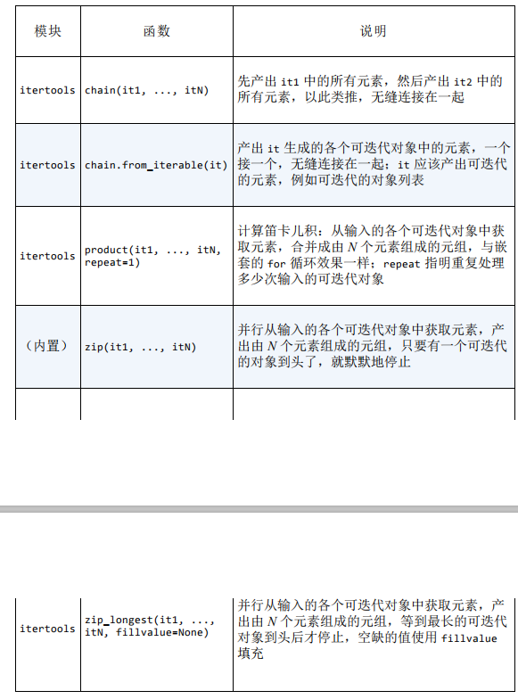
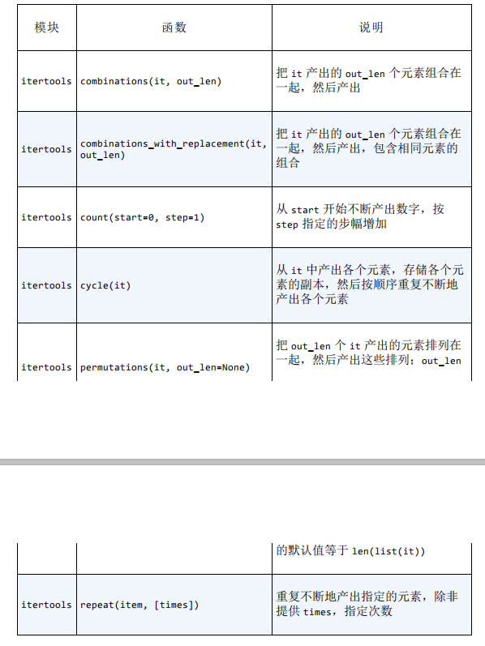
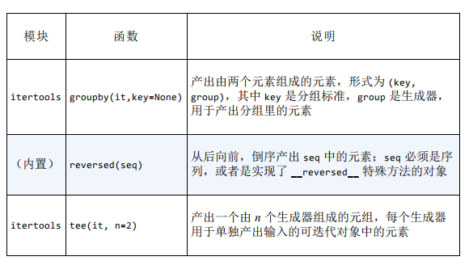

# 第十四章 可迭代对象、迭代器和生成器

## 1.可迭代对象、迭代器和生成器

### 可迭代对象

​	可迭代对象就是可以作为iter()参数的对象，当iter()作用于可迭代对象时，首先它会寻找这个对象是否有\_\_iter\_\_方法，如果有，则调用它，而且\_\_iter\_\_要求必须返回一个生成器;如果没有，如果对象是一个序列也可以利用\_\_getitem\_\_生成一个迭代器。

​	可迭代对象并不需要也最好不要实现\_\_next\_\_函数，因为可迭代对象的在被迭代时是必须生成一个迭代器的，此后对迭代器的操作就与可迭代对象本身无关了。

​	我们再来分析一下\_\_iter\_\_该如何定义，最麻烦的方式是返回一个自定义的迭代器，偷懒的方法就是利用已有类型，利用其生成迭代器。

### 迭代器	

​	通常，我们所说的迭代器都是继承于Iterator类的实例，Iterator类继承于Iterable：

`````python
class Iterator(Iterable):
	__slots__ = ()
	@abstractmethod
	def __next__(self):
	'Return the next item from the iterator. When exhausted, raise StopIteration'
		raise StopIteration
	def __iter__(self):
		return self
	@classmethod
	def __subclasshook__(cls, C):
		if cls is Iterator:
			if (any("__next__" in B.__dict__ for B in C.__mro__) and
				any("__iter__" in B.__dict__ for B in C.__mro__)):
				return True
		return NotImplemented
`````

​	我们来对这个迭代器的“老祖宗”进行分析，它和所有的迭代器能够成为迭代器的关键在于两点:

> 1.实现了\_\_iter__方法。我们知道\_\_iter\_\_方法是将一个对象否可迭代的关键,所以在此处就表示Iterator类本身就是可迭代的，而且返回的迭代器就是它本身。
>
> 2.实现了\_\_next\_\_方法，这个方法对于迭代器的重要性不言而喻，但此处的是抽象方法，这个类的子类需要自己实现自己的\_\_next\_\_方法。

​	此外Iterator还有一个至关重要的方法，就是\_\_subclasshook\_\_这个方法可以将所有实现了\_\_iter__方法的类都注册为自己的子类，而且可以通过isinstance的测试。

### 生成器

​	生成器现在完全可以和迭代器混用，不同的只是它的定义方式，生生器通常由生成器函数（以yield返回的函数，yield返回的是一个生成器对象）或者生成器表达式产生。我们在定义可迭代对象的\_\_iter\_\_时，可以将这个方法定义为生成器函数。

 **要善用生成器表达式，这样可以节省很多空间**。

## 2.标准库和itertools中的生成器函数



以上是用于过滤的生成器函数:

dropwhile是在第一个不为真处停止检查;而takewhile则与其相反。



以上是用于映射的生成器函数



以上是用于合并可迭代对象的生成器函数



以上是把输入元素扩展为多个输出元素的生成器函数



以上是用于重新排列元素的生成器。

## 3.yield from

`````python
def example(list):
    yield from list

def example2(list):
    for i in list:
        yield i
`````

## 4.iter()的另一个用法

iter(可调用对象，截至值),可调用对象要求没有参数，被调用时返回一个值，当这个值为截止值时，可调用对象则停止调用。iter()返回一个生成器。

## 5.精巧的例子

生成等差数列：

`````python
class Ari:
    
    def __init__(self, begin, step, end=None):
        self.begin=begin
        self.step=step
        self.end=end
        
    def __iter__(self):  # 迭代器和生成器在处理无穷序列时是列表无法相比的
        result=type(self.begin+self.step)(self.begin)
        forever=self.end is None
        index=0
        while forever or result<self.end
        	yield result
            index += 1
            result=self.begon+self.step*index
`````

使用itertools模块：

`````python
import itertools

def aritprog_gen(begin, step, end=None):
    first = type(begin+step)(begin)
    ap_gen=itertools.count(first, step)
    if end is not None:
        ap_gen=itertools.takewhile(lambda n:n<end,ap_gen)
    return ap_gen
`````

