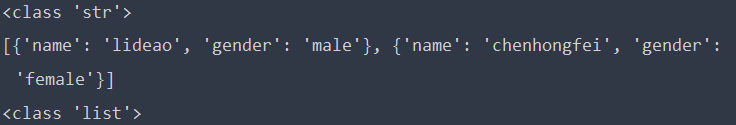

# 数据存储

## 一.文件存储

### 1.txt文件存储

### 2.JSON文件存储

​	JSON全称是JavaScript Object Notation也就JavaScript标记对象，它通过对象和数组的组合来表示数据。

#### a.对象和数组

​	JavaScript和Python一样，一切都是对象，例如字符串、数字、对象、数组等。对象和数组是常用的类型：

* 对象：在JavaScript中用{}括起来，数据结构与Python中的字典很相似，都是键值对，key代表属性，value为对应的值。
* 数组：

#### b.读取JSON

* 这是将JSON形式的字符串转换为JSON对象

`````python
import json

str1 = '''
[{
    "name":"lideao",
    "gender":"male"
},{
    "name":"chenhongfei",
    "gender":"female"
}]
'''

print(type(str1))
data = json.loads(str1)
print(data)
print(type(data))
`````



* 需要注意的是自己构造JSON形式的字符串时，字典内的字符串需要用双引号包围，不能使用单引号，字典也不能增加多余的逗号
* JSON型字符串转换为JSON对象之后实际上是列表内元素为字典，访问方式和通常一样

#### c.输出JSON

`````python
import json

data = [{
    'name':'李徳敖',
    'gender':'male',
    'birthday':'1992-10-18'
}]
# 文件输出的指定编码方式为utf-8
with open('data.json','w',encoding='utf-8') as file:
    # indent=2,表示缩进为2格;ensure_ascii=False
  file.write(json.dumps(data,indent=2,ensure_ascii=False))
`````

这里又是存在一个编码问题，json.dumps()的默认编码方式是ascii编码，如果json对象中含有中文，经过json.dumps()处理之后的字符串变为了：

[{"name": "\u674e\u5fb3\u6556", "gender": "male", "birthday": "1992-10-18"}]

注意，这里的\u674e背后不是代表 李 的ascii字符，而是实实在在的6个字符。因为Python是认识unicode字符的:

print('\u674e')的结果是 李，这样写入文件对于Python来说没有问题，但是为了兼容性，我们启用ensure_ascii=False，确保写入文件的不是\u674e六个字符，而是一个代表 李 的unicode编码。

Python文件输出的默认编码也不是unicode编码。

### 3.CSV文件存储

#### a.写入

CSV文件和txt差别不大，这里主要介绍一下一些相关模块和函数

以下虽然用到了一些csv专用的函数，但是要明白CSV文件的本质和txt是一样的，所以按通常的写入txt文件的方法也一样

``````python
import csv

with open('data.csv','w') as csvfile:
    writer = csv.writer(csvfile)
    # 将列表写入一行，格式是每个元素以逗号分隔
    write.writerow(['id','name','age'])
    # 二维列表，每个列表占一行
    wirte.writerow([['001','lda','21'],['002','chf','20']])
``````

类表格的形式写入（有表头）

``````python
import csv

with open('data.csv','w') as csvfile:
    fieldnames = ['id','name','age']
    # 定义表头
    writer = csv.DictWriter(csvfile,fieldnames=fieldnames)
    # 写入表头
    writer.writeheader()
    # 写入一行
    writer.writerow(['001','lda','21'])
``````

* 这里同样要注意写入中文的问题，open文件时需要制定utf-8编码

#### b.读取

```````python
import csv

with open('data.csv','r',encoding='utf-8') as csvfile:
    # 返回的是Reader对象，这是一个序列对象，每个元素是列表代表文件的每一行，
    reader = csv.reader(csvfile)
    for row in reader:
        print(row)
```````

