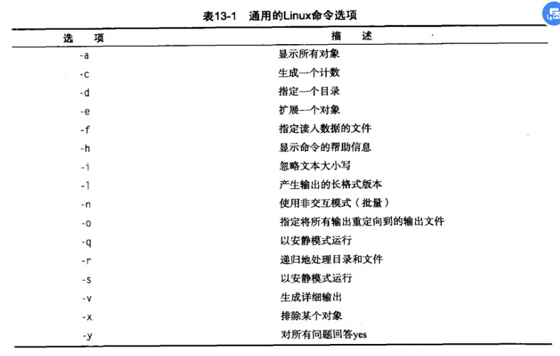

# Shell编程基础

## 一.基本概念

### 1.创建脚本和执行脚本

````shell
#!/bin/bash
# 第一行指明脚本所用shell

# -n表示不换行
echo -n "hello world" 
````

### 2.变量

* 可用系统的环境变量，变量名前加上$引用
* 可自定义用户变量，变量名区分大小写，可以是任意不超过20个字符的字母、数字、下换线及其组合
* <u>赋值时，括号两边不能出现空格</u>
* 单引号和双引号和PHP一样有着区别，很多时候，单引号可以省略
* 反引号可以将圈起命令的值输出给变量
* 有类似PHP中的复杂花括号语法，但是稍有不同

````shell
var=a;
a=b;
${!var};  # right
${$var};  # error
````


````shell
# 定义变量时，前面不加$
var1=1;
# 使用变量时前面加上$
echo $var1;
echo "$var1";
echo hello;
echo `date`;
var2=`date`;
echo $var2;
````

### 3.重定向输入输出

* 重定向输出，将命令结果输出到文件：ls > out.txt
* 重定向追加输出，ls >> out.txt
* 重定向输入，wc < out.txt
* 键入作为重定向输入,可以键入多行，但是必须设置一个开始和终止字符串

### 4.管道

* 管道符|，可以将一个命令的输出作为另一个命令的输入

### 5.进行数学运算

#### 使用$[]

* 只能处理整数运算
* 内部符号无需转义

#### 使用bc

bc可以识别

* 数字
* 变量
* 注释/**/
* 表达式
* 语句结构 if-then
* 函数

````shell
#!/bin/bash
expression='3.14/5';
scale='4';
# 注意这里的echo是必须的
calculate=`echo "scale=$scale;$expression"|bc`;
echo $calculate;
caculate=`bc << EOF
scale=$scale;
$expression;
EOF`;
echo $calculate;
````

### 6.脚本的退出状态码

* 通过$?查看上一个命令的退出状态码
* 运行成功是0，否则是一个正数值，不同的值可能代表不同含义
* 在脚本中通过exit设置退出状态码（0~255）

## 二.结构化命令

### 1.if分支结构

#### 结构

````shell
if judge
then
	command
elif judge
then 
	command
else
	command
fi
````

#### 判断

* 数值比较

````shell
# 空格很严格，判断符两侧和变量两侧都必须有空格
[ $var1 -eq $var2 ]
# -eq
# -ge 大于等于
# -gt 大于
# -le 小于等于
# -lt 小于
# -ne 不等于

# 可以比较整数，但是浮点数需要借助bc
[ 3 -gt 2 ]
[ `echo "3.14>2.14"|bc` -eq 1 ]
````

* 字符比较

```shell
[ 'a' = 'a' ]
# = != < > -n非0 -z为0
```

需要对< >进行转义

字符串比较也可以作为比较浮点数的方法

* 文件比较


#### 复合条件

* &&
* ||

#### 复杂数学表达式判断

````shell
# 使用双括号,内部符号无需转义
(( $var ** 2 > 90 ))
````


#### 复杂字符串比较

````shell
# 提供正则匹配
[[ $USER == r* ]]
````

### 2.case分支结构

````shell
#!/bin/bash
case $var in
hello | world)
	echo hello;
	echo world;;
testing)
	echo testing;;
*)
	echo '*';;
esac
````

### 3.for

`````shell
# 引号括起来的将被视为一个整体，其内部的分隔符将会被忽略
# 但在其外部，还是以空格为分隔符，引号并不能起到分隔的作用
# 下例中'hello world'i是一个整体
for test in 'hello world'i am learning
do
	echo $test;
done
`````

更改分隔符：

* 默认的分隔符是 空格 制表符 换行符
* 使用IFS更改

````shell
IFS.OLD=$IFS
# 多个分隔符
IFS=",\n:;"
IFS=$IFS.OLD
````

### 4.C语言风格的for

````shell
for(( i = 1; i <= 10; i++))
do
	command
done
````

* （（））内的变量没有通过$引用
* 变量赋值可以有空格
* 双括号内可以使用复杂数学表达式

### 5.while

````shell
while test command
do
	commands
done
````

* while后可以有多个命令，但是只有最后一个命令的返回状态码改变while的行为

````shell
while echo $var1
	# []内必须有严格的空格
	[ $var1 -ge 0 ]
do
	# $[]内部没有空格要求
	var1=$[$var1-1];
done
````

### 6.until

````shell
until echo $var 
[ $var -le 0 ]
do
var=$[ $var - 1 ];
done
````

### 7.break和continue

* break和continue后都可以加参数n，表示调出n层循环

### 8.整个循环输出重定向

````shell
for((a=1;a<10;a++))
do
	echo $a;
done > test.txt
````

## 三.处理用户输入

### 1.向脚本中传入参数

调用脚本时，可以在脚本后以空格分隔传入参数，与遍历类似的，可以使用引号忽略分隔符

#### 直接传入，直接处理

<u>在脚本中，$0代表脚本名，$1~9代表传入的9个参数，$#代表传入的参数个数。$*将传入点的所有参数作为一个整体，不能通过for遍历分隔；而$@将传入的参数当做一个列表；还可以使用一个shift命令，这个命令会让传入的参数列表左移一位，第一个参数将被挤掉并删除。</u>

例子：以--作为参数与选项的分隔，选项在前

````shell
#!/bin/bash
while [ -n "$1" ]
do
	case "$1" in
	-a) echo "Found the -a option";;
	-b) echo "Found the -b option";;
	-c) echo "Found the -c option";;
	--) shift;
		break;;
	*) echo "$1 is not an option";
	esac
	shift
done
# 后面是对参数的处理
````

例子：选项-b后可以跟参数

````shell
while [ -n "$1" ]
do
	case "$1" in 
	-a) echo "Found the -a option";;
	-b)  param=$2;
		 echo "Found the -b option and param=$param";
		 shift;;
	-c) echo "Found the -c option";;
	--) shift;
		break;;
	*)	echo "$1 is not an option";
	esac
	shift
done
````

#### 利用getopt处理

​	参数和选项的标准格式是形如：选项1 选项2 参数 选项3 -- 参数1 参数2 参数3

利用getopt命令，可以将不规则的参数输入转化为标准的参数输入

```shell
# set命令的 -- 可以将后面的参数列表设置为当前所在脚本的参数列表
# getopt -q表示对传入的非法参数不报错
# ab:c 表示有abc三个选项，而且，b选项带参数
set -- `getopt -q ab:c "$@"`
```

* 将getopt的参数用引号括起来可能将完全不符合我们的预期，慎用引号，getopt也无法处理包含空格的参数

#### 更好的getopts

``````shell
# getopts像python中的next一样，每一次向后产生一个选项，这个选项赋给opt
# 如果这个选项后有参数，可以通过$OPTARG获取
# 开头第一个:和getopt -q一样
# -- 将被忽略
# -- 后的参数留给用户处理
while getopts :ab:c opt
do
	case "$opt" in
	a) echo "Found the -a option";;
	b) echo "Found the -b option with the value $OPTARG";;
	c) echo "Found the -c option";;
	*) echo "Unknow option:$opt";;
	esac
done
# $OPTIND保存当前处理的参数的位置，结合shift可以移走已经处理的选项
#  getopts可以处理带空格的参数 
shift $[ $OPTIND -1 ];
``````

#### 选项含义的参照



### 2.标准输入

`````shell
# 一个参数可以接受带有空格的值
read -t 5 -p "please input yur name:" name;
# -t 5代表只会等待输入5秒
# -p 表示可以有提示语
# 后面可以跟多个参数
read -t 5 -p "please input yur name:" first last;
# -n1表示接收一个字符后立即结束
read -n1 -p "please input yes or no [Y/N]" answer;
# -s表示隐藏输入
read -s -p "Please input your password:" pass;
`````

### 3.从文件中读取

``````shell
# read每次读一行
# 读完后，read以非0状态码退出
# 注意，命令执行成功返回的是0，不成功才返回非0
# while是当命令执行成功时才进行循环
cat test | while read line
do
	echo $line;
done
``````


## 四.呈现数据

文件描述符：


STDIN默认是与标准输入绑定的，STDOUT和STDERR则是默认与标准输出绑定的，我们可以通过重定向改变文件描述符绑定的对象。

### 1.重定向输出文件描述符

#### 命令行中将STDOUT和STDERR输出到不同位置

````shell
# 当前麚只有test1，test1的信息正常显示,没有test2的错误消息将被重定向到error.txt
# 2>是一个整体，不可分割
# 1>也同理
ls -al test1 test2 2> error.txt

ls -al test1 test2 2>error.txt 1>right.txt

# 直接使用重定向符是将错误信息打印在屏幕上，正常信息重定向
ls -al test1 test2 >error.txt

# &>可以将所有输出全部重定向
ls -al test1 test2 &>error.txt
````

#### 将输出或输出与某一个文件描述符绑定

````shell
echo "This is an error" >&2;
read line <&2;
````

#### 在脚本中重定向所有输出

`````shell
exec 2>testerror

echo "1";

# 两个exec并不冲突
exec 1>testout

echo "2">&2;
# 这里的3是追加写，而不是覆盖（不严谨的说法：因为使用的同一个文件描述符对象）
echo "3";

# exec还可以设置不同文件修饰符之间的绑定
exec 2>&1
`````

### 2.重定向输入

````shell
exec 0< testfile

# read将尝试着从testfile读取而不是从键入读取
read line
````

### 3.自定义文件描述符

````shell
exec 3>testfile

echo "hello">&3;
````

### 4.恢复文件描述符原来的绑定

````shell
# 现将3与1绑定，相当于保存1
exec 3>&1
exec 1>output
# 将1恢复
exec 1>&3
````

### 5.对同一个文件输入输出

```shell
exec 3<> testfile
```

### 6.关闭文件描述符

一般来说，脚本结束后会自动关闭文件描述符，但是有时候需要提前关闭。

````shell
exec 3>testfile
echo "hello">&3
exec 3>&-
# 提前关闭后，再输出到testfile将会是覆盖而不是追加
exec 3>testfile
echo "world">&3
````

### 7.可以使用mktemp在/tmp下创建临时文件和临时目录方便文件描述符的使用

### 8.屏幕输出的同时记录日志

````shell
# tee可以使屏幕输出的同时将内容输出到testfile，-a表示追加写
date | tee -a testfile
````

