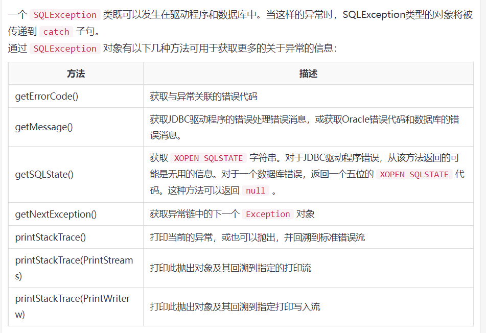

<u>本文所有例子都是以mysql为例</u>

## 一.使用步骤

<ol>
    <li>导入JDBC依赖包:import java.sql.*</li>
    <li>注册JDBC驱动程序:Class.forName("com.mysql.cj.jdbc.Driver")</li>
    <li>创建数据库连接对象:Connection conn = DriverManager.getConnection("jdbc:mysql://120.27.226.67:3306/security",USER,PASS)</li>
    <li>创建语句处理对象并执行<ol>
        <li>使用预处理<ul>
            <li>PreparedStatement preStmt = conn.prepareStatement("select group_concat(column_name) from information_schema.columns where table_schema=? and table_name=?"");</li>
            <li>preStmt.setXXX(要替换第几个?,替换内容)   XXX代表类型，例如String、Int等</li>
            <li>ResultSet rs=preStmt.executeXXX()  xxx根据sql语句的类型改变，查询语句为Query,返回值为ResultSet；update、insert、delete为Update,返回类型为int</li>
            </ul></li>
        <li>不使用预处理<ul>
            <li>Statement stmt = conn.createStatement()</li>
            <li>ResultSet rs =  stmt.executeXXX(SQL)</li>
            </ul></li>
        </ol></li>
    <li>获取从数据库返回的结果集:while(rs.next()){String name = rs.getXXX("name");}  可以通过字段名获取，也可以通过1、2、3等数作为字段顺序获取</li>
    <li>释放资源:rs.close();stmt.close();conn.close();</li>
</ol>

## 二.两个例子

````java
package com.test.JDBC;

import java.sql.*;

public class SecondTryJDBC {
    static final String JDBC_DRIVER = "com.mysql.cj.jdbc.Driver";
    static final String HOST = "jdbc:mysql://ip/数据库";
    static final String USER = "用户";
    static final String PASS = "密码";

    public static void main(String[] args) {
        Connection conn = null;
        Statement stmt = null;
        try {
            Class.forName(JDBC_DRIVER);

            System.out.println("Connecting to database...");
            conn = DriverManager.getConnection(HOST,USER,PASS);

            System.out.println("Creating statement...");
            stmt = conn.createStatement();
            String sqlInsert = "insert into users values(999,'aoaoao','123123');";
            int rs1 = stmt.executeUpdate(sqlInsert);

            String sqlSelect = "select id,username,password from users";
            ResultSet rs2 = stmt.executeQuery(sqlSelect);
            while(rs2.next()){
                System.out.print(rs2.getString(1)+" ");
                System.out.print(rs2.getString(2)+" ");
                System.out.println(rs2.getString(3)+" ");
            }

            String sqlUpdate  = "update users set password = 'aoaoao' where username = 'aoaoao'";
            int rs3 = stmt.executeUpdate(sqlUpdate);

            String sqlDelete = "delete from users where username = 'aoaoao'";
            int rs4 = stmt.executeUpdate(sqlDelete);


            rs2.close();
            stmt.close();;
            conn.close();
        } catch (ClassNotFoundException | SQLException e) {
            e.printStackTrace();
        }
    }
}

````

````java
package com.test.JDBC;

import java.io.BufferedReader;
import java.io.IOException;
import java.io.InputStreamReader;
import java.sql.*;
import java.util.Scanner;

public class FirstTryJDBC {
    static final String HOST = "jdbc:mysql://ip/数据库";
    static final String USER = "用户";
    static final String PASS = "密码";
    public static void main(String[] args){
        try {
            Class.forName("com.mysql.cj.jdbc.Driver");
            System.out.println("Connecting to database...");
            Connection conn = DriverManager.getConnection(HOST,USER,PASS);

            System.out.println("Creating statement...");
            Statement stmt = conn.createStatement();
            String selectDatabase;
            selectDatabase= "select database();";
            ResultSet rs1= stmt.executeQuery(selectDatabase);
            rs1.next();
            String databaseName = rs1.getString("database()");
            System.out.println("当前数据库名称:"+databaseName);


            String selectTablesName = "select group_concat(table_name) from information_schema.tables where table_schema=?";
            PreparedStatement preStmt1 = conn.prepareStatement(selectTablesName);
            preStmt1.setString(1, databaseName);
            ResultSet rs2 = preStmt1.executeQuery();
            rs2.next();
            String tablesName = rs2.getString("group_concat(table_name)");
            String[] tableName = tablesName.split(",");
            System.out.println("表名:");
            for(int i=0;i<tableName.length;i++){
                System.out.print(tableName[i]+" ");
            }
            System.out.println("");

            String targetTable;
            System.out.print("请输入你的目标列表:");
            Scanner br = new Scanner(System.in);
            targetTable=br.next();

            String selectColumnsName = "select group_concat(column_name) from information_schema.columns where table_schema=? and table_name=?";
            PreparedStatement preStmt2 = conn.prepareStatement(selectColumnsName);
            preStmt2.setString(1,databaseName.trim());
            preStmt2.setString(2, targetTable.trim());
            ResultSet rs3 = preStmt2.executeQuery();
            rs3.next();
            String[] cloumnName = rs3.getString("group_concat(column_name)").split(",");
            System.out.println("列名:");
            for(int i=0;i<cloumnName.length;i++){
                System.out.print(cloumnName[i]+" ");
            }
            System.out.println("");
            String targetColumn;
            System.out.print("请输入你的目标列:");
            Scanner scan = new Scanner(System.in);
            targetColumn=scan.next();
            String selectContent = "select group_concat("+ targetColumn +") from " + databaseName +"."+targetTable;
            System.out.println(selectContent);
            ResultSet rs4 =  stmt.executeQuery(selectContent);
            rs4.next();
            System.out.println(rs4.getString("group_concat("+ targetColumn +")"));

            rs1.close();
            rs2.close();
            rs3.close();
            rs4.close();
            stmt.close();;
            preStmt1.close();
            preStmt2.close();
            conn.close();
        } catch (ClassNotFoundException | SQLException e) {
            e.printStackTrace();
        }
    }
}

````

## 三.SQLException中的方法



````java
try {
   // Your risky code goes between these curly braces!!!
}
catch(Exception ex) {
   // Your exception handling code goes between these 
   // curly braces, similar to the exception clause 
   // in a PL/SQL block.
}
finally {
   // Your must-always-be-executed code goes between these 
   // curly braces. Like closing database connection.
}//原文出自【易百教程】，商业转载请联系作者获得授权，非商业请保留原文链接：https://www.yiibai.com/jdbc/jdbc_quick_guide.html
````

## 四.JDBC数据类型

下表列出了默认的JDBC数据类型与Java数据类型转换，当使用`PreparedStatement`或`CallableStatement`对象时可调用`setXXX()`方法或`ResultSet.updateXXX()`方法。

| SQL         | JDBC/Java            | setXXX        | updateXXX        |
| ----------- | -------------------- | ------------- | ---------------- |
| VARCHAR     | java.lang.String     | setString     | updateString     |
| CHAR        | java.lang.String     | setString     | updateString     |
| LONGVARCHAR | java.lang.String     | setString     | updateString     |
| BIT         | boolean              | setBoolean    | updateBoolean    |
| NUMERIC     | java.math.BigDecimal | setBigDecimal | updateBigDecimal |
| TINYINT     | byte                 | setByte       | updateByte       |
| SMALLINT    | short                | setShort      | updateShort      |
| INTEGER     | int                  | setInt        | updateInt        |
| BIGINT      | long                 | setLong       | updateLong       |
| REAL        | float                | setFloat      | updateFloat      |
| FLOAT       | float                | setFloat      | updateFloat      |
| DOUBLE      | double               | setDouble     | updateDouble     |
| VARBINARY   | byte[ ]              | setBytes      | updateBytes      |
| BINARY      | byte[ ]              | setBytes      | updateBytes      |
| DATE        | java.sql.Date        | setDate       | updateDate       |
| TIME        | java.sql.Time        | setTime       | updateTime       |
| TIMESTAMP   | java.sql.Timestamp   | setTimestamp  | updateTimestamp  |
| CLOB        | java.sql.Clob        | setClob       | updateClob       |
| BLOB        | java.sql.Blob        | setBlob       | updateBlob       |
| ARRAY       | java.sql.Array       | setARRAY      | updateARRAY      |
| REF         | java.sql.Ref         | SetRef        | updateRef        |
| STRUCT      | java.sql.Struct      | SetStruct     | updateStruct     |

在**JDBC3.0**中增强支持`BLOB`，`CLOB`，`ARRAY`，`REF`等数据类型。`ResultSet`对象可调用`UPDATEBLOB()`，`updateCLOB()`，`updateArray()`和`updateRef()`方法，使您可以在数据库服务器上直接操作相应的数据。

对于`setXXX()`和`updateXXX()`方法，可以转换成特定的Java类型到特定的JDBC数据类型。而使用`setObject()`和`updateObject()`方法，几乎所有的Java类型映射到JDBC数据类型。

`ResultSet`对象提供相应的`getXXX()`方法为每个数据类型来检索列值。每一种类型方法，可以使用与列名或由列的序号位置来获取列的数据。

| SQL         | JDBC/Java            | setXXX        | getXXX        |
| ----------- | -------------------- | ------------- | ------------- |
| VARCHAR     | java.lang.String     | setString     | getString     |
| CHAR        | java.lang.String     | setString     | getString     |
| LONGVARCHAR | java.lang.String     | setString     | getString     |
| BIT         | boolean              | setBoolean    | getBoolean    |
| NUMERIC     | java.math.BigDecimal | setBigDecimal | getBigDecimal |
| TINYINT     | byte                 | setByte       | getByte       |
| SMALLINT    | short                | setShort      | getShort      |
| INTEGER     | int                  | setInt        | getInt        |
| BIGINT      | long                 | setLong       | getLong       |
| REAL        | float                | setFloat      | getFloat      |
| FLOAT       | float                | setFloat      | getFloat      |
| DOUBLE      | double               | setDouble     | getDouble     |
| VARBINARY   | byte[ ]              | setBytes      | getBytes      |
| BINARY      | byte[ ]              | setBytes      | getBytes      |
| DATE        | java.sql.Date        | setDate       | getDate       |
| TIME        | java.sql.Time        | setTime       | getTime       |
| TIMESTAMP   | java.sql.Timestamp   | setTimestamp  | getTimestamp  |
| CLOB        | java.sql.Clob        | setClob       | getClob       |
| BLOB        | java.sql.Blob        | setBlob       | getBlob       |
| ARRAY       | java.sql.Array       | setARRAY      | getARRAY      |
| REF         | java.sql.Ref         | SetRef        | getRef        |
| STRUCT      | java.sql.Struct      | SetStruct     | getStruct     |

//原文出自【易百教程】，商业转载请联系作者获得授权，非商业转载请保留原文链接：https://www.yiibai.com/jdbc/jdbc_quick_guide.html 