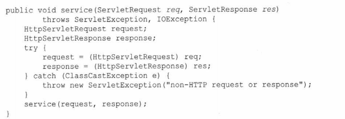
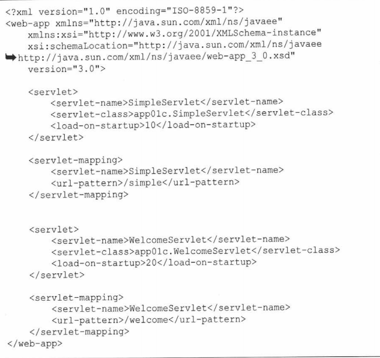

# 第一章 Servlet

## 一.Servlet API概述

### 1.四个主要的Java包

* javax.servlet：servlet和容器间的类和接口
* javax.servlet.http:http servlet和容器间的类和接口
* javax.servlet.annotation：
* javax.servlet.descriptor:包含为Web应用程序的配置信息提供编程式的访问

#### javax.serlvet

​	该包中的Servlet接口是Servlet技术的核心。Servlet中的方法相当于Servlet程序和Servlet容器之间的契约，Servlet程序对于请求的响应全部由Servlet接口中的方法实现。

注意：

* 继承于Servlet接口的类只有有一个实例

### 2.项目结构

* 项目
  * WEB-INF
    * classes
      * java包
        * .class文件	
    * 一些希望servlet访问而不希望用户访问的资源
  * 与WEB-INF平级的可以有JSP、HTML、图像文件或其他资源，建议将这些资源放于各自的文件夹下，这些资源用户均可以通过URl访问

## 二.Servlet

### 1.接口的方法

* void init(ServletConfig config) throws ServletException
* void service(ServletRequest reqeust,ServletResponse response) throws ServletException，java.io.IOException
* void destroy()
* java.lang.String getServletInfo()
* ServletConfig getServletConfig()

​	init、service和destory是Servlet程序的生命周期，init是第一次请求servlet时做初始化工作的方法，后续请求将不再调用；service每次请求都会调用，完成请求的主要工作；destory在销毁servlet时调用，通常在卸载应用和关闭servlet容器时调用

​	getServletInfo是返回servlet的有关描述，getServletConfig返回由Servlet容器传给init方法的ServletConfig

### 2.实现简单的servlet

```java
package com.demo1;

import javax.servlet.*;
import javax.servlet.annotation.*;
import java.io.IOException;
import java.io.PrintWriter;

// WebServlet注解类声明了一个Servlet应用
@WebServlet(name = "HelloServlet", value = "/HelloServlet")
public class HelloServlet implements Servlet {

    // transient使该成员变量不可序列化
    private transient ServletConfig servletConfig;

    @Override
    public void init(ServletConfig servletConfig) throws ServletException {
        this.servletConfig = servletConfig;
    }

    @Override
    public ServletConfig getServletConfig() {
        return servletConfig;
    }

    @Override
    public void service(ServletRequest servletRequest, ServletResponse servletResponse) throws ServletException, IOException {
        String servletName = servletConfig.getServletName();
        servletResponse.setContentType("text/html");
        PrintWriter write = servletResponse.getWriter();
        write.print("<html><head></head><body>Hello from "+servletName+"</body></html>");
    }

    @Override
    public String getServletInfo() {
        return "HelloServlet";
    }

    @Override
    public void destroy() {

    }
}
```

<u>源码一般不出现在servlet项目中</u>

### 3.将项目部署到Tomcat的简易方法

将应用打包为war文件，将其复制到Tomcat的webapps目录下即可

### 4.几个类的详解

#### ServletRequest

​	对于每一个HTTP请求，Servlet容器都会创建一个ServletRequest实例，将其传给service方法。

它的部分方法如下：

* public int getContextLength()返回请求主体的字节数或者-1
* public String getContentType()返回MIME类型或者null
* public String getProtocol()返回请求的协议名称和版本号
* public String getParameter(String name)返回请求参数的值或者null

#### ServletResponse

​	该类表示一个Servlet响应，在调用一个Servlet之前，Servlet容器会先创建一个ServletResponse，并将其传入service方法

* getWrite，返回一个PrintWrite对象，可向该对象中写入字符，通常这个字符就是HTML
* getOutputStream，和上述方法类似，但是用于传输二进制数据

#### ServletConfig

 ServletConfig的属性名和属性值都可通过@WebServlet或者部署描述符传入，他们常常是一些配置信息。

* getinitParameter(String name)
* Enumeration getInitParameterNames()
* ServletContext getServletContext()

```java
@WebServlet(name="appName",urlPatterns={"/path"},initParams={@WebInitParam(name="admin",value="hello"),@WebInitParam(name="user",value="world")})
```

#### ServletContext

​	ServletContext表示一个Servlet应用程序，每个Web应用程序只有一个context

#### GenericServlet

​	这个类和之前的HttpServlet类似，也继承于Servlet，它继承并重写了Servlet的所有抽象方法，让我们不必一定要重写Servlet的5个抽象方法，值得注意的是它的init函数的实现：

````java
 public void init(ServletConfig servletConfig) throws ServletException {
        this.servletConfig = servletConfig;
     	this.init()
    }
````

我们在重写GenericServlet的init时，需要重写的是它所提供的无参init函数，这样可以让this.servletConfig的初

不必我们亲自实现。

#### HttpServlet

​	这个类是能够处理 HTTP 请求的 servlet，它在原有 Servlet 接口上添加了一些与 HTTP 协议处理方法，继承于GenericServlet，它比 Servlet 接口的功能更为强大。因此开发人员在编写Servlet时，通常**应继承这个类，而避免直接去实现Servlet接口。**

​	这个类重写了父类的service方法，重写的方法中将会调用doGet、doPost、doHead等方法完成具体的功能。



可以看到重写的service将ServletRequest和ServletResponse向下转换为HttpServletReques和

HttpServletResponse

#### HttpServletRequest

​	继承于ServletReques，新增了几个方法

* String getContextPath()
* Cookie[] getCookies()
* String getHeader(String name)
* String getMethod()
* String getQueryString()
* HttpSession getSession()
* HttpSession getSession(boolean create)

#### HttpServletResponse

新增

* void addCookie(Cookie cookie)
* void addHeader(String name,String value)
* void sendredirect(String location) 重定向

## 三.处理用户表单

### 1.获取用户的表单参数的值

* String getParameter(String name)，获取的是对应name属性的输入框的值，这永远不会为null，即使发送的输入框为空，也是返回空字符串；如果获取的是复选框中的输入，选中的name获取“on”字符串，未选中的则是null
* String[] getParameterValues(String name)可以获取向\<select multiple\>这样的多选框中的多个值；当一个name对应多个输入时，getParameter只能获取最后一个，必须通过 getParameterValues获取全部参数值

## 四.使用部署描述符部署应用

例子：



​	这里解释一下load-on-startup，这个标签使Servlet程序在整个程序开始n秒后加载，而不是第一次调用Servlet时加载，这对于比较费时的init方法非常有帮助。

​	部署描述符就是WEB_INF目录下的web.xml文件，我们在Java代码中部署应用的方式是使用@WebServlet注解类，但是使用部署描述符有时候是比注解类更具有优越性，其一可以部署@WebServlet中没有的元素；其二，一些配置的修改无需重新编译Servlet类，如应用的路径和初始化参数等，可以直接在Web.xml中修改即可。

​	部署描述符的中的内容可以覆盖掉注解类中的内容。

