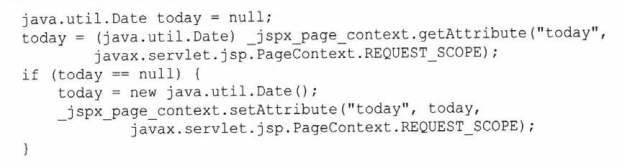

# 第三章 JSP

## 一.JSP概述

### 1.JSP简述

​	JSP可以的功能包括了模板引擎的功能，就是可以将用户界面与业务数据分开。但JSP相比于很多其他的Java模板引擎，它显比较“重量级”，因为JSP除了具有一个模板引擎所有的功能，它还能够完成许多Servlet才能完成的工作，有些简单的Web程序，仅需JSP就可以实现，但在不符合MVC的设计理念，所以JSP还是常用作一个模板引擎，但他作为一个模板引擎劣势相较于其他轻量级的模板引擎又较为明显，故现在使用较少。综合看来，JSP类似于PHP此类语言的功能。

JSP API一共有四个包：

* javax.servlet.jsp 包含将jsp页面转换为Servlet的核心接口和类
* javax.servlet.jsp.tagext
* javax.ell
* javax.servlet.jsp.el

### 2.JSP和Servlet结合的优点	

Servlet的两个问题：

* HTML直接通过Java字符串硬编码，这样一来，即使是表示层做极小的改动，程序也需要重新编译
* 在Java代码中写HTML十分繁琐

引入JSP的优点可以极大改善Servlet上面的两个缺点（前者在我使用idea时是感受不到的，这是IDE部署项目的问题），而且JSP页面无需注册。

### 3.JSP的工作过程

 当请求一个JSP页面时，Servlet/JSP容器要做两件事情：

* 将JSP页面转换为一个JSP页面实现类，javax.servlet.jsp.JspPage或其子接口javax.setvlet.jsp.HttpjspPage。JspPage是Servlet的子接口，这样使每个JSP页面都成为了一个Servlet
* 如果一个JSP页面转换成功，它将会被编译为Servlet类，之后和Servlet一样被使用

​	JSP页面会在修改后自动编译和执行，无需程序员手动操作。由于第一次JSP页面需要编译和转换，所以第一次调用JSP页面的时间往往比后续请求时间更长，对于这个问题，可以：

* 配置程序，使所有JSP页面在程序启动时全部调用
* 预先编译JSP，将其以Servlet的形式进行部署

## 二.JSP的一些组成要素

``````jsp
<%@page import="java.util.Data"%>
<%@page import="java.text.DataFormat"%>
<html>
    <head>
        <title>title</title>
    </head>
    <body>
        <%
        	DateFormat dateFormat = DateFormat.getDateInstance(DateFormat.LONG);
        String s = dateFormat.format(new Date());
        out.println("Today is "+s);
        %>
    </body>
</html>
``````


### 1.在JSP中嵌套Java代码--Scriptlet

​	如上面的例子中，<%%>中可以嵌套java代码

### 2.注释

​	JSP的注释是<%-- --%>注意它与HTML注释的区别。

### 3.隐式对象

​	Servlet程序少不了HttpServletRequest等类，JSP当然也有方法调用他们，即通过隐式对象调用。

隐式对象：

| 对象        | 类型                |
| ----------- | ------------------- |
| request     | HttpServletRequest  |
| response    | HttpServletResponse |
| out         | JspWriter           |
| session     | HttpSession         |
| application | ServletContext      |
| config      | ServletConfig       |
| pageContext | PageContext         |
| page        | HttpJspPage         |
| exception   | Throwable           |

使用方法:

​	直接使用即可

````jsp
<% String name = request.getParameter("name")%>
````

​	需要注意的是pageContext对象，这个对象是页面的context，我理解的就是代表当前页面对象，它有一些方法getRequest、getResponse等，这些方法在Scriptlet中作用不大，因为获取的对象通过隐式对象可以调用。PageContext还有两个重要方法是getAttribute和setAttribute，这两个方法可以在page、request、session、application中存取属性。

````jsp
<% pageCOntext.setAttribute("product",product,PageContext.REQUEST_SCOPE);
// 等同于
request.setAttribute("product",product);%>
````

​	还需要说明的是out对象，它相当于HttpServletResponse.getWrite()后得到的PrintWrite对象

`````jsp
<% out.println("hello") %>
`````

关于四个域对象：[JavaWeb四大域对象 - 简书 (jianshu.com)](https://www.jianshu.com/p/6c02951267d8)

<u>application代表的ServletContext一个web应用程序才有一个，为所有servlet共享，可以实现在不同servlet中传输数据。</u>

## 三.JSP句法元素

### 1.指令

​	指令指示JSP转换器如何将某个JSP页面转换成Servlet命令，有：

* page 重要
* include 重要
* taglib
* tag
* attribute
* variable

#### page指令

​	page指令可以就当前JSP页面的某些方面对JSP转换器提出指令。

语法：

​	<%@page attribute1="value1" attribute2="value2" ... %>

属性列表：

| 属性                     | 作用                                                         |
| ------------------------ | ------------------------------------------------------------ |
| import                   | 导入一种或多种java类型，多种类型间用逗号分隔；lang、servlet、servlet.http、servlet.jsp默认导入 |
| session                  | 默认值为true，表示当前界面会创建一个session参与session管理   |
| buffer                   | 指定out对象缓冲区大小，以KB为单位，默认为8KB以上，none表示不使用缓存 |
| autoFlush                | 默认为true，表示缓冲区满时自动flush，false表示必须response.flush，缓冲区满则抛出异常 |
| info                     | 指定getServletInfo的返回值                                   |
| errorPage                | 指向另一个页面，当该页面出错时，使用指向的页面作为响应       |
| isErrorPage              | 表明该页面是否是错误处理页面页面                             |
| language                 | 表明页面所用的脚本语言，默认为java                           |
| extends                  | 指定JSP的实现类必须扩展的超类，很少使用                      |
| trimDirectiveWhiteSpaces | 默认为false，表明不删除只包含空白字符的模板文本              |
| contentType              | 指定response的MIME类型                                       |
| pageEncoding             | 指定页面的字符编码，默认为ISO-8859-1                         |
| isELIgnored              | 表示是否忽略EL表达式                                         |
|                          |                                                              |

​	

注意：

contectType和pageEncoding都可以设置页面的编码，但是他们要一致，只在html文档中设置\<meta\>是无效的，设置contectType和pageEncoding之后甚至可以不需要设置\<meta\>，因为浏览器可以根据contentType解码

#### include指令

​	使用include指令可以将另一个文件包含到当前JSP页面，语法：

​	<%@include file="url"%> url是文件路径，以/开头是绝对路径，不以/开头是相对路径。

### 2.脚本元素

#### Scriptlet

​	前面已经介绍

#### 表达式

​	<%= %>可以直接嵌套在HTML中

````jsp\
<p>2+3=<%=2+3%></p>
````

#### 声明

<%! %>可以在其其中声明我们要使用的函数和变量，在声明init和destroy方法时，声明的函数要为jspInit和jspDestroy，jspInit就相当于HttpServlet中的init()

#### 声明和Scriptlet的区别

​	要始终记住JSP就是servlet，它会编译成servlet之后执行，而声明中的内容在编译后成为了servlet类的成员变量或成员方法，而Scriptlet中的变量和语句则是成为了servlet类的_service方法内部变量和语句。

#### 关闭脚本元素

​	JSP更建议作为模板引擎，通过EL访问服务器端对象，而不是脚本语言，所以通常关闭脚本元素，不在JSP页面中编写java代码。关闭的方法是在部署描述符中添加：

`````xml
<jsp-config>
	<jsp-property-group>
        <url-pattern>*.jsp</url-pattern>
        <scripting-invalid>true</scripting-invalid>
    </jsp-property-group>
</jsp-config>
`````

​	这将禁止使用声明、Scriptlet和表达式

### 3.动作

​	在关闭脚本元素后动作代替Scriptlet。动作可以实现表现逻辑和业务逻辑分离，它将会被编译成执行某个操作的Java代码，它以标签的形式而不是脚本的形式完成java代码的功能。

#### 补充：JavaBean

​	首先JavaBean指的是Java中符合一种规范的class，这个规范我在不同的地方看到了许多不同的定义，但是两点一定要满足：

* 私有的property
* 通过一系列的共有的get和set方法访问私有的property

可能需要满足的条件：

* 实现了Serializable接口
* 具有一个无参构造函数

#### useBean

目前使用较少，它的功能被EL和定制标签代替。

`````jsp
<html>
<head>
  <title>Title</title>
</head>
<body>
<jsp:useBean id="today" class="java.util.Date"/>
<%-- 创建了一个名为today，类型为Date的脚本变量 --%>
<%=today%>
</body>
</html>
`````

以下是它编译后产生的java代码：



useBean声明的变量在_jspService中，但注意<u>脚本变量</u>和<%! %>还有<% %>中变量的区别。

​	对象的property必须有相应的set和get方法，须符合JavaBean的规范。

#### setProperty和getProperty

设置一个对象的属性值和获取一个对象的属性值。

`````java
<html>
<head>
  <title>Title</title>
</head>
<body>
<jsp:useBean id="today" class="自定义包.自定义类"/>
<jsp:setPropetry name="today" property="date" value="23th"/>
date:<jsp:getPropetry name="employee" property="date">
<%-- 获取和设置的属性当然一定要是对象所具有的 --%>
</body>
</html>
`````

​	对象的property必须有相应的set和get方法，须符合JavaBean的规范

#### include

``````jsp
<html>
<head>
  <title>Title</title>
</head>
<body>
<jsp:include page="jspf/menu.jsp">
    <%-- 可以携带参数 --%>
	<jsp:param name="text" value="How are you?"/>    
</jsp:include>
</body>
</html>
``````


​	include动作用于动态地包含另一个资源，它可以包含另一个JSP页面、一个Servlet或者一个静态HTML。

​	我们需要区分include指令和include动作。include指令发挥作用的时间是在JSP1文件转换为servlet之前，在这之前include指令将另一个JSP2文件的内容原封不动的插入到include指令的位置，然后再将整个JSP1文件进行转换编译，但这会带来一个问题，如果JSP2内容修改了，但JSP1的代码没有变化，我们访问JSP1时仍然访问的是之前编译的Servlet。而include动作，在JSP1编译后，变现为一个include方法，这个include方法获取另一个JSP或者servlet的输出（只能获取输出，次级JSP页面中改变Servlet结构的部分毫无作用，简单来说，就是获取了另一个JSP页面print的结果），这个动作可以解决include指令的问题，但它却没有include指令强大。

​	所以我们在使用时，对于include动作能够完成的就是要include动作，不能完成的再使用include指令。

#### forward

​	forward动作是将当前页面跳转到另一个不同资源。

`````jsp
<jsp:forward page="jspf/login.jsp">
	<jsp:param name="text" value="Please login"/>
</jsp:forward>
`````

