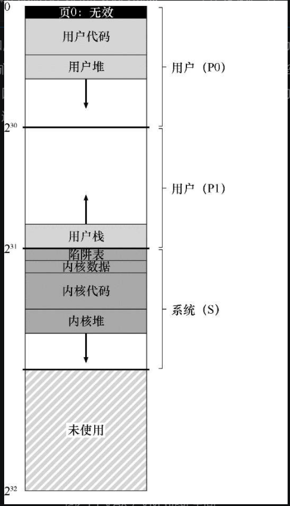

# 内存管理硬件

参数：

32位虚拟地址空间，512字节的页

即虚拟地址由23位的VPN和9位的偏移组成，VPN的高两位用于区分分页所在的段


进程空间的组成：



前半部分（P0+P1）(进程空间)：p1:用户程序+向下增长的堆	p2:向上增长的栈

后半部分（系统空间）：受保护的操作系统代码和数据

系统空间中还贮存着受保护的操作系统代码和数据，操作系统以此方式实现跨进程共享


细节：

512的页是比较大的，用于确保较小的页表；

进程空间分为了两部分（P0，P1），而不是代码、堆、栈三部分；

P0和P1各提供了一个页表，无需分配栈和堆之间未使用的地址空间，它们同样需要基址寄存器（分段页表的地址）和界限寄存器。


内核虚拟内存中存放用户页表（每个进程2个），操作系统进一步降低了内存压力（使用操作系统的进程也虚拟内存），内核的虚拟内存如果受到严重压力，内核可以将这些页表的页面交换到磁盘。


页表存放于内核的虚拟内存也意味着地址转换更加复杂，找到页表时也需要一次虚拟地址到硬件地址的映射（此时TLB的效果更加明显）。


# 真实的地址空间


补充，空指针访问导致段错误：

`````c
int *p = NULL;  // set p=0
*p=10;
`````

首先，硬件试图在TLB中查找VPN（0），未命中，查询页表，发现VPN 0的条目被标记为无效。


因为所有进程的分配的虚拟内存空间大小相同，这意味着受保护的操作系统代码和数据在每个进程中的虚拟地址都是相同的，这也就意味着切换进程时我们只需要更改p1和p2的基址寄存器和界限寄存器，而不需要更改指向受保护的操作系统代码和数据的基址寄存器和界限寄存器


在每个进程中放入操作系统代码会使进程与操作系统的通信更加方便，但要注意对操作系统代码的保护。

# 页替换

VAX中的页表项（PTE）包含以下为：一个有效位，一个保护位字段(4位)，一个脏位,位OS使用保留的字段（5位），最后一个是物理帧号码（PFN），但是没有引用位。


没有引用位，在换出页时如何确定哪些页是活跃的。这个时候不采用LRU，而采用分段的FIFO替换策略：每个进程都有一个可以保存在内存中的最大页数，成为主流级大小RSS（Resident Set Rize），内个页都保存在FIFO列表中，当一个进程超过RSS时，其先入的页被驱逐。对于脏页的处理:在页被驱逐出队列时，并不是马上被换到外存中，而是先按脏页和干净页分类，各放入一个干净列表和脏页列表的末尾，内存空间不足必须要换出页时，先换出干净列表中的页再换出脏页列表中的页。


脏页换入外存的进一步优化——聚集：VMS江大批量的也从脏页列表中分组到一起，并将它们一起写入外存。

# 其他虚拟内存技巧

页的按需置零（VMS和大多数现代操作系统）：

当一个地址空间申请一个页时，处于多方面的考虑，需要将这个页置零后再交给地址空间，但是这样做的代价是昂贵的，特别是在这个页交给地址空间后却不被使用的时候。利用按需置零，当页添加到页表中时，增加一个不可访问的条目，当进程访问这个页时，会向操作系统发送陷阱，处理陷阱时操作系统再将这个页置零。

写时复制（VMS和大多数现代操作系统）：如果操作系统需要将一个页面从一个地址空间复制到另一个地址空间，不是实际复制它，而是将其映射到目标地址空间，并在两个地址空间中将其标记为只读，如果两个地址空间只是读取页面，则不会采取进一步操作。但如果其中一个地址空间尝试写入页面，舅父陷入操作系统产生实际的复制过程。


这里介绍的是<u>惰性操作</u>，也就是将某一种工作推迟，但这在操作系统中有时是有益的，可以避免一些无用的工作。