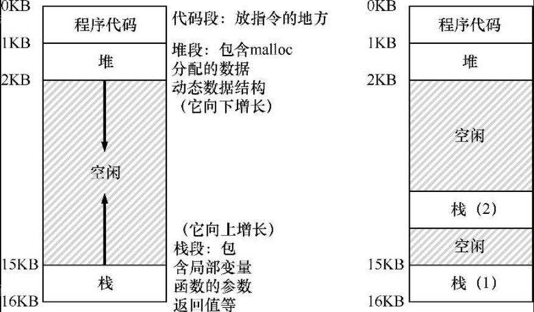

# 并发 

* 并行是指在同一时刻，多个任务一起运行
* 并发是指在同一时间段内，多个任务一起运行（实际上是每个任务分配了一个更小的时间段）

​	这一部分的主题“并发”让人有点迷惑，因为这部分的内容我觉得是涵盖了并行和并发的概念，如果这个主题叫做”高并发“可能更容易让人理解。谈到并发必定要谈到多线程（但并发的来源是多进程），多线程在单CPU上运行时，更符合上面对并发的定义，而且相对于单线程来说，它做到了更高的并发；而多线程在多CPU上运行时，更符合上面并行的概念。

## 一.线程

### 1.线程和多线程

​	每个线程类似于独立的进程，只有一点区别：它们共享地址空间，从而能够访问相同的数据，但是每个线程都有自己独立的栈。

​	因此，单个线程的状态与进程状态非常类似。线程有一个程序计数器（PC），记录程序从哪里获取指令。每个线程有自己的一组用于计算的寄存器。所以，如果有两个线程运行在一个处理器上，从运行一个线程（T1）切换到另一个线程（T2）时，必定发生上下文切换（context switch）。线程之间的上下文切换类似于进程间的上下文切换。对于进程，我们将状态保存到进程控制块（ProcessControl Block，PCB）。现在，我们需要一个或多个线程控制块（Thread Control Block，TCB），保存每个线程的状态。但是，与进程相比，线程之间的上下文切换有一点主要区别：地址空间保持不变（即不需要切换当前使用的页表）。



​	拥有线程的计算机系统中，进程是资源分配的最小单位，线程是调度的最小单位。也就是说，CPU分给某个进程的时间片等资源不会因为其线程的多少而改变(需要铭记这时我之前的一个理解误区，我原来以为多线程有助于进程抢占时间片资源)，但是在分配给这个进程的时间片内，这个进程的多个线程可以通过调度来灵活的使用这段时间片。

### 2.多线程的优缺点

优点：如果多线程运行在多核上，多线程可以同时运行在多个核上，实现并行，毫无疑问，这种情况下一个进程完成任务的效率大大提高；如果多线程运行在单核上，而且当前进程的任务是I/O密集型任务。我们直到，在进行I/O任务时，往往会阻塞，此时CPU空闲，相当于白白浪费了时间，退一步讲，即使系统的调度算法比较优秀，能够在阻塞时将其他进程调度来执行，但对于本进程来说，任务完成的时间就被推迟，多线程可以很好地解决这个问题，在一个线程阻塞时，另一个线程调度执行，可以很好的利用CPU。

缺点：线程之间的切换虽然没有进程间切换那么费劲，但也是有代价的，如果多线程运行在单核上，而且遇到的是计算密集型任务，线程之间切换的带来的额外开销将会降低CPU的利用率。

## 二.实现并发需要解决的问题

​	这本书中谈到并发时是基于多线程的，但毫无疑问，并发的概念最早是来自于多进程的，多线程实现的并发有种种问题，并且人们研究出了锁、信号量等去解决这些问题。但是我们需要明白，多线程有锁来解决多线程并发带来的一些问题，多进程也一定（也许）有一种类似的东西来解决多进程并发带来的一些问题。为何多线程比多进程更为引人注目呢？究其原因，多线程是一个进程，一个进程往往是为了完成一个任务，而多个线程完成一个任务少不了访问共同变量（哪些变量是由进程决定的），也少不了安排先后次序（怎么样排序也是由进程决定的），而进程间这样的问题是较少的。


补充，并发术语：

* 临界区（critical section）是访问共享资源的一段代码，资源通常是一个变量或数据结构。
* 竞态条件（race condition）出现在多个执行线程大致同时进入临界区时，它们都试图更新共享的数据结构，导致了令人惊讶的（也许是不希望的）结果。
* 不确定性（indeterminate）程序由一个或多个竞态条件组成，程序的输出因运行而异，具体取决于哪些线程在何时运行。这导致结果不是确定的（deterministic），而我们通常期望计算机系统给出确定的结果。
* 为了避免这些问题，线程应该使用某种互斥（mutualexclusion）原语。这样做可以保证只有一个线程进入临界区，从而避免出现竞态，并产生确定的程序输出。

### 1.访问共享数据

#### 问题的描述

````c
#include <stdio.h>
#include <pthread.h>
int counter=0;

void* mythread(void *arg){
     int i=0;
    printf("%s begin\n", (char*)arg);
    for(i=0;i<1e7;i++){
        counter+=1;
    }
    printf("%s done\n", (char*)arg);
    return NULL;
}

main(){
    pthread_t p1,p2;
    printf("main begin(counter=%d)",counter);
    Pthread_create(&p1,Null,mythread,"A");
    Pthread_create(&p2,Null,mythread,"B");
    pthread_join(p1, NULL);
	pthread_join(p2, NULL);
    printf("main end(counter=%d)",counter);
}
````


​	这个程序的共享变量是counter，按照我们的期待，每个线程都会使counter增加10的7次方，最终的打印结果应该是20000000，但是结果却相差甚远。访问共享变量在多线程中是常见的，但是其结果的不符合预期使我们不能接受的。

#### 产生的根本原因

* 线程的不可控的调度

​	进程的调度我们有一个进程调度算法来进行，而线程的调度也有类似的调度算法来负责，也就是说，线程的调度是程序员无法控制的。假如出现这样的情况：线程A读取到counter值为5，接下来，B线程被调度运行，操作系统将当前正在运行的线程A（它的程序计数器、寄存器，包括eax等）的状态保存到线程的TCB，然后B读取到counter值为5，+1后为6并保存回去，然后A又被调度执行，它接着之前的状态执行，在读取的5上+1得到6，然后保存回去，这时候就出现了问题<u>。由于执行这段代码的多个线程可能导致竞争状态，因此我们将此段代码称为临界区（critical section）。临界区是访问共享变量（或更一般地说，共享资源）的代码片段，一定不能由多个线程同时执行。</u>

* 操作的非原子性

​	上述的线程操作中，取counter值，+1，然后保存回去，这一段操作不是原子的，所以可以被线程B打断，于是造成了问题。

#### 解决方法

* 使用更强大的指令，是操作变得原子

​	这种方法显然是难以实现的

* 操作系统提供一些同步原语，使多线程代码<u>以同步和受控的方式访问临界区</u>，从而可靠地产生正确的结果

### 2.有序的线程调度

#### 问题的描述

​	构建多线程程序时，多个线程之间是难以完全独立的，有时候我们需要多个线程相互协作完成一些任务，例如：线程A负责处理数据包，线程B负责接收数据包，这个时候线程A就必定要在线程B之前完成，但由上面的描述可知，线程的调度是我们难以控制的。

#### 问题存在的原因

* 线程的不可控的调度

#### 解决方法

* 睡眠/唤醒交互机制

## 三.解决方法的详述

### 1.锁：解决访问共享变量的问题

#### 锁的介绍

##### 基本思想

​	锁机制通常由锁变量、lock()加锁操作、unlock()释放锁操作组成。当一个线程访问临界区时，它必须取得该临界区的锁即lock(锁变量)操作，通过这个锁变量的状态。lock判断能否取得锁，如果能够取得锁，线程就可以访问这个临界区，如果不能取得，线程就等待。这样一来，程序员就可以通过使用锁来保证临界区内只有一个进程活跃，使原来无法控制的线程调度变得一定程度上可控。

​	<u>锁的具体实现机制是操作系统和硬件层面的事，程序员在使用锁时可以不关心它的实现细节。</u>

##### 评价锁

* 互斥性：最基本的功能，即提供互斥，<u>阻止多个线程进入临界区</u>（加锁后，线程仍可以被中断，但是加锁能够确保只有一个线程进入临界区）
* 公平性：当锁可用时，是否每个线程都有机会抢到锁，会不会出现一些线程永远都抢不到锁，被饿死的情况？
* 性能：使用锁之后毫无疑问会增加时间开销，针对只有一个线程竞争锁、多个线程在一个CPU上竞争锁、多个线程在多个CPU上竞争锁，这三种情况该如何设计锁使得性能更高。

#### 操作系统如何实现锁

##### 多种为实现锁提供的原语或方法

* 控制中断：在某个线程进入临界区后关闭中断，使其他进程不能打断当前进程的任务。
  * 缺点：贪婪的程序可能在lock关闭中断后不unlock，一直占用处理器，而且由于中断被关闭，操作系统无法收回CPU；不支持多处理器，当运行在多个CPU上的线程试图访问一个临界区时，除非同时关闭所有CPU的中断（但是毫无疑问，者会带来新的问题），否则无法解决问题；关闭中断导致中断丢失，可能导致严重的系统问题，例如IO设备的正常运行极度依赖中断；现代CPU对于关闭和打开中断的代码执行得较慢。
* 测试并设置指令（原子交换）：使用一个变量来标记临界区是否被线程占用，当一个线程进入临界区时，调用lock来检查这个变量的值(假设1是被占用，0是没有占用)，如果为0，则设置标志为1，然后继续运行，结束时调用unlock()清除标志。
  * 缺点：这个方案本身就存在互斥性的问题，如果线程A获取标记变量为0，随后被中断，线程B获取变量也为0，设置为1，进入临界区，线程调度又开始运行A，A由于之前获取的标记变量也为0，也可以进入临界区；使用<u>自旋等待</u>，效率极低。
* 自旋锁：首先需要系统提供一个硬件原语: int TestAndSet(int *old_ptr,int new){int ild=*old_ptr;*old_ptr=new;return old;},这段代码是原子的，也就是说CPU在执行这段代码时无法被中断打断。锁的实现方式void lock(lock_t *lock){while(TestAndSet(&lock->flag,1)==1);} void unlock(lock_t *lock){lock->flag=0;}。
  * 缺点：单处理器上，自旋锁需要抢占式的调度器，因为一个自旋的线程将永远不会放弃CPU；没有对公平性的保证；性能开销大，如果有多个线程，一个线程进入了临界区，其它进程在调度执行时无法获取锁将会一直自旋，浪费CPU周期。（自旋锁在多CPU上效果不错）
* 比较并交换：也需要系统提供原语int CompareAndSwap(int *ptr,int expected,int new){int actual=*ptr;if(actual==expected)*ptr=new;return actual;}，利用这个原语实现一个自旋锁或者其他类型的锁
* 链接的加载和条件式存储指令
* 获取并增加:

​		

优点：能够保证所有线程都有机会抢到锁。

##### 实现细节

​	为了实现一个满足互斥性、公平性、高性能的锁，仅有硬件原语是不够的，还需要操作系统的支持，需要操作系统对线程进行一些简单的调度控制。

* 避免自旋（高性能），等待时主动放弃CPU：

​	

yield是操作系统提供的一个指令，将会使线程主动放弃CPU，使由running态变为ready态。

这种方法仍然存在问题，一个线程抢到锁之后并不能安心的运行，它随时可能被其他线程打断，虽然其他线程获取不了锁遂放弃CPU，但是频繁的上下文切换仍然使开销增大；而且没有解决公平性的问题。

* 使用队列（高性能）：


代码分析：guard保证进出队列时的操作不被打断，相当于是队列锁。flag则是对临界资源的锁。

使用队列避免饿死，使用park()主动放弃CPU保证高性能。不过这个解决方案仍然存在问题：如果不凑巧，一个线程将要park，假定它应该睡到锁可用时。这时切换到另一个线程（比如持有锁的线程），这可能会导致麻烦。比如，如果该线程随后释放了锁。接下来第一个线程的park会永远睡下去（可能）。解决方法有两种，一种是将guard传入内核，保证其原子性；或者增加新的系统调用setpark:通过在guard=0前setpark()，一个线程表明自己马上要park。如果刚好另一个线程被调度，并且调用了unpark，那么后续的park调用就会直接返回，而不是一直睡眠。即在解除对队列的保护之前就将线程加入队列。

##### linux的实现方法，两阶段锁

​	杂合了自旋锁和休眠锁，先自旋一段时间（如果此时有其他现场放弃了锁，就可以避免额外的上下文切换），然后休眠。


### 2.条件变量：实现线程的同步

​	锁的公平性可以由队列解决，加入队列的线程决定了线程的运行顺序，这在一定程度上实现了有序的线程调度，但问题是，某个线程加入队列的时间是我们无法决定的，这还是有由线程调度算法决定的，所以说仅仅使用队列还是无法实现有序的线程调度。

​	很多情况下某一线程需要检查某一条件是否满足之后才会继续运行，多个线程在这样条件限制之下就会存在一个有序队列。其实仅仅使用锁也可以完成线程的有序调度，加入有两个线程A和B，A负责处理数据包，B负责接收数据包，A必须在B接收到至少一个数据包后开始运行：

`````c
// 这是一段伪代码

// 数据包数量
int num = 0;
// 锁
mutex x;

void *A(void *arg){
    while(true){
        // 数据包数量小于等于0时一直线程自旋
        while(num<=0);
        // 加锁
        lock(x);
        // 处理数据包
        num--;
        // 解锁
        unlock(x);
    }
}

void *B(void *arg){
    while(true){
        lock(x);
        num++;
        unlock;
    }
}
`````

​	上面这个例子利用了锁实现了线程的同步，但是显然性能不好，存在自旋的问题。

#### 条件变量的介绍

##### 基本思想

​	请回忆在锁的部分我们是如何解决自旋问题的，我们使用了一个队列和休眠唤醒机制，当一个线程获取锁失败时，它不是不断的自旋查询能否获取锁，而是加入一个队列并休眠，在队列中按顺序等待被唤醒然后获取锁。我们使用条件变量的思想也和这一模一样，只不过前者某个线程加入队列的时间我们无法决定，而后者可以通过某个变量来设置线程加入条件变量队列的顺序。

`````c
// 伪代码

//数据包数量
int num;
// 条件变量
cond c = 0;
// 锁
mutex x;

void *A(void *arg){
    while(true){
        // 加锁
        lock(x);
        while(num<=0)
            // 休眠并释放锁
            wait(c,x);
        // 处理数据包
        num--;
        // 解锁
        unlock(x);
    }
}

void *B(void *arg){
    while(true){
        lock(x);
        num++;
        // 唤醒并让唤醒的线程尝试重新获取锁
        signal(c);
        unlock;
    }
}
`````

#### 示例

##### 生产者/消费者问题

````c
cond_t empty,fill;
mutex_t mutex;

void *producer(void *arg){
    int i;
    for(i=0;i<loops;i++){
        pthread_mutex_lock(&mutex);
        while(count==MAX){
            pthread_cond_wait(&empty,&mutex);
        }
        put(i);
        pthread_cond_signal(&fill);
        pthread_mutex_unlock(&mutex);
    }
}

void *consumer(void *arg){
    int i;
    for(i=0;i<loops;i++){
        pthread_mutex_lock(&mutex);
        while(count==0){
            pthread_cond_wait(&fill,&mutex);
        }
        int tmp=get();
        put(i);
        pthread_cond_signal(&empty);
        pthread_mutex_unlock(&mutex);
    }
}
````

​	当有多个生产者和多个消费者时一定要注意使用两个条件变量，因为一个显然的问题是一个消费者唤醒的应该是一个生产者，而生产者唤醒的应该是一个消费者，所以需要两个队列来存放生产者或消费者。

##### 内存分配问题


当一个程序申请内存空间时，如果当前空闲内存不够，该程序将会进入队列等待，当有内存被free后，队列中的程序将被唤醒。但是此时有一个问题是，不同的程序需要的内存不同，假如当前空闲内存为50MB，我们该怎样选择去唤醒那些需要内存小于50MB的程序呢？这里使用的方法是广播，其唤醒所有队列中的程序，然后满足条件的获取空闲内存，不满足条件的睡眠。

### 3.条件变量和锁的结合：信号量

​	显然，条件变量的使用离不开锁，所及干脆将锁和条件变量结合。信号量既是锁，也是条件变量（队列）。

#### 二值信号量（锁）

`````c
sem_t m;

sem_init(&m,0,x); // x是初始化值

sem_wait(&m);

sem_post(&m);
`````

#### 用作条件变量

````c
set_t s;

void *child(void *arg){
    printf("chlid\n");
    sem_post(&s);
    return NULL;
}

int main(){
    // 初始化为0
    sem_init(&s,0,0);
    printf("parent:begin\n");
    pthread_t c;
    pthread_create(c,NULL,chlid,NULL);
    sem_wait(&s);
    printf("parent:end\n");
    return 0;
}
````

#### 例子

##### 生产者消费者问题

`````c
sem_t empty;
sem_t full;
// 一个信号量只能保证同一队列内的线程互斥，生产者消费者问题中，不仅要保证同一队列内的线程互斥，还要保证两个队列之间互斥，所以还需要一个锁
sem_t mutex;

void *producer(void *arg){
    int i;
    for(i=0;i<loops;i++){ 
        sem_wait(&empty);
        sem_wait(&mutex);
        put(i);
        sem_post(&mutex);
        sem_post(&full);
    }
}

void *producer(void *arg){
    int i;
    for(i=0;i<loops;i++){
        sem_wait(&full);
        sem_wait(&mutex);
       	int tmp = get(i);
        sem_post(&mutex);
        sem_post(&empty);   
    }
}

int main(){
    sem_init(&empty,0,MAX);
    sem_init(&full,0,0);
    sem_nit(&mutex,0,1);
}
`````

##### 读者/写者问题


一个保护reader的锁，一个写锁，读者读时不能写但其他读者可以读（要获得写锁）；写者写时，其他人既不能读也不能写。

​	rw->lock是对共享变量reader的保护

##### 哲学家就餐问题

每个哲学家的行为

````c
while(1){
    think();
    getforks();
    eat();
    putforks();
}

// 左右手的行为
int left(int p){return p;}
int right(int p){return (p+1)%5;}

void getforks(){
    // 使某一位哲学家拿起叉子的顺序与其他人不同，可防止死锁
    if(p==4){
        sem_wait(forks[left(p)]);
    	sem_wait(fork([right(p)]);
    }else{
        sem_wait(fork([right(p)]);
        sem_wait(forks[left(p)]);
    }
}
````

#### 使用锁和条件变量实现信号量


​	实现的Zemaphore和Dijkstra定义的信号量有一点细微区别，就是我们没有保持当信号量的值为负数时，让它反映出等待的线程数。事实上，该值永远不会小于0。这一行为更容易实现，并符合现有的Linux实现。

## 四.并发编程中常常出现的问题

### 1.死锁

​	死锁（deadlock）是一种在许多复杂并发系统中出现的经典问题。例如，当线程1持有锁L1，正在等待另外一个锁L2，而线程2持有锁L2，却在等待锁L1释放时，死锁就产生了。

#### 死锁产生的四个条件

* 互斥：线程对需要的资源进行互斥访问
* 持有并等待：线程持有量资源，同时又在等待其他资源
* 非抢占：线程获取的资源不能被抢占
* 循环等待，线程之间存在环路，环路上每个线程都额外持有一个资源，而这个资源又是下一个线程要申请的

#### 预防

* 循环等待：之前哲学家就餐的问题就是一个由循环等待产生的死锁问题。最直接的方法就是获取锁时提供一个全序（可以直接按照锁的地址来）。假如系统共有两个锁（L1和L2），那么我们每次都先申请L1然后申请L2，就可以避免死锁。这样严格的顺序避免了循环等待，也就不会产生死锁。但这个方法在锁过多时难以实用。
* 持有并等待：通过原子的抢锁。额外增加一个锁，用于对所有需要的锁上锁，使得要么抢到所有需要的锁，要么抢不到锁。
* 非抢占：尝试抢锁，抢不到就释放已经抢到的锁


* 互斥：一般来说，几乎无法避免互斥。但是也有人设计了无等待的数据结构，即通过硬件指令构造出不需要锁的数据结构。

### 2.非死锁

* 违反原子性缺陷
* 错误顺序缺陷

## 五.基于事件的并发

## 补充：关于线程的API

### 1.线程的创建和等待完成

``````c
#include <stdio.h>
#include <pthread.h>
#include <assert.h>
#include <stdlib.h>
#include <Windows.h>

// 函数的格式是严格的
void* mythread(void *arg) {  
	Sleep(3);
	printf("正在执行%d",*((int*)arg));
	return NULL;
}

int main() {
	pthread_t p1,p2;
	int a = 1, b = 2;
    // pthread_create之后，线程即进入就绪态，和JAVA不同，JAVA在create之后只是新建太，还需start进入就绪态
	pthread_create(&p1, NULL, mythread, &a);
	pthread_create(&p2, NULL, mythread, &b);
	printf("OK");
    // join使主线程阻塞，等待指定线程完成
	pthread_join(p1, NULL);
	pthread_join(p2, NULL);
	printf("完成");
}
``````

* 注意必须非常小心如何从线程返回值。特别是，永远不要返回一个指针，并让它指向线程调用栈上分配的东西。

### 2.锁 条件变量 信号量

加锁：

int pthreead_mutex_lock(pthread_mutex_t*mutex);

解锁：

int pthreead_mutex_unlock(pthread_mutex_t*mutex);

静态初始化:

pthread_mutex_t lock=PTHREAD_MUTEX_INITIALIZER;

动态初始化：

int rc=pthread_mutex_init(&lock,NULL);

assert(rc==0);

条件变量：
int pthread_cond_wait(pthread_cond_t *cond,pthread_mutex_t *mutex);

int pthread_cond_signal(pthread_cond_t *cond);

初始化条件变量：

pthread_cond_t cond=PTHREAD_COND_INITIALIZER;

信号量：

sem_t m;

sem_init(&m,0,x); x是初始化值

sem_wait(&m);

sem_post(&m);

````c
// 等待者
pthread_mutex_t lock=PTHREAD_MUTEX_INITIALIZER;
pthread_cond_t cond=PTHREAD_COND_INITIALIZER;
pthread_mutex_lock(&lock);
while(ready == 0) // 使用while比使用if判断好
    pthread_cond_wait(&cond,&lock);
pthread_mutex_unlock(&lock);

// 唤醒者
pthread_mutex_lock(&lock);
ready=1;
pthread_cond_signal(&cond);
pthread_mutex_unlock(&lock);
````

### 3.并发的数据结构
