# 第三章 运输层

<u>注：本章所有发送方用A表示，接收方用B表示</u>

## 一.运输层服务和概述

### 1.运输层和网络层的关系

​	网络层提供了主机之间的逻辑通信，而运输层为运行在不同主机上的进程提供了逻辑通信。

​	在进行网络通信时，运输层在端系统负责收集和分发来自于不同进程的报文，而网络层则负责从运输层得到报文段然后完成主机之间的逻辑通信。

​	很显然，运输层所提供的服务受制于底层网络层协议所提供的服务。事实上，网络层提供的服务是不可靠的，所以运输层就要以比较复杂的手段来保证可靠传输。

### 2.因特网运输层概述

#### (1).基本服务(UDP)

​	运输层的分组常被称为报文段，但是UDP分组也被称作数据报（这与网络层分组相同，所以不常用）

​	UDP只能提供两个运输层的基本服务，**进程到进程的数据交付**和**差错检查**。

​	因为没有可靠数据传输服务，UDP也是不可靠服务，而且UDP不能调节其发送速率。

##### a.进程到进程交付(多路复用、多路分解)

​	多路复用与多路分解，就是将网络层提供的主机到主机交付服务延伸到为运行在主机上的应用程序提供的进程到进程的服务。

​	多路复用和多路分解实现的关键在于套接字，一个网络应用进 程有一个或者多个套接字，它们作为应用层向运输层传输数据的门户。

​	将运输层报文段数据正确交付到正确的套接字的工作称为**多路分解**;从源主机的不同套接字接受数据块，并给其加上首部从而生成报文段，然后将报文段传给网络层，这些工作称为**多路复用**。


​	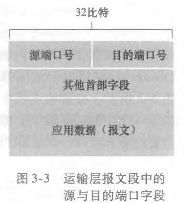

​	套接字有唯一标识符，这些标识符便是端口号，如上图，端口号是一个16位的字段，大小在0～65535之间，0～1023为周知端口号，保留给一些周知的协议使用。

##### b.差错检查

​	简单检查传输的数据是否出错。

#### (2).更多服务(TCP)

##### a.包含UDP的服务

##### b.可靠传输

​	保证数据完整、按序、无重复地传输。

##### c.流量控制

​	控制发送速率，保证接收端可以来得及处理接收的数据。

##### d.拥赛控制

​	为整个网络考虑，当拥赛时减缓发送。

## 二.运输层协议

### 1.UDP协议

#### (1).概述

​	UDP提供了运输层最低限度的服务，如果应用程序选择UDP最为运输层协议，那么应用程序差不多就是直接在与应用层协议打交道。UDP相对于TCP来说，A和B之间没有进行过握手，所以说，UDP是无连接的。

#### (2).报文段

##### a.格式

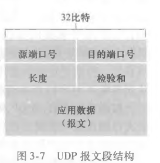

##### b.详解

​	UDP报文段首部共有8个字节，源端口和目的端口无需多解释;长度字段则指明了UDP报文段的字节数;检验和用于差错检查，其计算方式是对报文段中所有16比特字进行求和再求反的操作，B可以将接收的报文段除检验和外的所有部分求和再与检验和相加，如果全为1,则说明传输没有差错（不可靠），反之有一个0都说明传输有差错（可靠）。	

#### (3).提供的服务

##### a.进程到进程的传输（无连接的多路复用和多路分解）

````python
from socket import *


server_port = 12000  # 这是自己的端口，作为服务器，端口和ip不能变
server_socket = socket(AF_INET, SOCK_DGRAM)
server_socket.bind(('', server_port))  # 显示地分配端口号，不要系统分配
print('The server is ready to receive')
while True:  # 符合服务器的特性，可以不断接受来自不同客户的消息
    message, client_address = server_socket.recvfrom(2048)  # 目的主机的端口号和ip地址来自于A
    print(f'收到来自主机{client_address!r}的消息：{message.decode()}')
    modified_message = message.decode().upper()
    server_socket.sendto(modified_message.encode(), client_address)
````

​	如上代码，这是一个使用UDP协议的服务器端代码，注意到它的操作，它将服务器所用的一个套接字绑定于一个固定端口，作为服务器端这是可以理解的，特别要注意到的是，这个服务器进程不管接收还是发送数据，都是通过这一个套接字，这个套接字在网络中只需要一个目的IP和一个目的端口号就可以被定位。

##### b.差错检查

​	报文段格式详解处已经说明。

​	UDP因为没有可靠数据传输，所以它只能检查出差错而不能修正，它所实现只是：丢弃受损的报文段;其他实现是将受损的报文段交给应用程序并给出警告。

#### (4).相比于TCP，UDP的优势

* 应用层可以更为精细地控制数据的发送：UDP是无连接、提供最基本服务的运输层协议，应用层只要交付给它数据，它几乎不做什么处理就可以立即发送，而TCP协议则有自己繁杂的控制发送过程。
* 无需建立连接，减少时延
* 无需维护连接状态，减少开销
* 分组开销少，UDP首部仅需8字节开销，而TCP需要20字节

#### (5).UDP的致命缺点

​	UDP的特性导致了UDP分组可以被无节制地高速传输，这样一来，就会有大量的UDP分组溢出丢失，即可能导致网络拥赛，还浪费了的大量的带宽，而且还会挤垮TCP连接。

### 2.TCP协议

#### (1).概述

​	TCP协议是一种面向连接的协议，之所以被称为面向连接的，这是因为在一个应用进程可以开始向另一个应用进程发送数据之前，两个进程必须先相互“握手”，即它们必须相互发送某些预备报文段。

​	TCP的连接不是一种物理连接，两个端系统中间的其他系统并不需要维护这条连接，仅仅只有发送和接收信息的两端需要维护连接。

​	TCP是双全工服务的，TCP连接也总是点对点的，一个TCP连接不可能连接2个以上对象。

#### (2).报文

##### a.格式

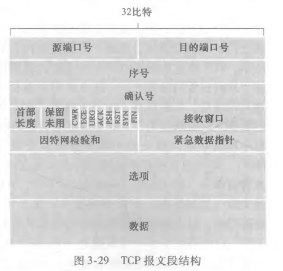

##### b.详解

​	首部至少为20字节，选项是可选和变长的，前面20字节是必选的，选项字段用于协商最长报文段MSS的长度，还包含一个时间戳。

* 源端口号和目的端口号各为16比特，这个无需再多谈
* 32比特的序号在一次TCP连接中按序标识出不同的分组，但是要特别注意，例如一号分组的序号为0,一号分组的**应用层数据长度**为1500,那么2号分组的序号为1500
* 确认号是B期望A发送的下一个分组的序号，即接收方提示发送方我已正确、有序收到了哪些数据报
* 4比特的首部长度指明了以32比特为单位的首部长度
* 6比特的标志字段：ACK比特用于只是确认字段中的值是有效的，即B成够接收分组时返回的报文段ACK比特为1;RST、SYN和FIN比特用于连接和拆除;当一个服务器收到SYN分组后，服务器返回的运输层报文段中的RST置为1时说明服务器收到了请求但是拒绝建立TCP连接。
* 紧急数据指针与标志位中的PSH、URG并未使用
* 接收窗口对于流量控制和拥赛控制至关重要，后面将会介绍

#### (3).通信过程

##### a.三次握手

* 客户端TCP首先向服务端TCP发送一个特殊的TCP分组，这个分组不包含应用层数据，它的SYN比特被置为1,并**随机**的选择一个初始序号
* 当SYN分组到达服务器，服务器就会提取SYN分组内的所需数据并认为有人向它发起了连接，这时服务器就会给一条将要建立的TCP连接分配缓存和变量，并向客户TCP发送允许连接的报文段。这个允许连接的报文段也不含应用层数据，但是其包含了三个信息：SYN比特被置为1,**确认号被置为SYN分组的序号+1**（即使A发送的分组没有应用层数据）,并选择自己的初始序号。这个报文段被称为SYNACK报文段。
* 用户收到SYNACK分组之后，要对其进行确认，方式是向服务器返回一个分组，这个分组的序号为SYN分组序号+1,SYN比特置0,而且此分组可以携带应用层数据。	

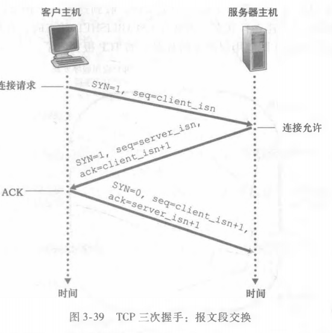

##### b.两次（四次）挥手

​	参与TCP连接的任意一个进程都可以终止TCP连接，连接结束后，双方分配给TCP连接的资源将会被回收。

* 客户端想要终止连接，它向服务器发送一个特殊的TCP分组，FIN比特被置为1;服务器收到该分组，要对其进行确认，返回一个ACK确认分组。
* 服务器也要进行挥手，它也向客户端发送一个FIN比特置为1的分组，客户端同样要对其进行ACK确认。

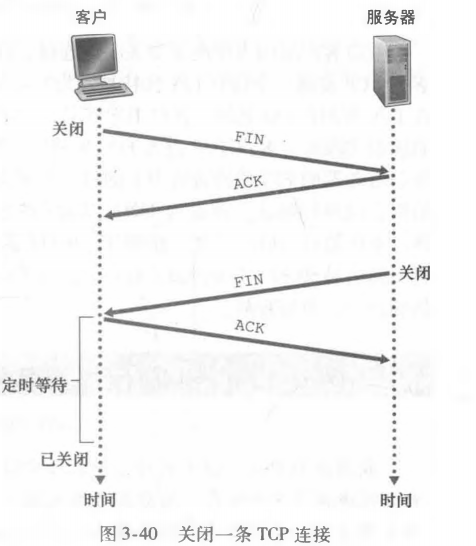

#### (4).面向对象的特点

##### a.连接

​	对于UDP连接，只要有目的端口和目的IP，即可完成一次单向通信，如果两个分组的目的端口和目的IP相同，那么毫无疑问，这两个分组的目标进程是同一个。而对于TCP连接，必须有一个建立连接的过程，建立连接之后才能通信，客户和服务器在建立连接时都必须有对方和自身的端口号和IP，观察以下代码：

````python
from socket import *

server_port = 12000
server_socket = socket(AF_INET, SOCK_STREAM)
server_socket.bind(('', server_port))
server_socket.listen(3)
while True:
    new_socket, addr = server_socket.accept()
    message = new_socket.recv(1024).decode().upper()
    new_socket.send(message.encode())
    new_socket.close()  # 服务器的一个socket链接一个客户端的socket，需要关闭
````

TCP服务器端固定绑定的12000端口的套接字只是一个欢迎套接字，当有客户希望与其建立TCP连接时，服务器端会再启用拥有新的端口的套接字与客户建立连接，而这个新套接字的启用一是需要服务器自身分配的新端口号和自身IP，另一个则是客户的IP和端口号，需要知道对方的IP和端口号的原因是，即使两个TCP分组的目的端口号相同，只要它们的源端口不同，它们也不是同一条TCP连接。


​	一个TCP连接往往对应一对进程的连接，在现如今的Web服务中，使用了更先进的线程来代替多进程。

##### b.连接带来的时延

​	很显然，TCP与UDP相比建立连接时需要额外的延时，像端系统远离服务器所在的数据中心时，这个延时会更大。针对这种问题，**TCP分岔**起到了很好的解决效果，TCP分岔大概的思想就是，服务商在临近客户的地方部署一个服务器（CDN或者Web缓存），这样用户到服务器的RTT会大大减小，更为关键的是，这个临近客户的服务器会以一个非常大的窗口向数据中心维护一个TCP连接。

## 三.TCP提供的服务

### 1.与UDP相同的部分

#### (1).面向连接的多路复用（web服务器与TCP）

​	功能是相似的，同样是完成进程到进程的传输，不同的TCP套接字需要四元组标识，UDP则是二元组标识。

#### (2).与UDP相同的差错检查

​	差错检查与UDP完全相同。

### 2.可靠数据传输

​	运输层的可靠数据传输之所以如此复杂的原因之一是底层信道的不可靠，底层信道既不能保证分组完好无损地到达，也不能保证分组按序到达，也不能剔除重复的分组。

#### (1).原理

##### a.逐步构造基本的模型

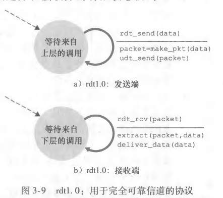

* 用于完全可靠信道的协议：当底层信道完全可信的时候，实现十分简单，发送端只需要等待上层的调用，封装应用层数据，然后发送即可;B同样简单。

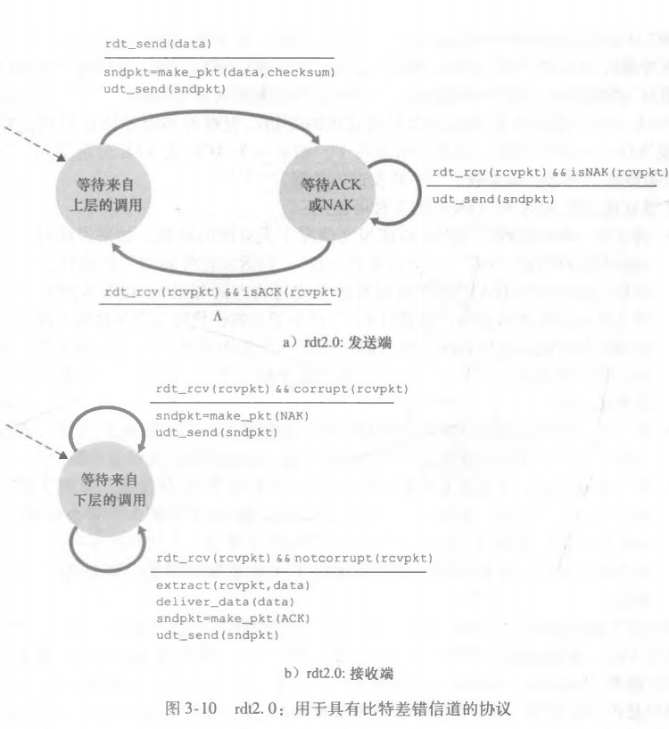

* 用于具有比特差错的信道：面对一个有比特差错的分组，数据链路层和网络层都只提供了差错检测的方法，而没有提供修复的方法，而且，差错检测也无法检测出具体出错的比特，在运输层我们可以想象这种修复更不可取，其代价太大。所以，运输层对于出错的分组，是选择整组重传，为了确定B收到的分组出错还是没有出错，B很有必要返回一个信号给A，告诉它是否出错。我们暂且构建一个傻瓜式的通信过程，即一问一答的过程。当A受到上层的调用时，其封装后向B发送分组，它发送后进入一个等待回应的状态，这个状态下它只是等待。B收到该分组，检查该分组（从链路层到运输层都有检查），如果正确无误，则其对收到的分组正常处理，然后返回一个ACK确认分组;反之，其丢弃该分组，返回一个NAK分组。再回到A其如果收到ACK分组，他就可以继续发送接下来的分组，否则重传分组。

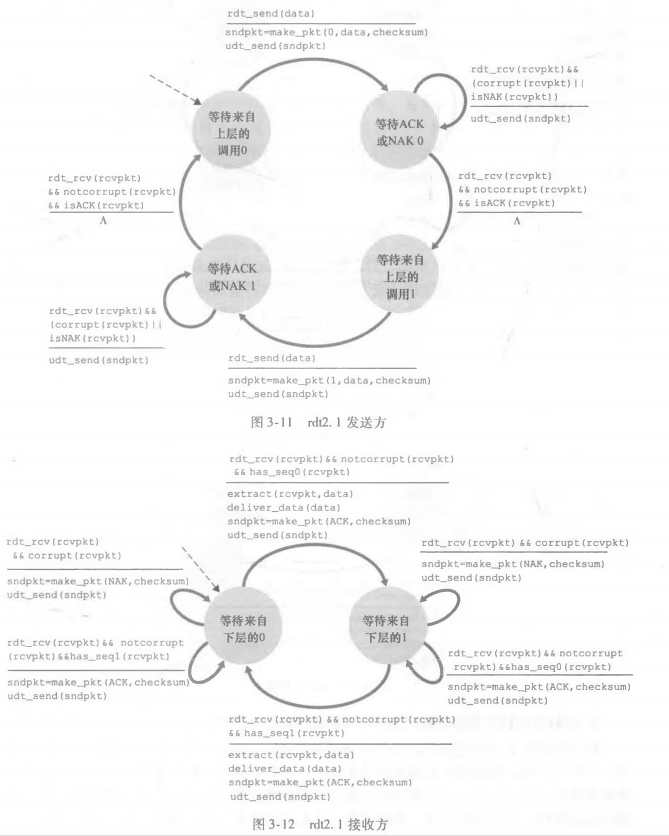

​	其实刚刚的模型有一个致命的缺陷，他没有考虑ACK/NCK分组受损的可能。对此的解决方法是A接收到模糊不清的回应时直接重传（还可能考虑过的两种方法是A向B询问，但这样容易陷入死循环;想办法修复分组，前文以讨论，代价大），但是这也有一个问题，如果B的本意是ACK分组，那么A重传的分组再次被B接收后，B相当于接收了重复的分组，而且B没有方法辨别这个分组是不是重传的，所以A发送时需要给分组加上标号，以让B判断它是重传的还是初次传的。

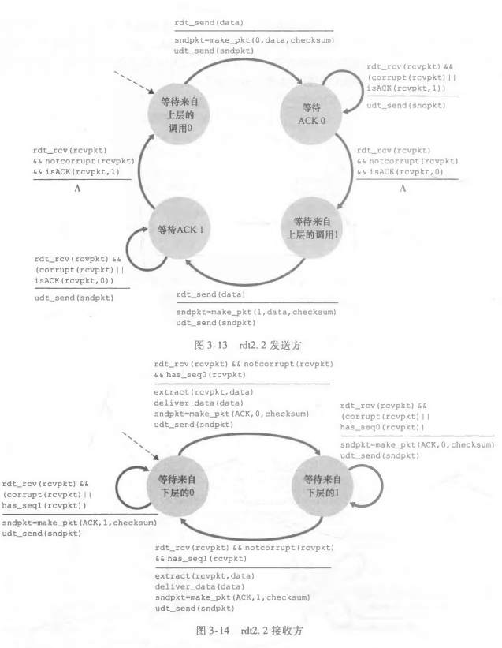

​	A对分组标号之后，B就可以舍弃掉NCK了，返回一个与上一次的ACK相同序号的ACK即可达到NCK的作用。

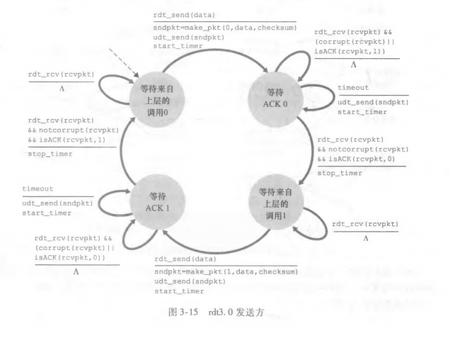

* 用于即可能存在比特差错也可能丢包的信道：如果底层信道的问题再加上丢包，那么会出现的问题就是在A或B一方会迟迟得不到他想要的分组，解决这个问题的一种办法是，设置一个等待时间，超过这个时间，我们即视分组为丢失。而且，我们这里让A负责检测和恢复丢包。这里的解决方案的思想很简单，但是有一个很重要的点需要我们细细地思考，等待时间最好为多少（<a href='#anchor_point_1'>这点我们随后具体讨论</a>）？在出现丢包的情况下,我们的分组重传是基于时间的，所以我们需要一个**倒计数定时器**，每当A发送一个分组时（不管是初次还是重传），便启动一个定时器，A如果超时没收到ACK确认分组，它便重传分组同时重置计时器。


效果图：

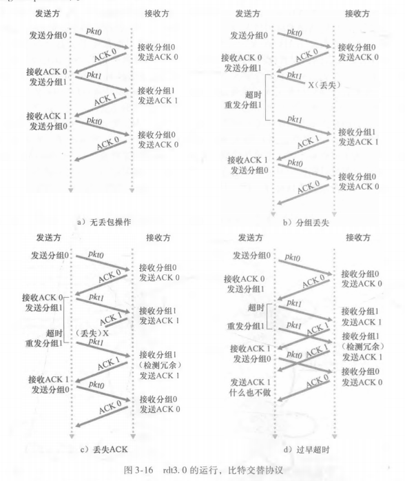

##### b.更为完备的两个流水线模型：回退N步和选择重传

​	上面最终构造的协议已经能够实现在存在比特错误和丢包的信道实现可靠传输，但糟糕的是，这个协议是一个**停等协议**，这个协议采取的是一发送一确认的模式，这样做是因为每一次发送都可能出差错或者丢包，但实时上一次完整的TCP连接中，处差错和丢包的分组毕竟占少数，这样的停等协议产生了很大的不必要的时延，造成了发送速率和信道的利用率都极低，这是一个直观的网络协议限制底层网络硬件所提供的能力的例子。

​	为了解决这样效率极低的情况，提出了两种流水线的可靠数据传输协议：回退N步和选择重传。但是流水线协议我们需要考虑新的问题：

​	1.因为可以连续发送分组，为了确定分组是否是重传的，原来的0、1两个序号就不够用了，我们需要更多更大的序号.

​	2.A和B的运输层协议要考虑缓存多个分组（应用层只向运输层交付一次数据，不能因为传输出错，运输层就向应用层要多次数据），A最低限度应该要缓存那些已经发送但是还尚未确认的分组来为重传做准备，B最低限度需要部分已经正确接收的分组以防止重复接受分组。


流水线：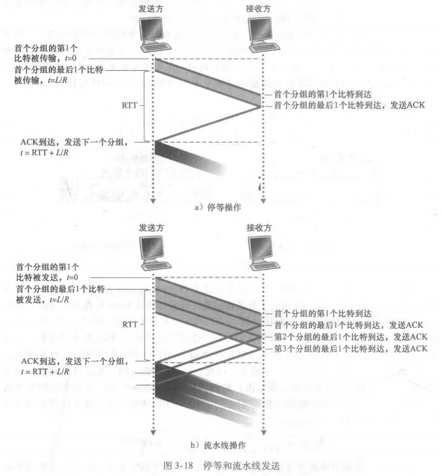

* 回退N步（GBN）：GBN允许A连续发送多个分组，而不等待确认，但是未确认的分组有一个上限N。

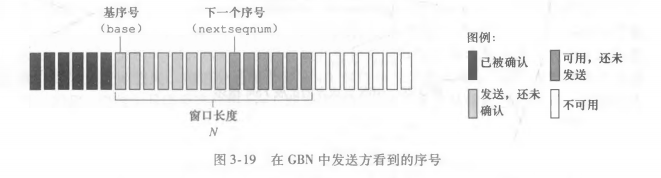

​	如图，基序号之前的部分是已经完全确认的分组，窗口中包括发送而未确认的分组和还可发送的分组。

​	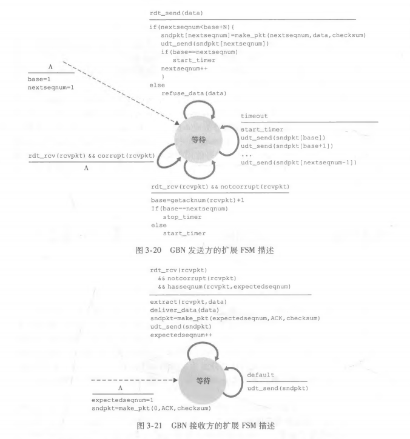

​	协议具体的内容如上图，几个需要注意的点是：1.只有一个计时器，最初开始发送时重置，超时时重置，每收到一个ACK确认分组重置，所有发送分组都确认就停止。2.B只有收到按序的分组才返回一个ACK确认分组，其他情况下B丢弃分组并重新发送上一次发送的ACK分组。3.对于A来说，一旦收到某个ACK确认分组，那么标志着这个确认分组之前的所有分组B都收到了，A也不必管没有之前没收到的ACK分组。

​	GBN的一个好处是，B不必缓存任何失序分组，但是却会造成一定的浪费，一个中间分组的丢失可能会造成大量的分组被丢弃，而引起大量分组的重传，这不管是对A还是整个网络都是不利的。

* 选择重传（SR）解决了上述的问题：

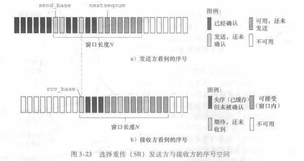

​	SR同样有窗口长度和base、nextseqnum等变量，与GBN不同的是B不会丢失失序的分组，而是将它们缓存起来，对收到的分组返回相应的ACK分组，这就使得A不能通过收到一个ACK分组即确定它已经收到了之前的所有分组，而且因为是对某一个具体的分组进行重传，那么意味着每一个分组都需要有他自己的一个定时器。

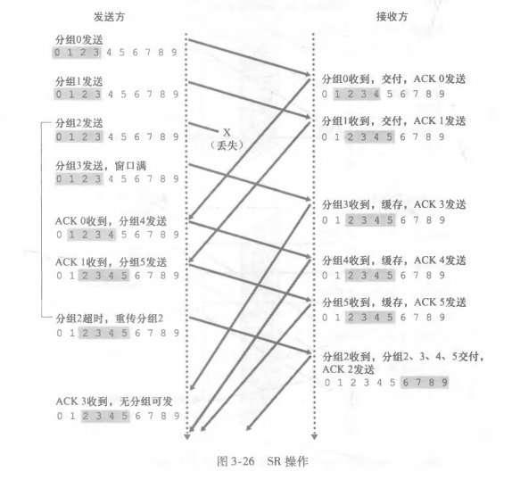

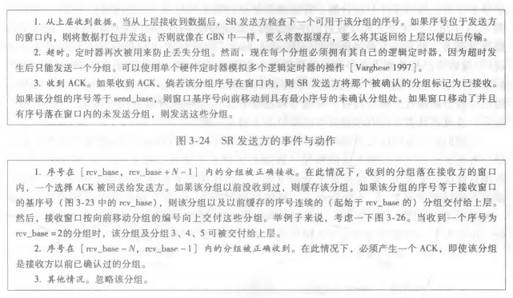

#### (2).TCP的实现方式（选择确认）

​	TCP的可靠数据传输的实现结合了GBN和SR的特点。A用超时和冗余确定机制来确认是否重传，而且只使用一个定时器，这和GBN相似，但是与GBN不同的是，A在超时发生时不会重传所有未确认分组，而是仅仅重传第一个未确认分组，并且重置定时器时间（只有重传可以重置时间），因为这默认了一种可能性，即B收到了除第一个未确定分组外的其他分组，而且将它们缓存了起来，事实上B也确实会对失序的分组进行缓存。

​	思考一下，对于GBN，B对于每个按序且正确的分组返回ACK，所以一旦A收到任意一个ACK，那么这个ACK所代表的分组和之前的分组就能确认全部按序到达了，而SR则需要确保A收到每个ACK分组，才能确认所有分组到达B。TCP结合了GBN和SR的特点，它该如何产生ACK呢？如下图（注意此时的ACK号已经不是确认到达的分组了，而是期待下一个分组）：

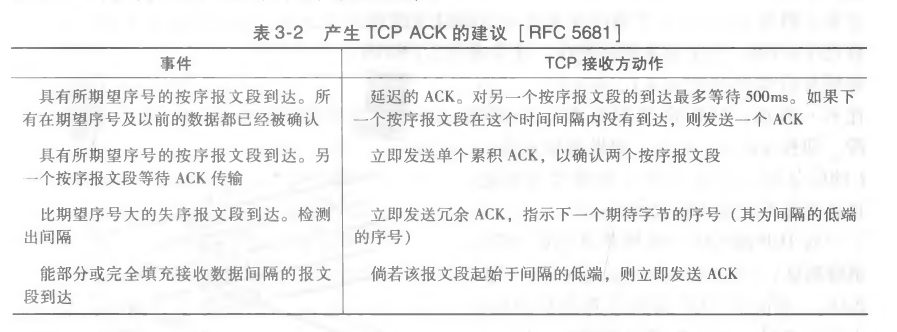

首先，TCP的ACK分组和GBN一样，当A收到一个ACK分组时，它可以确认这个ACK分组所代表的分组和之前的分组全部按序到达了，这就要求B在按序收到一个分组时要返回一个相应的ACK分组，而且这里可以做一点优化，就是在B收到分组时可以不着急发送ACK分组，而是稍作等待，如果等待的这段时间内有分组到达，那么B就可以减少发送ACK分组的次数，但是有一种情况是无需等待的，那就是B一次性连续收到了N个分组，这个时候A已经将窗口用完，B不返回ACK确认分组，A将不会再发送分组，那么很显然B就无需再等。如果B收到了一个失序分组，也就是大于期望值的分组，其会立即返回一个冗余ACK分组指示期待的分组。当B接收到的分组刚好填充了间隔时，它也会立即发送ACK分组，否则A会发送重复分组。

​	刚刚说过，B存在发送冗余ACK的行为，但是A收到的两个相同的ACK分组时并不会立即重传分组，也不重置计时器。A只有在超时时会重传，或者收到了额外3个冗余ACK分组时才进行重传，这是因为仅仅收到一个ACK冗余分组时有可能是A发送的分组在传输的过程中被打乱了顺序，又或者稍有拥堵使得B未能及时收到。但是如果A能够在超时之前收到冗余的三个ACK分组说明当前网络并不拥堵，而且不一定是顺序被打乱了，很可能是丢包了或出错了，所以这时A可以直接重传。

### 3.流量控制（滑动窗口）

​	前面说过，TCP通信的双方都有缓存，这个缓存的大小总是有限的，A可以通过拒绝或者让应用层等待调用TCP来方式缓存溢出，但是B的缓存的内容是来自于A的，它无法拒绝，拒绝就意味着丢包，如果A的窗口太大又或者B的缓存太小，那么就有可能发生缓存溢出。

​	TCP提供的流量控制服务就是为了消除A使得B缓存溢出的可能，流量控制是一个速度匹配服务，使AB双方速度相匹配。双方的运输层报文中的**接受窗口**字段即时这个功能实现的关键，接受窗口字段指示自己还有多少可用的缓存，如果B通过该字段告知A它可用的缓存为0,A会开始发送一个只有一个字节数据的报文段，以持续得到B的回复（这防止B有空闲空间后不通知A而让A一直等待），直到B回复表明其可用缓存不为0之后，A再开始发送正常的分组。

### 4.拥塞控制

#### (1).原理

##### a.拥塞原因与代价

* 拥堵会使时延增大
* 拥堵会造成丢包和极大延时，从而导致重传，然后造成更大的拥堵
* 某一段网络的拥堵会使上层经过很长链路的分组的努力白费

##### b.拥塞控制方式

* 端到端的控制，当出现超时和冗余ACK时，网络可能发生了拥堵，TCP可以选择减小其窗口长度
* 路由器向发送方发送一个比特指示拥堵情况

#### (2).TCP实现方式

​	TCP是让发送方根据一些信息来感知网络的拥赛程度，然后合理的限制其发送速率。TCP的方法伴随着三个问题，A如何感知拥堵，A如何限制发送速率，限制发送速率的算法如何实现。

* 维护一个额外的变量cwnd即**拥塞窗口**，这个窗口不同于接收窗口，接受窗口的大小TCP并不能自控制，而cwnd可以。cwnd对发送速率的限制体现在，A发送的未确认分组的数量不能大于cwnd与接受窗口中的较小者。

* A如何感知拥堵呢？我们要知道，伴随着拥堵的往往是丢包和极大的时延，对于A来说就是收到冗余的ACK分组（这个要仔细考虑）和超时，这时就应该要减小拥塞窗口，而当A能够准确无误地按时收到ACK分组时，又说明当前网络大概率不拥堵，就可以增加拥塞窗口。事实上，如下图，这是TCP的处理原则：

  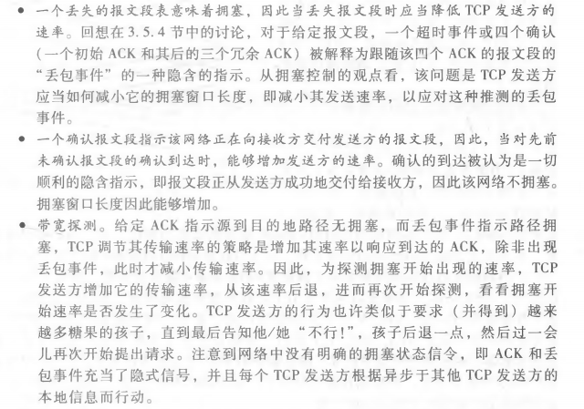

​	

**TCP拥塞控制算法**：

​	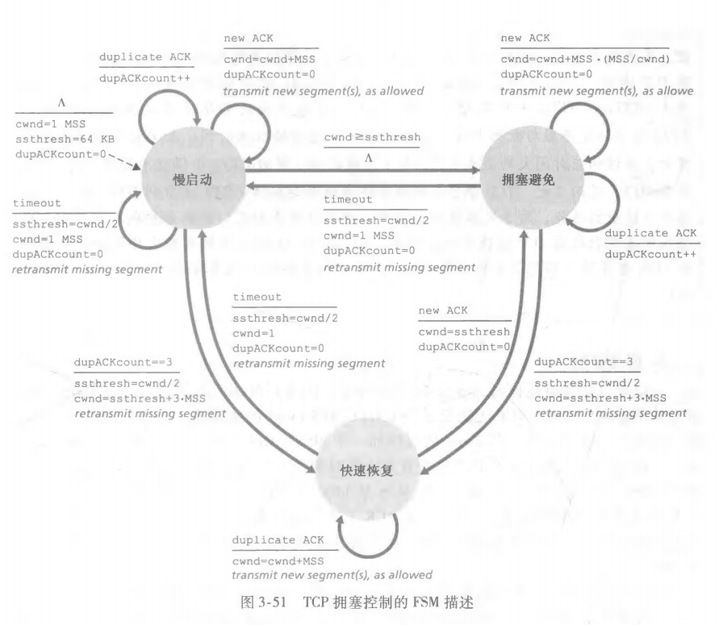

* 慢启动：cwnd通常设置为一个MSS长，每当收到一个期望的ACK，cwnd就增加一个MSS，事实上以时间为单位来看，没过一个RTT，其发送速率就增加了一倍，这个增长是很快的。当丢包发生即拥堵产生时，TCP将cwnd置为1,另外设置一个变量ssthresh=cwnd（上一次）/2作为慢启动的阀值，然后再次进行慢启动，如果到达阀值，则结束慢启动进入拥赛避免模式。<u>总的来说，慢启动就是一个由低速到高速，并最终确定一个较为合适的速度的过程。</u>
* 拥塞避免：这个阶段仍然尝试着增加cmwd，不过增加的更为谨慎，每过一个RTT仅将cwnd增大1，当超时事件发生时，cwnd被设为1,ssthresh同样设为原cwnd的一半，然后回到慢启动。可以看出拥塞避免阶段和慢启动一样是一个加快发送速率的过程，只不过这个过程更为谨慎。
* 快速恢复：前面所谈到的拥堵都是A通过超时感受到的，那么冗余ACK呢？其实A收到三个冗余的ACK是说明这样一种情况，刚刚发生了拥堵，有丢包时间，但是此时很可能已经不拥堵了，因为A可以在超时前收到三个冗余ACK。慢启动和拥塞避免时收到三个ACK都会进入快速恢复阶段，cwnd设为1，,ssthresh的操作与之前相同，而且可以想到，这个阶段很可能会收到大量的重复分组，而且也需要重传一些分组，这个快速恢复状态就是用于快速重传分组的，一但收到新的ACK分组，即可进入拥塞避免阶段（正常运行，慢速增长），若是超时则进入慢启动阶段（重新开始）。

#### (3).其他

##### a.拥塞控制下TCP连接的安全性

​	TCP趋于在竞争的多条TCP连接之间提供对一段瓶颈链路宽带的平等分享。

​	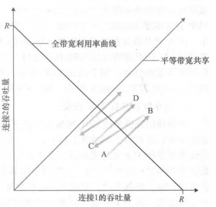

能达成这样效果的关键在于拥塞控制中，发送速率上限的减小是减半式减少，所以对于初始发送速率较大的一方来说，它减少的速率也多，两条TCP连接的速率摇摆不定，最终趋于平衡。


但是一条TCP面对多条TCP也不公平，TCP面对UDP也不公平。

### 5.其他

#### (1).序号和确认号的案例


#### (2).<a id='anchor_point_1'>TCP协议对RTT的估算</a>

​	根据之前的RTT和本次测量的RTT预估一个均值。

#### (3).设置和管理重传超时间隔

​	基于RTT时间，但是要根据网络的波动加上一个余量。

#### (4)SYN泛洪连接

​	前面提到过，服务器在接收到SYN分组之后，就准备分配给这条即将建立的TCP连接相应的缓存和变量，但是如果发送方仅仅是为了浪费服务器的资源而发送大量的SYN分组，这就形成了SYN泛洪连接，这属于DOS的一种。

​	针对SYN泛洪连接的防御系统称为SYN cookie。这个防御系统中，近一个SYN分组不会使服务器分配相应资源，同时它利用了SYN cookie来验证一个SYN分组之后有没有相应的SYNACK分组。


