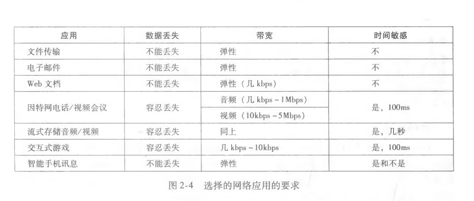
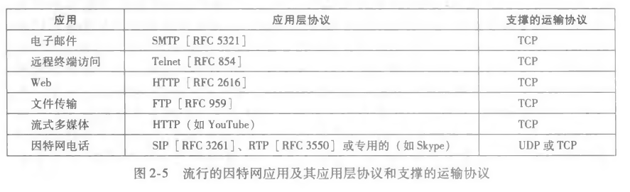
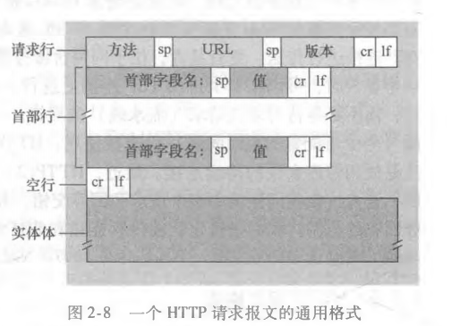
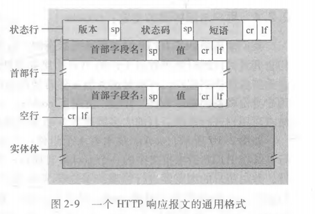
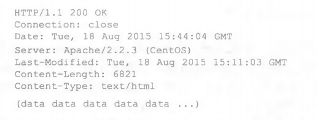
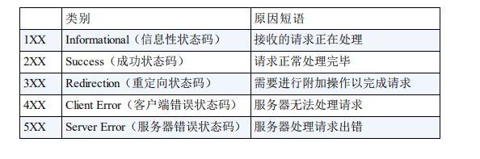
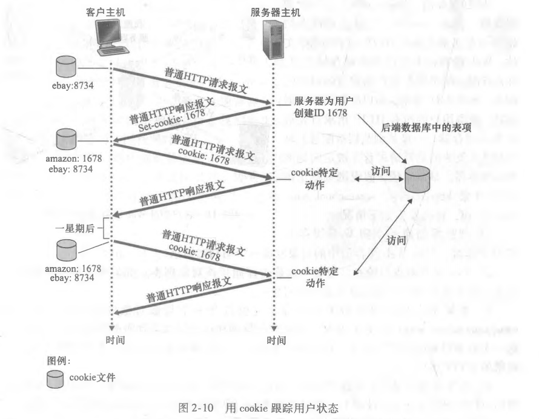
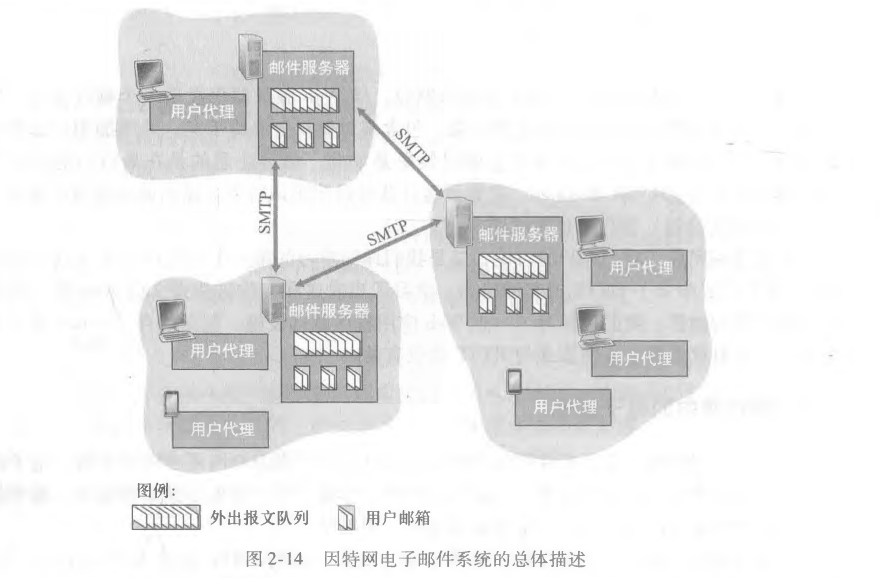
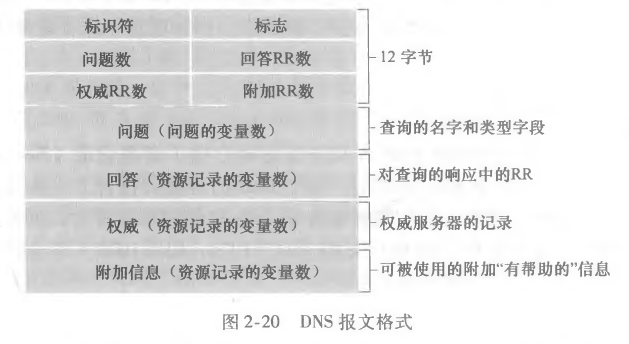
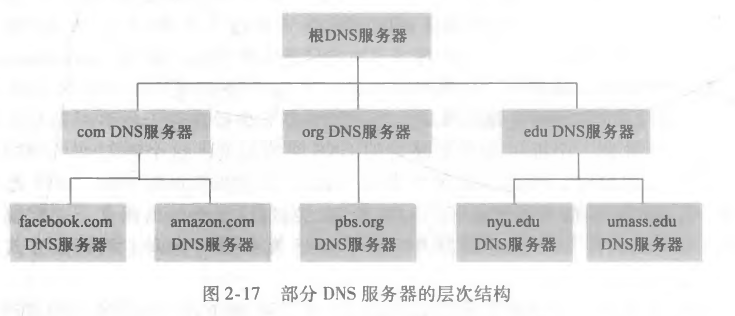

# 第二章 应用层

## 一.应用层的一些基本概念

### 1.网络应用程序体系结构

#### (1).C/S

​	C/S即客户-服务器体系结构，在这个体系结构中，有一个**总是打开的主机**被称为服务器，它服务于许多其他被称为客户的主机。

​	在该体系结构中，客户不直接通信。

​	该体系结构还有一个重要的特点是**服务器具有周知的、固定的IP地址**。

​	现实中，往往都是使用具备大量主机的数据中心创建强大的**虚拟服务器**。

 #### (2).P2P

​	P2P体系结构中，对于服务器有着**很小的依赖（甚至没有依赖）**。应用程序在主机之间直接通信，这些主机被称为对等方。

​	该体系结构最重要的特性是**自扩展性**，每个对等方在该体系结构中都承担了一定服务器的责任，所以每个对等方都可以为整个系统增加服务能力，而不是像C/S一样，过多的主机会使系统不堪重负。

*要指出的是，还有一些应用混杂了上述两种体系结构，对于许多即时讯息应用而言。服务器用于跟踪用户的IP，客户之间直接交换报文通信。*

### 2.进程通信

​	在网络中，通信的并不是两台主机，而是两个进程之间在通信。位于两台主机的进程，跨越操作系统传送报文进行通信。

#### (1).客户和服务器

​	在P2P中我们淡化了服务器和客户的概念，但是在一次网络通信（或者一次网络通信的某一时刻中）总有一方扮演服务器的角色，而另一方扮演客户的角色。

​	在单向通信中，上载数据的是服务器，下载数据的是客户。在双向通信中，发起通信的是客户，而另一方是服务器。

#### (2).套接字

​	如上所属，多数应用程序是由通信进程对组成的，进程（而不是应用层）要将通信的报文（报文内格式和部分内容有应用层协议决定）交由应用层以下传输，即要交付给运输层。而进程是通过一个叫做**套接字**的**软件接口**向运输层交付报文的。

​	套接字是同一台主机内应用层和运输层之间的接口，由于套接字是建立网络应用程序的可编程接口，因此套接字也被称为应用程序和网络之间的**应用程序编程接口**。

#### (3).进程寻址

​	以发邮件为例，向一台目的主机发送邮件，为了让该主机的适当进程能够正确的接收到该邮件，我们必须在邮件报文中加上目的主机的地址和目的进程的端口号。

### 3.可供应用使用的运输服务

#### (1).应用程序所需要的[^1]

##### a.可靠数据传输

​	数据从一台主机交付到另一台主机的过程中，实际上是被分割成了很多分组发送，我们需要这些分组从一端被正确无误地交付给另一端，即要求分组被完整、按序、不重复地交给另一端。

​	有些应用无法容忍传输过程中数据的丢失，例如网页、文本、邮件等，但是还有一些是**容忍丢失的应用**，例如音频或者视频，丢失或损坏少许数据影响并不大。

##### b.吞吐量

​	第一章中说过，吞吐量就是发送进程向接收进程交付比特的实际速率。很多时候，网络中的某个通道是被许多通信所共享，而且不断有通信加入或者退出，所以，一个应用程序的吞吐量如果不加以约束，往往是不稳定的。

​	而有些应用是**带宽敏感应用**，它们需要吞吐量总是保持在一个恒定速率。与之相对的，**弹性应用**对带宽没有要求。

##### c.定时

​	该服务就是对延迟的控制，有些即时通信/交互程序对延迟敏感，需要对延时加以控制。

##### d.安全性

​	一端发送的数据要被另一端完整的、安全地收取到，对传输的报文进行加密，中途被截取也无法解密。

​	安全性服务除了数据机密性外包括数据完整性和端点鉴别。

[^1]:  

#### (2).UDP和TCP(SSL)所提供的服务[^2]

* TCP能够提供的服务包括面向连接的服务和可靠数据传输。还有流量控制，这个和吞吐量有一点关系，但是主要是用于防止接收方和放送方速率不匹配。还有拥赛控制，这个服务是面向整个网络的，而不是服务于一个应用或主机。
* UDP是一种不提供不必要服务的清凉级运输协议，它仅提供最基本的服务。它提供不可靠传输且没有面向连接。
* SSL被称为安全套接字，SSL并不是一种新的运输层协议，而是TCP的加强，这种加强是在应用层之上的，SSL除了就具有TCP的所有功能之外，还具有端点鉴别、加密、数据完整性。在一个应用使用SSL时，它先将报文发送给SSL的套接字，SSL对报文进行加密，然后再交付给TCP的套接字进行传输。值得一提的是，HTTPS和HTTP的区别就在于一个使用SSL传输，一个使用TCP传输。

[^2]:  

#### (3).因特网所不提供的服务

​	综上所述，UDP、TCP和在其基础上的SSL只提供了可靠数据传输、安全性。剩下的吞吐量和定时，在因特网运输层并没有被提供，但是通常由应用提供这些服务。

### 4.应用层协议

​	上面的内容描述了许多与运输层相关的内容，我们知道互联网通信的本质是进程通信，进程将报文通过套接字交付给运输层协议，我们并没有谈论与报文有关的问题，**但报文是非常重要的，它决定了应用程序要发送什么数据、怎么发送等**。

​	针对报文，我们至少有这些问题：

> * 如何构造报文
> * 报文的各个字段是什么含义
>
> * 进程何时发送报文

​	**应用层协议定义了：**

> * 交换的报文的类型，请求/响应
> * 报文的语法，报文中的各个字段该如何描述
> * 字段的语义
> * 进程何时以及如何发送把文，对报文该如何响应

​	从应用程序的角度来看，**应用层协议**只是网络应用程序的一部分，不像运输层及以下的协议，它们是操作系统或者硬件的一部分，**应用层协议在编写任何一个网络应用软件时都要独立编写，而不是从系统调用**。

## 二.C/S体系应用层协议

### 1.HTTP(HyperText Transfer Protocol)

#### (1).概述

##### a.历史背景

​	早期因特网的使用者是研究人员、学者和大学生，它承担的主要任务是远程登录主机，在本地和远程主机之间传输文件、收发新闻、收发电子邮件。上世纪90年代，万维网（World Wide Web）的出现极大的改变了人们使用互联网的方式，它使因特网在众多网络中脱颖而出，成为惟一的数据网。

​	对于大多数用户来说，Web最具吸引力的就是**按需操作**，用户需要时则请求，然后即可得到想要的内容，这不同于电视和广播。

##### b.HTTP协议

​	Web应用的应用层协议是**超文本传输协议**(HyperText Transfer Protocol，HTTP),它是Web的核心。HTTP协议由两个程序实现，客户端程序和服务器端程序，它们通常运行在不同端系统中，通过HTTP报文对话。

##### c.相关术语

​	Web页面（文档）是由对象组成的，这些对象可能是HTML文件、图像、Java小程序或视频。这些对象都可通过URL地址寻址，一个Web页面可以有多个对象，页面通过URL引用它们。

​	URL分为两部分：存放服务器的主机名和对象的路径名。

##### d.所使用的运输层协议

​	HTTP协议使用TCP协议。

#### (2).报文

##### a.报文格式

​	

​	通用的HTTP请求报文格式如上图，由请求行、首部行、空行、实体体组成。请求行可以表示客户端的请求操作类型、首部行则是一些有关客户端和请求资源的信息和选择，实体体就是要协议决定要发送的数据，在请求报文中可能是PUT方法提交的表单。

​	

​	通用的HTTP响应报文如上图，与请求报文不同的是状态行，状态行决定了HTTP协议的响应情况，首部行则是对服务器和用户所请求对象的描述，实体体通常存放所请求对象。

##### b.请求行、首部行、实体体

​	

以上面的请求报文为例，详述以一下HTTP报文：

​	首先，该报文以ASCII文本书写，每一行以换行回车结束。第一行的请求行只能有一行，GET表示该报文期待得到一个Web对象（每次HTTP协议请求的只能是一个对象，即时一个Web页面有多个对象，HTTP协议也是通过多次请求得到这些对象），其他常用方法还有POST、HEAD、PUT等，随后的内容是请求对象的路径，再随后是HTTP协议的版本。

​	随后的首部行有可以有多行，Host告知目的主机的名字，Connection告知浏览器使持续链接或者非持续连接，User-agant显示浏览器类型，Accept-language表明请求对象的语言类型。

​	

​	相应报文与请求报文总体上类似。

##### c.响应码

​	

#### (3).通信过程

​	HTTP决定Web客户向服务器请求Web页面的方式，当用户请求一个Web页面时，浏览器向服务器发出对该页面中所包含对象的HTTP请求报文，服务器收到请求并对这些请求相应。	

#### (4).其他

##### a.运输层相关的持续连接和非持续连接

​	如同我们前面所提到的首部行Connect，HTTP协议有两种连接方式：持续连接和非持续连接。

​	当客户与服务器使用HTTP协议通信时，需要考虑一个问题，我们每次的通信是通过一个TCP连接还是每次通信都新使用一个TCP连接呢？前一种即**持续连接**，后一种即**非持续连接**。HTTP默认的是非持续连接。

​    非持续连接的例子：

浏览器正在向服务器请求一个包含十个对象的页面，它的请求过程是，先建立一个TCP连接请求HTML文本，请求成功后，断开该TCP连接，检查HTML文件，发现其中还有其他对象，再建立TCP连接，继续请求其他对象。

​	持续连接的例子：

还是使用上面的情况，非持续连接一个明显的缺点是，它需要建立多个TCP连接来传输一个页面，持续连接则不需要，它从头到尾只需要一个TCP连接，这样做的好处是不仅节约了服务器建立TCP连接的开销，更为重要的是，它使得客户可以向服务器连续发送多个HTTP请求，而不必要遵循必须得到回应后才能继续发送请求。这是因为，在非持续连接中，一次HTTP请求代表一次TCP连接，往往从浏览器到服务器的TCP并行连接数是有限制的，而且往往为1，持续连接不管要请求几个对象，都只使用一个TCP连接，所以它可以让客户能够连续发送请求。

##### b.无状态协议

​	HTTP协议是无状态协议，因为HTTP服务器不保存任何用户的信息。请注意HTTP的请求报文，里面关于客户的信息少之又少，最多是用户浏览器类型之内的信息，这根本无法标识一个用户。

##### c.cookie

​	上面说了，HTTP协议是无状态协议，这是从服务器的性能考虑的。但是标识用户的服务在一些地方确实是需要的，在这种情况下，

​	首先要指出，cookie并不属于HTTP协议的内容，但它确实与HTTP协议相配合得到了广泛的运用。

​	

如上图，cookie技术有四个组件：

	* 在HTTP响应报文中的一个cookie首部行
	* 在HTTP请求报文中的一个cookie首部行
	* 在用户端系统中保留一个cookie文件，由浏览器管理
	* 位于Web服务器的一个后端数据库

举例：

我要访问一个网站，填一份调查问卷，当我第一次发送请求报文时，服务器返回一个响应报文，报文中包含一个cookie值，我的浏览器察觉到了它，并把这个值存储在浏览器管理的cookie文件里。此后我再次访问该网站，我的请求报文中都会加上上次服务器发给我的cookie值，服务器从而得知我已经填过问卷，无需再填。

此外需要提出两点:一是，cookie相当于一个匿名账户，服务器根据cookie最多能够知道是哪一台主机的某个浏览器再访问它，而无反判断是哪一个人在访问它，不过因为我们在浏览某一个网站时，有时需要登录，服务器往往会将我们输入的用户信息与cookie关联起来，这样，服务器就可以从cookie判断是哪一个‘’人‘’（实际上是帐号）在访问它了，这也是许多网站只需登录一次此后就无需登录的原因（显然，当一个cookie信息过期之后，还是要重新登录）。

另外要说明的一点是，cookie值不是随机取的，是服务器根据客户的地址和一些其他信息计算出的一个唯一值，这有效防御了冒用cookie。

##### d.web缓存与条件get

​	Web缓存服务器也叫代理服务器，它可以代替最初始的Web服务器来满足HTTP请求的网络实体。Web缓存其有自己的磁盘存储空寂那，并且在存储空间中保存**最近请求过的对象的副本**。HTTP请求是否经过缓存可以通过设置浏览器决定。

​	当浏览器请求被定向到一个Web缓存器时，它的操作是：

* 浏览器创建一个到Web缓存器的TCP链接，请求一个对象
* Web缓存器检查它有没有该对像，如果有，直接相应给浏览器;如果没有，则向初始服务器请求该对象，得到响应后，本地保存该对象，并将对象响应给浏览器

​	注意几点：1.web缓存器既是客户又是服务器。2.不由某个互联网内容提供商提供的web缓存器不同于CDN，而是需要ISP购买安装，它所针对的网站也不是某一个互联网内容提供商的网站;当然内容提供商在构建它自己的CDN网络时也使用了web缓存器，这时的web缓存器则是为该内容提供商专用。

​	

​	web缓存的好处：1.它可以大大减少对客户请求的享用时间，因为减少了RTT（与计算机内部的高速缓存有异曲同工之妙）和可能的拥堵。2.它还可以大大减少一个机构到互联网的通信量，使得该机构可以不急于增加带宽。

​	web缓存器有一个缺点是，它所提供的对象可能是陈旧的，这个时候我们需要HTTP协议中的条件GET来避免陈旧的对象。条件GET是get方法，并且在首部行中加上If-Modified-Since，这一行告诉web服务器，它需要去初始服务器查询该对像是否修改过，而且修改时间在If-Modified-Since之前还是之后，如果在之后，需要的是初始服务器的对象，否则还是从web缓存返回对象。

##### e.端口

​	HTTP使用默认端口80,HTTPS则使用默认端口443.

### 2.1 SMTP(Simple Mail Transfer Protocol)

#### (1).概述

电子邮件的诞生时间很早，在因特网还处于襁褓之中时，电子邮件就已经成为了为最流行的网络应用，直到如今电子邮件变的越来越精细，也越来越强大，但是它仍是最流行的应用程序之一。

​	

​	如上图，电子邮件的组成有三部分：用户代理、邮件服务器、简单邮件传输协议（SMTP）。

​	当一个用户要发邮件时，他的邮件代理向其邮件服务器发送邮件，此时邮件放在邮件服务器的外出报文队列中，当另一方要阅读报文时，他的用户代理在其邮件服务器的邮箱中取得报文。

​	邮件服务器是邮件体系结构的核心，每个接收方在其邮件服务器上有一个邮箱，有关维护和管理着发送给接收方的报文内。一个典型的过程是：A向B发送邮件，邮件经A的用户代理到达A的邮件服务器，再传输到B的邮件服务器，在这里被分发到B的邮箱里。A的邮件服务器到B的邮件服务器的过程使用的是SMTP协议。

​	还有一个问题，A向B发邮件，当B的邮件服务器关机或者故障时该怎么办？这个时候A会将报文放于一个发送队列里，每隔一段时间就尝试发送，如果一直不成功，A的邮件服务器最终会删除该报文并告知A。

#### (2).报文

##### a.报文格式

​	如上图，这是TCP连接已经建立之后的通信过程，S即为客户交给TCP的内容，而C是服务器交给TCP的内容。以上是客户向服务器发送了一个报文（Do you like ketchup?How about pickles?）事实上，发送的报文不应该是这样的，它必须含有一个首部行From和一个首部行To，可能含有一个或多个例如Subject的可选首部行，随后才是内容[^3]。**而且值得注意的是，上面图片所显示的在报文之前也有一些HELO、MALL FROM等类似首部行的内容出现，但是这些内容是SMTP握手协议的一部分，而不是邮件报文的一部分。

[^3]: 

##### b.各行解释

 略。

#### (3).通信过程

​	

​	如上图，这是一个典型的SMTP通信过程：

		* A调用代理程序并提供B的地址和撰写报文，然后指示代理发送报文
		* A的报文被代理使用SMTP发送给邮件服务器，服务器将报文放置在要发送的报文队列里
		* 服务器针对该报文建立一个TCP连接到B的邮件服务器
		* 经过SMTP握手之后，发送报文
		* B的邮件服务器收到报文，并将其放置于B的邮件服务器
		* B**方便的时候**调用邮件服务器阅读报文

**有一点很重要，两个邮件服务器是直接通信的，中间没有其他中转站，即使这两个服务器在地理上相距很远**。

#### (4).其他

##### a.与HTTP相比

​	SMTP与HTTP的功能不同，但是还是有两个内容可以对比一下：

​		1.编码：

​			HTTP的报文除了实体体之外，其他部分一定是普通的ASCII文本，而且也不用进行其他编码就传输，实体体则可以选择采用几种编码方式。

​			而SMTP的报文一定是7位ASCII编码，即时它的报文中传送的是图片、视频等对象，也要将这也对象编码为7位ASCII编码传输（这也反映了SMTP着一协议的古老）。

​		2.拉协议与推协议：

​			HTTP协议是拉协议，SMTP协议是推协议，这两个名词从字面意思就可以理解。拉协议：客户请求，服务器提供内容;推协议：客户向服务器发送内容。从代理到邮件服务器和从邮件服务器到另一个邮件服务器都可以用SMTP，但是从邮件服务器到代理则是使用的其他的邮件访问协议，这是因为某个用户肯定是希望自己方便时才去查看邮件，而不是随时准备收邮件，这是一个按需操作，需要使用拉协议。

##### b.端口

​	默认端口25.

### 2.2 邮件访问协议

​	A向B发送的邮件实际上是存放在B的邮件服务器中的，那么B想要查看邮件时该怎么操作呢？早期的操作方式邮件始终留在邮件服务器内，B通过远程登录邮件服务器来查看他的邮件。而在如今，邮件访问使用了C/S体系结构，客户端和服务器之间采用邮件放那该文协议通信。

​	B是接收方，在其本地PC上放置一个邮件服务器是自然的想法，在这种情况下，发送方发送的邮件可以直接交给B了，但是这样做的代价是B的PC要一直在线，显然这对于大多数用户来说都是现实的，所以我们设置了邮件服务器，B需要的时候，使用某种拉协议，向邮件服务器请求自己的邮件。

​	现在我们又产生了一个新的问题，既然B请求自己的邮件时是采用一个类似HTTP协议的拉协议，那么为什么不向web所做的那样，使用一个服务器，A发给服务器报文，B请求服务器报文呢？这主要出于两点考虑，一是因为这样做可以使服务器有宕机维护的机会，试想一下，在B的邮件服务器关机的时候，A仍可以向B发送邮件，A只要将邮件发给自己的邮件服务器，邮件服务器就会一直尝试发送给B，即时B的邮件服务器关机了;还有一点是，邮件服务器的应用比Web还要多，学校、公司、甚至个人**都有自己的邮件服务器**。

#### (1).POP3(Post Office Protocol-Version 3)

​	POP3中文名是第三版邮局协议，它非常简单，工作大致分为三个过程：

		* 特许：用户代理以明文发送用户名和口令鉴别用户
		* 事物处理：用户代理可以取回报文、标记删除、获取邮件统计信息
		* 更新阶段：服务器删除标记的报文

#### (2).IMAP(Internet Mail Access Protocol)

​	中文名称是**因特网邮件访问协议**，IMAP与POP3相比有几个特点：

​		IMAP可以远程在邮件服务器中建立文件里，将不同邮件放在不同文件夹里，例如来自不同发送方的邮件就放在不同文件夹里。此外，IMAP服务器在通信过程中维护了会话的用户状态信息。另一个更为重要的特性是，IMAP允许用户只获取报文的一部分。	

#### (3).HTTP

​	越来越多的人使用HTTP从他们的邮箱服务器获取邮件。

### 3.DNS

#### (1).概述

​	IP地址是因特网中中，每一个主机位置的唯一标识，但是IP地址虽然便于电脑处理，但是不利于人的使用和记忆。由此便诞生了一种将主机名转换为IP地址的服务，**域名系统**(Domain Name System,DNS)。

​	**DNS**通常指两个内容：**一是由分层DNS服务器实现的分布式数据库**。二是一个使得主机能够查询该分布式数据库的应用层协议。

​	DNS服务器通常是运行着BIND软件的UNIX机器，DNS运行在UDP协议上，使用53号端口。

#### (2).报文

##### a.报文格式

​	DNS有着查询和回答报文，两种报文格式相同。

​	

##### b.各行解释

	* 前12个字节是首部区域
	* 略

#### (3).通信过程

​	DNS有一点不同于其他用用层协议，DNS协议并不直接为用户提供服务，而是转为HTTP、SMTP、FTP等协议提供域名转IP的服务。当某个浏览器访问www.baidu.com/index.html时，DNS可能这样起作用：

		* 同一台用户主机上运行着DNS应用的客户端
		* 浏览器从上述URL中抽取域名www.baidu.com，将这个域名提供给DNS客户端
		* DNS客户向DNS服务器发送一个包含主机名的请求
		* DNS客户收到一份应答报文，其中有响应的主机地址

#### (4)DNS提供的一些其他服务

​	DNS除了域名转为IP地址之外，还有一些其他的功能：

		* 主机别名：一台主机可以有好几个域名，DNS服务器可以识别一个主机的别名，返回**规范主机名**和IP地址。
		* 邮件服务器别名：邮件服务器除了可以有上述的主机别名之外，还可以与一个已存在的Web服务器主机名相同，DNS也可以识别这样的情况。
		* 负载分配：我们前面提到过谷歌、百度等公司都是使用的由大量主机组成的数据中心为客户提供服务，那么这个数据中心的所有主机虽然IP不同，但是它们被绑定到同一个域名，当有请求发送到这个域名时，DNS服务器会轮流提供绑定着这个域名的IP地址，这实际上起到了一个负载分配的功能。

#### (5)原理/DNS服务器体系结构

​	很容易想到，DNS服务是非常重要的，而且也是非常繁忙的，它的重要性与繁忙性比我们常用的谷歌、百度等网站要高的多。既然如此，我们理应想到DNS服务器不可能是一个单独的服务器或一个单独的数据中心，它至少需要有类似CDN的设计。事实上确实如此：

* 分布式、层次数据库：

  ​	为了处理扩展性问题，DNS使用了大量的DNS服务器，它们以层次方式组织，并且分布在全世界范围内。没有任何一台DNS服务器拥有全部的主机映射，相反所有的主机映射分布在所有的DNS服务器上。

  ​	大致上，DNS服务器分为三种:根DNS服务器、顶级域DNS服务器（TLD）和权威DNS服务器。

  ​		DNS提供服务的大致过程是，客户先与根服务器之一联系，该根服务器返回相应的顶级域TLD服务器的IP，客户再与TLD联系，TLD返回权威DNS服务器的IP，客户再与权威DNS服务器联系，最终的到目标主机的IP。

  根服务器全球共有400多个，这些根服务器由不同组织管理，根服务器提供TLD服务器的IP;TLD服务器提供权威DNS服务器的IP地址;在因特网上具有公共访问主机的组织几个必须提供公共可访问的DNS记录，这些记录能将主机名映射为IP地址。一个组织可以自己构建一个DNS服务器存放自己的DNS纪录，也可以支付费用将自己的DNS服务器放置在其他DNS服务器上。

* DNS本地服务器和缓存：

  ​	事实上DNS服务器之下还有一种常用的DNS服务器，叫做本地DNS服务器，这个DNS服务器往往有本地ISP提供，其中存储了本地主机的DNS记录，本地用户可以很方便的查询本地的DNS纪录，其他地区的主机访问本地的主机时，可能要最终从本地DNS服务器获取该主机的DNS记录，当然，从本地访问DNS体系结构的DNS服务器时，是通过访问本地DNS服务器，再由本地DNS服务器向外访问得到结果。

  ​	本地DNS服务器还有类似Web缓存的功能，它们可以缓存请求过的DNS记录，本地主机再次访问该记录时，就不必再访问DNS体系结构，它还可以缓存顶级域DNS服务器的IP，所以现实中查询DNS体系结构的服务器时，通常会绕过根DNS服务器。

#### (6).DNS记录

​	共同实现DNS分布式数据库的所有DNS服务器中存储了**资源记录**(Resource Record，RR),RR提供了主机名到IP的映射。一个RR包含这些字段的四元组:(Name,Value,Type,TTL)。TTL是记录的生存时间，决定了其在缓存中存在的时间。Value和Name取决于Type：

	* Type=A，Name是主机名，Value是主机对应的IP地址
	* Type=NS，Name是个域，Value是知道目标主机域名映射的权威DNS服务器的主机名
	* Type=CNAME，则Value是别名为Name的主机的规范名称
	* Type=MX，同上，但是为邮件服务器专用

​	当你建立了一个网站，希望自己的网站可以以通过域名访问时，需要向某个**注册登录机构**申请注册登记，注册登记就是将一条包含你的主机映射的A类型DNS记录放入两个权威DNS服务器（一个主要，一个辅助），此外顶级域DNS服务器里也理应有两条相应的NS和A类型的DNS记录。

​	DNS服务器中的DNS记录在过去主要依赖于管理人员手动建立文件配置，但现在允许通过DNS报文对数据库做动态添加。

#### (7).针对DNS的攻击

​	常见的有两种：

		* 一种是针对DNS服务器的DDos攻击，使得DNS服务器无法提供重要的DNS服务
		* 另一种是想办法截获DNS客户端的查询信息，返回错误的RR给请求者

## 三.P2P体系结构

### 1.概述

​	C/S体系结构总是依赖于总是打开的基础设施服务器，而P2P体系结构对服务器则有着很小的依赖，它通常是间接性开机的主机之间的直接通信。

​	我们以一个单一服务器向大量主机发送一个大文件为例，在C/S结构中，该服务器需要向每个有需求的主机分发一个大文件的副本，这对服务器造成了极大负载，同上也要花费许多时间。P2P分发中，每个对等方能够向任何其他对等方重新分发它已经收到的该文件的任何部分，从而在分发过程中协助该服务器。

### 2.P2P体系结构的扩展性

​	用一句话概括就是在C/S体系结构中，客户越多，整个体系的负载越大，其传输时间也越长。而但由于P2P有自扩展性，越来越多的对等方会使得整个体系结构的性能更强。

### 3.BitTorrent协议

​	BitTorrent是一种用于文件分发的流行P2P协议，在BitTorrent中参与一个文件分发的所有对等方叫做**洪流**。在一个洪流中的对等方彼此下载等长度的文件块，当一个对等方刚加入洪流时，它没有块，随着时间积累，它不断在新增块，也在上载块，当它获取了整个文件之后，它可以离开该洪流也可以继续留在洪流中做贡献。

​	洪流中有一个基础设施节点，叫做**追踪器**，每个对等方加入洪流时，它们在追踪器中注册自己，并且每个一段时间要通知追踪器自己还在洪流中（当然，不通知就是离开了）。

​	当某一个对等方A加入洪流时，其他追踪器会随机抽取一个固定数量的对等方作为A的**临近对等方**，将它们的IP发给A，A与它们创建TCP连接，当然A的临近对等方可能会有人离开，这是就会有其他对等非来补全。每个对等方具有文件的块的不同子集，A周期性的询问它的临近对等方，以获得它的临近对等方所具有的块的集合。在A知道它的临近对等方所具有的块之后，要做出两个重要的决定，向哪些邻居请求块和向哪些向A请求的邻居发送块。第一个问题由**最稀缺优先**的技术，即A会统计在它的邻居中分布最少的块（首先是A没有的），向这些邻居的这些块发起请求。这是一种从整体上考虑的技术，这使得整个结构中稀缺的块能够尽快增加，以平衡每个块的副本数量。第二个问题采用了一种对换算法，A会给予向它发送数据的所有邻居中速度最高的四位对等方发送数据，这四个邻居叫**疏通**，没过10秒A将重新测试速率，以选择新的疏通。更为重要的是每过30秒，A会随机再选其一个试探对象B向其发送数据块，如果A向B发送数据的速度够快，那么A也将有机会成为B的疏通，B就会向A发送数据，如果更为巧合的事情发生了，那就是B向A发送数据后，也成为了A的疏通，那么A和B就可以相互持续地互相发数据了。我们可以仔细思考一下，上述的过程会促使速率相当的两个对等方相互发送数据。这种关于交换的鼓励机制也被称为**一报还一报**。

## 四.内容分发网

### 1.使用一个或几个数据中心的问题

* 如果客户原理数据中心，那服务器为客户提供的服务将会有很高的时延
* 热门请求对象非常可能经过相同的链路发送多次，这造成了带宽的浪费，也使得内容提供商要付出极大成本
* 如果数据中心出现或其通向互联网的链路出现故障，那么其提供的服务完全瘫痪

### 2.使用CDN解决以上问题

#### (1).CDN服务器安置原则

* **深入**：在全球的接入ISP中部署服务器使得CDN集群尽可能靠近用户，减少用户到CDN集群之间的链路和路由器数量，从而改善用户感受的时延和吞吐量。但是高度分布式的部署使得服务器的维护任务成为挑战。

* **邀请做客**：在少量关键位置，例如IXP处放置CDN服务器，这样成本较深入方式小，当然延时和吞吐量相应的可能增大和减小。

  某一个CDN集群不会具有所有资源的副本。向google这种向全球提供服务的公司，其资源太多，全部放进一个CDN集群不太可能，而且往往不同地区对不同资源的偏好也不同，只需要将该地区最流行的资源放在靠近该地区的CDN集群即可，一旦该地区对某个资源的请求在靠近本地的CDN集群中无法得到满足，那么这个CDN将会向其他CDN集群或者数据中心请求资源（这类似与web缓存）。

  #### (2).CDN和专用DNS服务器

  ​	某一个用户向服务器请求资源，这个资源是部署在CDN集群上的，那么根据域名定位主机IP的过程与一般的DNS服务器不太一样，要用到一个专用DNS基础设施（我个人认为前面所谈到过的本地DNS服务器也算一种专用DNS服务器）。

  ​	以一个例子来描述:

  <ol><li>用户访问某一个部署在CDN集群上的资源</li>
      <li>用户的LDNS服务器将DNS请求中继到一台权威服务器,该权威服务器不是返回一个具有该资源的IP，而是返回一个用于CDN集群的专用DNS服务器的主机名和IP地址</li>
      <li>从这时起，该用户的DNS请求进入了相应的专用DNS服务器，这里的DNS服务器向LDNS返回具有目标资源的CDN服务器的IP</li>
      <li>LDNS服务器向用户主机转发内容服务器的IP地址</li>
      <li>客户主机利用该IP地址请求资源</li>
  </ol>
  
  

## 五.心得体会（包括二三两章）

​	略写：

​		Web缓存与Cache缓存，计算机内外部自成一体

​		考虑用户的体验：计算机常开、按需操作

​		设计协议时，除了从用户的角度考虑还要从整体角度考虑

​		我真的觉得DNS很鸡肋！！！

