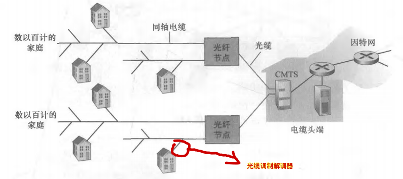
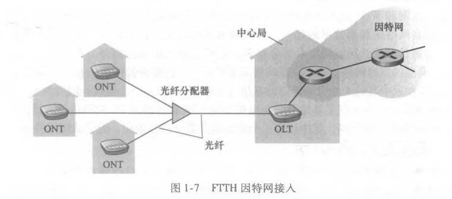
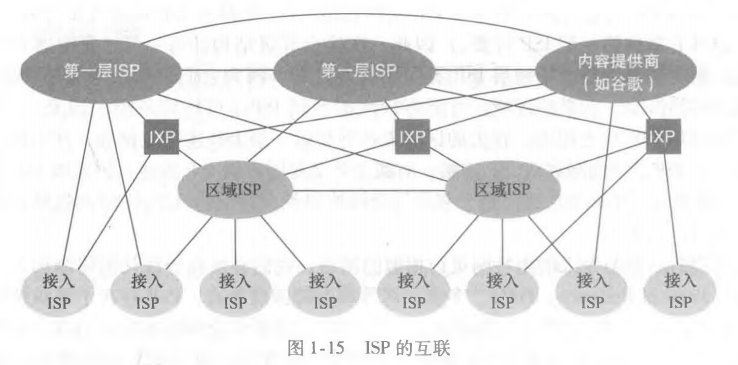
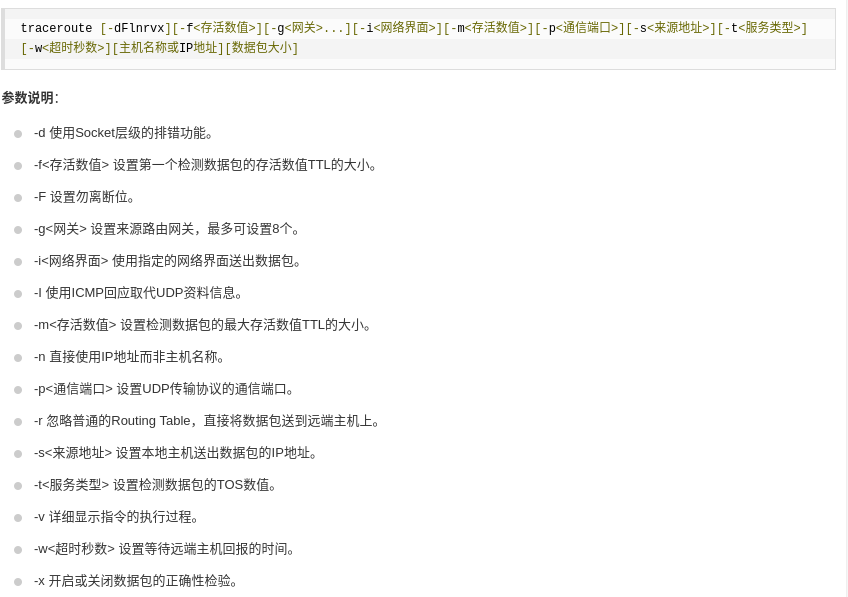
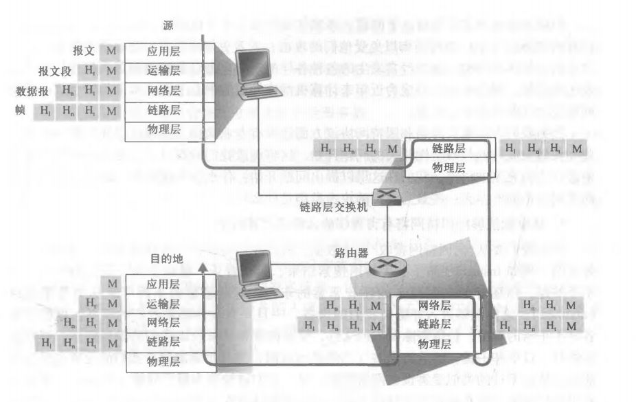

# 第一章 计算机网络和因特网

## 1.什么是因特网

​	因特网是计算机网络的一种，它也是目前最大的计算机网络。因特网也被译为互联网（Internet），但是需要注意的是互联网不同于互连网（internet），互联网是互连网的一种。

### 1.1具体构成

​	因特网由分布在网络边缘的主机或称端系统与将它们连接到一起的处于互联网核心的通信链路和分组交换机构成。

​	其中分组交换机最为著名的是**路由器**和**链路层交换机**，交换机的作用是转发分组，决定分组的去向。链路层交换机通常位于接入网中，路由器通常位于网络核心。

### 1.2 服务描述

​	涉及多个相互交互数据的端系统的应用被称为分布式应用程序。

​	与因特网相连的端系统提供了一个**套接子接口**，该接口规定了一个端系统通过互联网向另一个端系统交付数据的方式。

### 1.3 什么是协议

​	协议是通过网络通信的双方必须遵守的规则。现存的协议有很多，不同的网络可能使用着不同的协议，只有相同的协议之间才能通信。

​	端系统、分组交换机和其他网络不见都要运行一系列的**协议**，<u>这些协议控制着因特网中信息的接收和发送</u>。

​	协议的标准化即**因特网标准**由因特网工程任务组研发，标准文档称为请求评论（RFC）。

## 2. 网络边缘

​	主机也被称为端系统，这是因为它们位于网络的边缘。端系统也被分为客户端和服务器，很多服务器都属于大型数据中心。

​	<u>位于网络边缘的端系统提供计算机网络的资源，属于资源子网。</u>

### 2.1 接入网

​	接入网是指将端系统物理连接到其 **边缘路由器**[^1] 的网络。 

[^1]: 边缘路由器是指端系统到任何远端端系统所经过的第一台路由器。

#### 2.1.1 接入网的种类和物理媒介

##### 数字用户线 （DSL）

描述：DSL和电缆接入是利用了电话线作为基础设施，网络信号和电话信号共用电话线。

物理媒介：双绞铜线

实现：从家庭到ISP时，DSLAM将电话信号和数字信号分隔开，并将模拟信号转变为数字信号;从ISP到家庭时，分配器将电话信号和数字信号分隔开。

特点：利用了频分复用技术，不同的信号使用不同的频率传输。

缺点：受传输媒介的限制，接入用户不能里ISP太远。

##### 电缆接入（HFC）

描述：光缆调制解调器等同于DSL调制解调器，CMTS等同DSLAM。

物理媒介：同轴电缆、光缆

实现：和DSL类似

特点：共享广播媒体，多个用户共享一根同轴电缆。由头端发送的每个分组向下行经每段链路到每个家庭。

缺点：多个家庭共享上下行通道存在拥堵问题。

##### 光纤到户（FTTH）

描述：从本地中心局直接到家庭提供了一条光纤路径，更一般的情况时从中心局出来的每跟光纤由较少的家庭共享。

物理媒介：光纤

FTTH有两种光纤分布体系：

* 有光源光纤网络（AON）

* 无光源光纤网络（PON）

  

##### 以太网和WIFI（常用于学校和企业、家庭）

##### 广域无线接入：3G和LTE

## 3.网络核心

### 3.1分组交换

​	<u>分组交换</u>、<u>存储转发</u>。

​	在网络应用中，端系统彼此交换报文，报文可以执行控制功能或者包含数据，报文会在这个传输过程中被划分为小块的数据块，称为分组。分组要经过分组交换机和通信链路，分组将会以等于该链路的最大速率通过通信链路。

#### 3.1.1 存储转发

​	多数分组交换机在链路的输入端使用存储转发传输，存储转发传输是指 <u>在交换机能够开始向输出链路传输该分组的第一个比特之前必须接受整个分组</u>， <u>**这就产生了存储转发延时**</u>。

#### 3.1.2 排队延时和分组丢失

​	每台分组交换机都有一个输出缓存，也成为输出队列，它用于存储路由器准备发送的分组。会有这样一种情况，当一个分组到达分组交换机时，在它前面还有别的分组在被分组交换机处理，这时，该分组就只能等待于输出缓存中，这就产生了排队延时。

​	输出缓存也是有限的，当输出缓存已满的情况下，还有分组到达分组交换机，那么必定会有分组“被挤掉”，这就产生了分组丢失。

#### 3.1.3 转发表和路由选择协议

​	分组的头部包含了目的端系统的IP地址，分组每到达一个路由器的时候，路由器就会根据分组头部的IP得知分组所需要前往的下一个路由器机，路由器再根据转发表将目的地址映射成为输出链路。许多路由器的转发表都是根据路由选择协议自动设置的。

### 3.2 电路交换

​	使用电路交换的两个端系统需要先建立一个稳定的链接，这很耗费时间，而且链接建立后，会持续的占用一部分资源，即时自己不使用，别人也用不了。但是电路交换相比分组交换要更为稳定。

​	电路交换也使用了频分复用技术。

### 3.3 网络的结构

​	现如今的网络结构分为多层。第一层之间的ISP直接相连，上下两层之间通过IXP链接，而且第一层以下的ISP也通过链接同一个IXP实现了对等。一个低级的ISP可以选择和多个上层ISP相连，这是多宿;还有POP，这是指底层ISP跨越多层直接与较上层的ISP相连。

## 4.分组交换网络中的时延、丢包和吞吐量

### 4.1 分组交换中的时延（还有存储转发时延）

* 节点处理时延：节点检查首部和决定将分组发往何处所需的时间是处理实验的一部分，例外可能还包括检查比特级错误等。
* 排队时延：分组在链路上等待被发送的时间。
* 传输时延（发送时延）：将所有分组的比特推向链路的时间
* 传播时延：分组在链路上传播所需的时间。

### 4.2 排队时延和丢包

​	多个分组同时到达队列时，靠前的分组所承受的排队时延较小，越往后的分组承受的时延越高。我们令分组到达路由器的平均速率为a，R是传输速率，所有分组都是由L比特组成，当La/R>1的时候会出现这样一种情况，分组进入路由器的速度要比出路由器的速度块，这回造成分组在路由器中堆积，随着堆积的队列越来越长，后面到来的分组将会忍受越来越长的排队时延。

​	但是，存储队列毕竟是有限的，分组队列不可能无限堆积，当队列满了之后，就会出现丢包。

### 4.3 Traceroute

​	将设我们要从A端到B端，中间有N-1个路由器，则我们在使用Traceroute程序时，会从A向B发送N个分组(不是同时发送，发送N次)，这些分组分别发往B和A到B间的路由器，路由器和B端接收到分组之后，将会向A端返回一个报文，报文记录了发送分组到收到返回报文的时间、接收方的名字和地址。事实上，执行一次Traceroute程序会发送三次N个分组。

​	在windows中Traceroute的命令是tracert。

​	在linux中是traceroute：

### 4.4 有需要时，端系统可以有意地延迟分组传输

### 4.5 计算机网络的吞吐量（平时我们能够真实体会到的网速）

​	吞吐量就是<u>两个端系统之间</u>实际的速率，单位bps。

​	在不考虑延时的情况下，吞吐量取决于两端之间最小的传输速率，而且端到端之间经过一条共用线路时，如果其他端到端也在使用该线路通信，吞吐量也会减小。

## 5协议层次及其服务模型

### 5.1 分层的体系结构

​	计算机网络的分层的核心思想就是将功能分层，每一层之间有联系，但是也有一定独立性。每一层还可以为上一层提供服务，利用下一层提供的服务，某一层的实现不管怎么变化，只要它提供的服务和利用的服务不变就可。

#### 1.协议分层

​	五层**因特网**协议栈为：应用层-》运输层-》网络层-》链路层-》物理层。

​											报文   -》报文段-》数据报-》帧

​	协议可以由软件或者硬件实现，某一层的协议的不同部分可能分布在构成网络的端系统、路由器或其他组件中。

​	协议分层也有缺点，可能会使某一层冗余较低层的服务。

​	**各层的所有协议被称为协议栈。**

##### a.应用层

​	应用层是应用程序和它们的应用层协议存留的地方，协议包括HTTP、SMTP、FTP等。

​	应用层协议分布在多个端系统上，在这一层的分组被称为报文。

##### b.运输层

​	运输层在应用程序的端点之间传送应用层报文，协议有TCP、UDP。

​	TCP提供面向连接的服务，可靠性强，有流量控制和拥赛控制。

​	UDP提供无连接服务。

​	位于这一层的分组称为报文段。

##### c.网络层

​	网络层将分组从一台主机移动到另一台主机，TCP/UDP为这一层提供运输报文段和目的地址。

​	协议有IP协议（网际协议）、路由选择协议。

​	这一层的分组被称为数据报。

##### d.链路层

​	为了将分组从网络的某一个节点传输到另一个节点，必须依赖链路层的服务。

​	传输方式的不同也让链路层提供不同的服务。

​	这一层的分组叫做帧。

##### e.物理层

​	这一层是具体的比特传输。

#### 2. OSI模型

​	应用层-》表示层-》会话层-》运输层-》网络层-》链路层-》物理层

​	表示层作用是使应用程序能够解释数据交换的含义;会话层则提供类数据交换的定界和同步功能，包括建立检查点和恢复方案。

​	<u>表示层和会话层在因特网中交由应用程序按需要实现。</u>

#### 3. 封装

​	从应用层报文向链路层帧，每一层都会在分组的头部加上一些信息。一个分组有两种类型的字段：首部字段和有效载荷字段。

## 6.面对攻击的网络

* 通过网络将病毒或者蠕虫放入计算机，被感染的计算机构成了僵尸网络

* 通过拒绝服务攻击攻击服务器和网络基础设施
* * 弱点攻击：向目标发送精巧设计的报文，使其停止运行或者崩溃。
  * 带宽泛洪：向目标发送大量分组，使目标的接入链路变的堵塞，使合法分组无法到达服务器。
  * 连接泛洪：向目标创建大量全开或半开的TCP链接
  * 单一攻击源难以产生巨大的效果，更强大的是DDOS攻击，控制许多‘肉鸡’攻击目标。
* 通过嗅探分组在广播网络中复制本来发往其他主机的分组，而且分组嗅探是被动的，难以检测，只能通过密码解决。
* 通过人工制作分组冒充某一端系统，被称为IP哄骗。